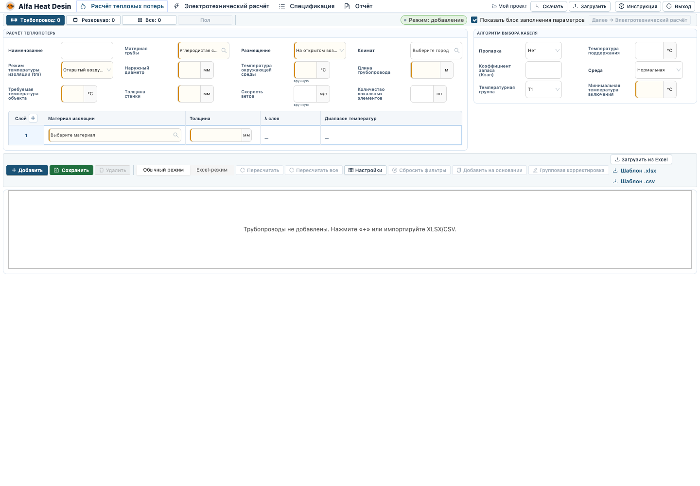
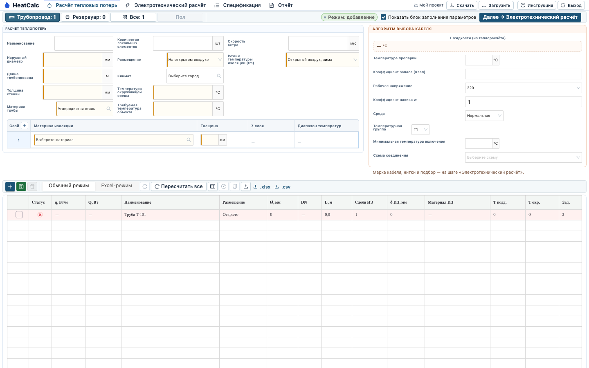

# Замечание 1. Коэффициент теплопроводности теплоизоляции

**Дата:** 2026-08-14

**Статус:** рабочая позиция для ответа клиенту; не является ACTIVE-очередью разработки

**Источник требований:** `ТНП/1_Кейс_«Расчёт спецификации для неавторизованных пользователей» (1).pdf`,
редакция 4 от 07.07.2026, страницы 24 и 27.

## Прямая цитата клиента

> «Коэффициент теплопрооводности теплоизоляции у нас прописан справочник и ручной
> ввод, тут только справочник».

Цитата фиксирует ожидание двух способов задания λ, но сама по себе не содержит
требования показывать справочный и ручной способы одновременно.

## Статус и решение

Требование ТЗ о двух способах задания λ **уже реализовано**. Замечание
**не принимаем как дефект**: ручной ввод появляется для нестандартного
материала, а не является вторым постоянно видимым полем.

Если замечание означает, что справочную и ручную λ нужно всегда показывать
рядом, это **дополнительное пожелание**. Без отдельного согласования его
**не принимаем**, поскольку PDF этого не требует, а два одновременных источника
значения создают неоднозначность.

## Что прямо написано в ТЗ

На странице 24 указаны два взаимоисключающих сценария:

1. `Материал изоляции` — материал из справочника **или** нестандартный материал.
2. `Теплопроводность нестандартного материала` — обязательна, если материал не
   из справочника; значение λ берётся от поставщика или из ТЗ.
3. Для того же нестандартного материала обязателен его температурный диапазон.

На странице 27 в разделе `Бизнес-правила приемки исходных данных` прямо
указано:

> «Для нестандартного материала нельзя принимать расчет без теплопроводности и
> температурного диапазона».

Следовательно, ТЗ требует два пути, а не два постоянно доступных поля:

```text
справочный материал -> λ и диапазон из справочника
нестандартный материал -> ручные λ и диапазон температур
```

Если варианта `Другое` нет или после его выбора ручные поля не появляются,
это будет дефектом по ТЗ.

## Готовая формулировка ответа клиенту

> Требование ТЗ соблюдено: для справочного материала коэффициент
> теплопроводности и температурный диапазон берутся из справочника. Для ручного
> ввода необходимо выбрать нестандартный материал (`Другое`) — после этого
> становятся доступны поля λ и температурного диапазона. Постоянное
> одновременное отображение справочного и ручного способов ТЗ не требует.

## Скриншоты

Каталожный путь: материал выбран из справочника, отдельного постоянного поля
ручной λ нет. В колонке `λ слоя` стоит прочерк — значение берётся из
справочника, а не вводится рядом со списком материалов.




