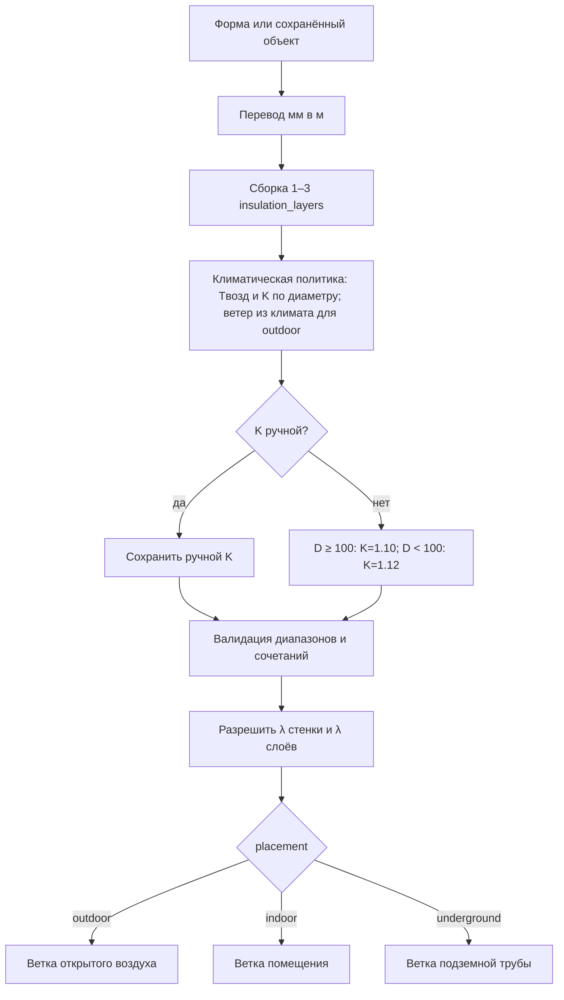
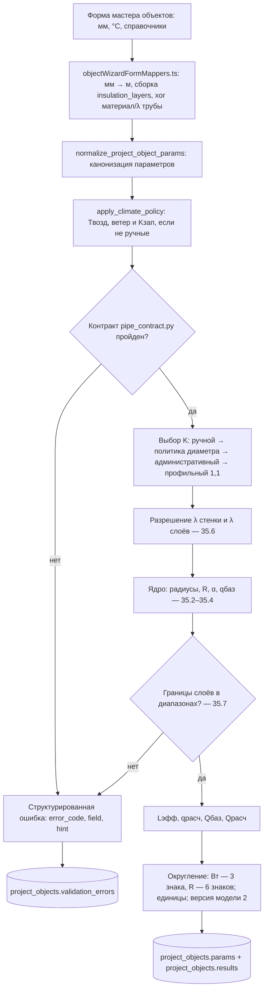
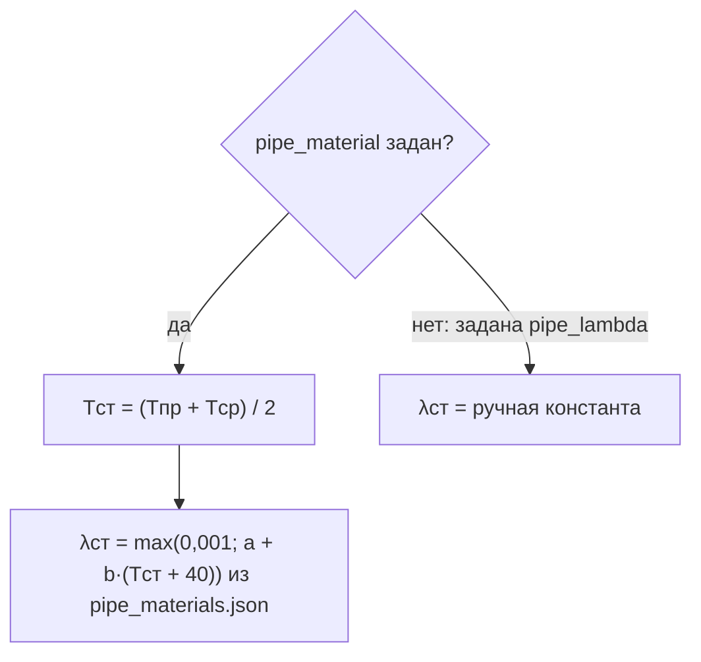
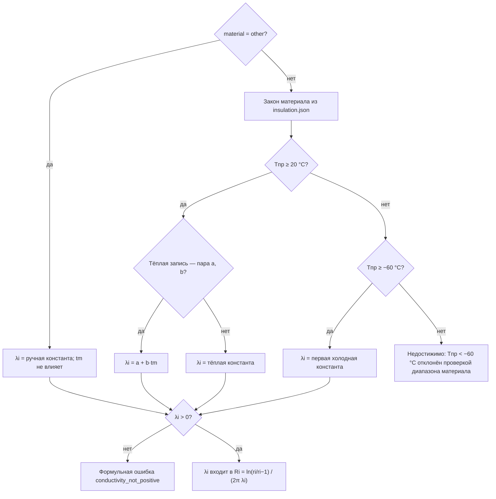
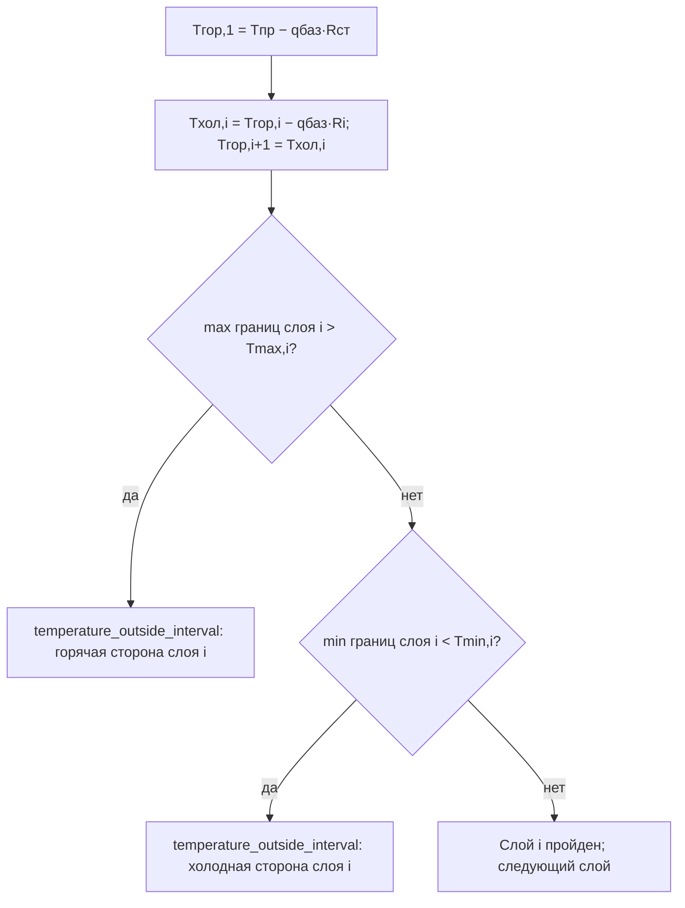

# Отчёт о фактическом расчёте теплопотерь трубопровода

**Дата фиксации:** 2026-08-15  
**Проверено по коду:** HEAD 2b83d00  
**Статус:** снимок фактического поведения; не нормативная документация  
**Объект расчёта:** трубопровод (`pipe`), формульная модель `pipe_heat_loss`, версия `2`  
**Аудитория:** продакт-оунер; описано текущее поведение («как есть»), не целевая методика  

Отчёт прослеживает путь данных от поля формы до сохранённого результата:
лейблы и имена полей, единицы и диапазоны, автозаполнение, формулы, порядок
вычислений, блокирующие проверки, состав результата. Зафиксировано текущее
поведение кода, а не желаемая методика.

Путь данных:

    Форма (мм, °C)              лейблы и диапазоны          heatcalc-fields.default.json
      → payload API             мм → м, сборка слоёв        objectWizardFormMappers.ts
      → климатическая политика  Tвозд, ветер и K по диаметру heat_loss_application.py
      → контракт входов         диапазоны и сочетания       pipe_contract.py
      → расчётное ядро          R, α, q, Q                  pipe.py + pipe_evaluation.py
      → публичный результат     округление, единицы         app/formulas/heat_loss/pipe.py
      → объект проекта          project_objects.params / results / validation_errors

Сквозной пример (полный разбор — раздел 28): пользователь вводит диаметр
108 мм, стенку 6 мм, изоляцию 50 мм с ручной λ = 0,04 и Kзап = 1,2. В API
уходит `outer_diameter=0.108`, `wall_thickness=0.006`,
`insulation_layers=[{thickness: 0.05, conductivity: 0.04, …}]`. Ядро
возвращает `heat_loss_per_meter_base=41.158` Вт/м; в
`project_objects.results` сохраняется `total_heat_loss_design=2617.640` Вт.

---

## 1. Физическая модель

Для трубопровода используется модель установившегося одномерного радиального
теплового потока через многослойную цилиндрическую стенку:

    продукт или труба
        → стенка трубы
        → первый слой изоляции
        → второй слой изоляции, если задан
        → третий слой изоляции, если задан
        → воздух или грунт

Основной расчёт:

\[
q_{\text{баз}}=
\frac{T_{\text{пр}}-T_{\text{ср}}}{R_\Sigma}
\]

где:

- \(q_{\text{баз}}\) — базовые линейные теплопотери, Вт/м;
- \(T_{\text{пр}}\) — требуемая температура объекта, °C;
- \(T_{\text{ср}}\) — температура воздуха или грунта, °C;
- \(R_\Sigma\) — полное термическое сопротивление, м·К/Вт.

Полные проектные теплопотери:

\[
Q_{\text{расч}}
=
q_{\text{баз}}
\left(
L+n_{\text{лок}}L_{\text{экв}}
\right)
K_{\text{зап}}
\]

### 1.1. Названия стандартных формул и моделей

| Часть расчёта | Общепринятое название | Фактическая запись | Краткий смысл |
|---|---|---|---|
| Стенка и слои | Закон Фурье для установившейся радиальной теплопроводности через цилиндрическую стенку | `R=ln(r2/r1)/(2*pi*lambda)` | Превращает геометрию и λ цилиндрического слоя в сопротивление на 1 м трубы |
| Сумма стенки, слоёв и внешней среды | Метод термических сопротивлений; последовательное соединение | `Rsum=Rwall+sum(Ri)+Rexternal` | Складывает последовательные препятствия одному и тому же тепловому потоку |
| Поверхность–воздух | Закон Ньютона–Рихмана, записанный через линейное сопротивление теплоотдаче | `Rair=1/(2*pi*r*alpha)` | Учитывает переход тепла с наружной поверхности в воздух |
| Влияние ветра | Именованного универсального закона нет; эмпирическая корреляция принятого ТНП | `alpha=11.6+7*sqrt(v)` | По скорости ветра задаёт эффективный коэффициент наружной теплоотдачи |
| Труба в однородном грунте | Сопротивление заглублённого цилиндра в полупространстве; метод геометрического фактора/зеркального источника | `Rground=arcosh(H/r)/(2*pi*lambda_ground)` | Моделирует двумерное растекание тепла от трубы к поверхности однородного грунта |
| Мощность на единицу длины | Тепловой аналог закона Ома | `qbase=deltaT/Rsum` | Делит температурный напор на полное сопротивление и получает Вт/м |
| Местные элементы | Метод эквивалентной длины | `Leffective=L+n*Lequivalent` | Заменяет добавочные потери элементов условной дополнительной длиной трубы |
| Коэффициент запаса | Общепринятого физического названия нет; инженерный коэффициент запаса | `qdesign=qbase*K` | Переводит базовый физический результат в проектную нагрузку |

Корреляция для ветра и конкретные значения коэффициентов являются принятой
реализацией источника, а не универсальными физическими константами.

---

## 2. Обозначения

| Обозначение | Величина | Единица |
|---|---|---:|
| \(T_{\text{пр}}\) | требуемая температура объекта | °C |
| \(T_{\text{возд}}\) | температура окружающей среды | °C |
| \(T_{\text{гр}}\) | температура грунта | °C |
| \(T_{\text{ср}}\) | температура расчётной внешней среды | °C |
| \(T_{\text{ст}}\) | средняя температура стенки трубы | °C |
| \(T_m\) | расчётная температура для определения λ изоляции | °C |
| \(D\) | наружный диаметр трубы без изоляции | м |
| \(D_{\text{из}}\) | наружный диаметр трубы со всей изоляцией | м |
| \(r_0\) | наружный радиус трубы без изоляции | м |
| \(r_{\text{вн}}\) | внутренний радиус трубы | м |
| \(r_i\) | наружный радиус после слоя изоляции \(i\) | м |
| \(r_{\text{из}}\) | наружный радиус трубы со всей изоляцией | м |
| \(\delta_{\text{ст}}\) | толщина стенки трубы | м |
| \(\delta_i\) | толщина слоя изоляции \(i\) | м |
| \(\lambda_{\text{ст}}\) | теплопроводность стенки трубы | Вт/(м·К) |
| \(\lambda_i\) | теплопроводность слоя изоляции \(i\) | Вт/(м·К) |
| \(\lambda_{\text{гр}}\) | теплопроводность грунта | Вт/(м·К) |
| \(v\) | скорость ветра | м/с |
| \(\alpha\) | коэффициент наружной теплоотдачи | Вт/(м²·К) |
| \(H\) | глубина от поверхности грунта до оси трубы | м |
| \(R_{\text{ст}}\) | сопротивление стенки трубы | м·К/Вт |
| \(R_i\) | сопротивление слоя изоляции \(i\) | м·К/Вт |
| \(R_{\text{из}}\) | суммарное сопротивление изоляции | м·К/Вт |
| \(R_{\text{нар}}\) | сопротивление теплоотдаче в воздух | м·К/Вт |
| \(R_{\text{гр}}\) | сопротивление теплоотдаче через грунт | м·К/Вт |
| \(R_\Sigma\) | полное термическое сопротивление | м·К/Вт |
| \(q_{\text{баз}}\) | базовые линейные теплопотери до \(K_{\text{зап}}\) | Вт/м |
| \(q_{\text{расч}}\) | проектные линейные теплопотери после \(K_{\text{зап}}\) | Вт/м |
| \(L\) | геометрическая длина трубопровода | м |
| \(n_{\text{лок}}\) | количество локальных элементов | шт. |
| \(L_{\text{экв}}\) | эквивалентная длина одного локального элемента | м |
| \(L_{\text{доп}}\) | дополнительная эквивалентная длина | м |
| \(L_{\text{эфф}}\) | эффективная расчётная длина | м |
| \(K_{\text{зап}}\) | коэффициент запаса | безразмерный |
| \(Q_{\text{баз}}\) | базовые суммарные теплопотери | Вт |
| \(Q_{\text{расч}}\) | проектные суммарные теплопотери | Вт |

### 2.1. Как читать происхождение величин

В отчёте источник значения разбирается по этапам. Это важно: «значение видно
на форме» не всегда означает «значение ввёл пользователь».

| Этап | На какой вопрос отвечает |
|---|---|
| Лейбл формы | Как поле называется именно в модальной форме объекта; табличный и краткий лейблы могут отличаться |
| Поле формы | Под каким ключом значение живёт во frontend-состоянии |
| Поле API/ядра | Под каким ключом каноническое значение передаётся в backend и формулу |
| Первичный источник | Пользователь, климатический JSON, внутренний словарь материала/грунта, значение по умолчанию или расчётное ядро |
| Разрешение и приоритет | Как из возможных источников выбирается одно фактическое значение и что может его переопределить |
| Маркер происхождения | Как источник фиксируется в `*_source` или другом служебном поле; сам маркер в уравнение не входит |
| Участие | В какую формулу, ветвь или проверку попадает готовое значение |

Сохранённый объект — это этап хранения, а не самостоятельный первичный
источник. Например, климатический ветер хранится в объекте как `wind_speed`,
но его первичный источник — `wind_avg_cold` либо `wind_max_jan` внутреннего
климатического словаря, а признак источника — `wind_speed_source=climate`.

Для формул используются две подписи:

- **Общепринятое название** — только если у соотношения есть устойчивое
  название в теплопередаче или геометрии;
- **Смысл действия** — зачем этот шаг нужен в текущем алгоритме.

Если устойчивого названия нет, отчёт прямо называет выражение внутренним
методическим правилом, бизнес-правилом или эмпирической корреляцией.

---

## 3. Исходные данные: геометрия и стенка

| Лейбл модальной формы | Поле формы | Поле API/ядра | Обозначение | Frontend → backend | Первичный источник и разрешение | Маркер происхождения | Как участвует |
|---|---|---|---:|---|---|---|---|
| Наименование | <code>name</code> | В формулу не передаётся | — | Текст, до 200 символов | Frontend формирует из параметров; пользователь может заменить | Нет | Только идентификация объекта |
| Наружный диаметр | <code>outer_diameter_mm</code> | <code>outer_diameter</code> | \(D\) | 10,8–3000 мм → 0,0108–3 м | Пользователь; mapper делит мм на 1000 | Нет | Задаёт радиусы и ветвь климатической политики \(D<100/D\ge100\) |
| Длина трубопровода | <code>pipe_length</code> | <code>pipe_length</code> | \(L\) | 0,5–200 000 м → тот же диапазон | Пользователь; единица не меняется | Нет | Умножает линейные потери при расчёте суммарной мощности |
| Толщина стенки | <code>wall_thickness_mm</code> | <code>wall_thickness</code> | \(\delta_{\text{ст}}\) | 0,1–40 мм → 0,0001–0,04 м | Пользователь; mapper делит мм на 1000 | Нет | Задаёт внутренний радиус и \(R_{\text{ст}}\) |
| Источник теплопроводности трубы | <code>pipe_lambda_mode</code> | Само поле ядро не читает | — | <code>reference/manual</code> | Пользователь выбирает режим; frontend передаёт ровно один из двух источников λ | Нет; XOR проверяется контрактом | Управляет подготовкой, но не входит в уравнение |
| Материал трубы | <code>pipe_material</code> | <code>pipe_material</code> → закон λ | — | Один из 5 кодов справочника | Пользователь выбирает код; backend получает закон из внутреннего словаря материалов труб | Отдельного <code>*_source</code> нет; наличие <code>pipe_material</code> означает справочный режим | Вычисляет \(\lambda_{\text{ст}}(T_{\text{ст}})\) |
| Теплопроводность трубы λ | <code>pipe_lambda</code> | <code>pipe_lambda</code> | \(\lambda_{\text{ст}}\) | 0,001–400 Вт/(м·К) → \(0<\lambda\le400\) | Пользователь; допустима только вместо <code>pipe_material</code> | Наличие <code>pipe_lambda</code> означает ручной режим | Непосредственно входит в \(R_{\text{ст}}\) |
| Размещение | <code>placement</code> | <code>placement</code> | — | <code>indoor/outdoor/underground</code> | Пользователь | Нет | Выбирает температуру среды и воздушное либо грунтовое сопротивление |

### 3.1. Значения поля «Размещение»

| Название на форме | Значение | Что делает приложение |
|---|---|---|
| На открытом воздухе | <code>outdoor</code> | Использует температуру воздуха и рассчитывает \(\alpha\) по скорости ветра |
| В помещении | <code>indoor</code> | Использует температуру воздуха и постоянное \(\alpha=9\) |
| Подземно | <code>underground</code> | Не использует воздух и ветер; использует температуру и теплопроводность грунта |

---

## 4. Исходные данные: температура и климат

| Лейбл модальной формы | Поле формы | Поле API/ядра | Обозначение | Frontend → backend | Первичный источник | Разрешение, приоритет и маркер | Как участвует |
|---|---|---|---:|---|---|---|---|
| Климат | <code>climate_key</code> | <code>climate_key</code> | — | Ключ строки JSON | Пользователь выбирает населённый пункт из внутреннего климатического словаря | По ключу, либо по паре регион/город, frontend и backend находят одну строку | Сам в формулу не входит; запускает климатическую подготовку |
| Регион | <code>climate_region</code> | <code>climate_region</code> | — | Текст из выбранной строки | Внутренний климатический словарь после выбора пользователем | Сохраняется как идентификация/fallback поиска; отдельного source-маркера нет | В уравнение не входит |
| Населённый пункт | <code>climate_city</code> | <code>climate_city</code> | — | Текст из выбранной строки | Внутренний климатический словарь после выбора пользователем | Сохраняется как идентификация/fallback поиска; отдельного source-маркера нет | В уравнение не входит |
| Требуемая температура объекта | <code>process_temperature</code> | <code>process_temperature</code> | \(T_{\text{пр}}\) | −90…600 °C → тот же диапазон | Пользователь | Только ручной ввод; source-маркера нет | Формирует \(\Delta T\), выбирает ветвь λ и участвует в проверке материала |
| Температура окружающей среды | <code>ambient_temperature</code> | <code>ambient_temperature</code> | \(T_{\text{возд}}\) | −70…70 °C → тот же диапазон | Пользователь либо <code>t_0_92/t_abs_min</code> климатического JSON | Ручное значение с <code>ambient_temperature_source=manual</code> при пассивном пересчёте приоритетнее климата; явный повторный выбор климата делает значение климатическим | Только воздушная труба; создаёт \(\Delta T\) |
| Скорость ветра | <code>wind_speed</code> | <code>wind_speed</code> | \(v\) | 0…20 м/с → тот же диапазон | Пользователь либо <code>wind_avg_cold</code>, иначе <code>wind_max_jan</code> климатического JSON | Явное ручное значение приоритетнее климата. Frontend заполняет поле интерактивно; backend независимо восстанавливает климатический ветер. Маркер <code>wind_speed_source=manual/climate</code> | Только <code>outdoor</code>: определяет α; для <code>indoor</code> не влияет, для подземной трубы удаляется |
| На форме скрыто; реестровый лейбл «Обеспеченность климата» | <code>climate_temperature_basis</code> | Метаданные <code>climate_temperature_basis</code> | — | <code>t_0_92/t_0_98/t_abs_min</code> | Пользователь в текущей модальной форме значение не выбирает; backend применяет политику диаметра | \(D\ge100\): <code>t_0_92</code>; \(D<100\): <code>t_abs_min</code>. Применённая ветвь хранится в <code>climate_policy_rule</code> | В уравнение не входит; объясняет выбор \(T_{\text{возд}}\) |
| Режим температуры изоляции (tm) | <code>insulation_temperature_basis</code> | <code>insulation_temperature_basis</code> | — | Enum, допустимый набор зависит от размещения | Пользователь либо frontend-default для размещения | Передаётся выбранный/подставленный режим; отдельного source-маркера нет | Выбирает внутреннее правило расчёта \(T_m\) для справочной λ изоляции |
| Коэффициент запаса (Kзап) | <code>safety_factor</code> | <code>safety_factor</code> | \(K_{\text{зап}}\) | 1,05–1,70 на форме → 1,00–1,70 в backend | Пользователь, политика диаметра, административный fallback или профиль ядра | Приоритет: <code>manual</code> → климатическая политика 1,10/1,12 → административное значение → профиль 1,10. Маркер <code>safety_factor_source</code> | Умножает базовые линейные и суммарные потери |

### 4.1. Служебные поля происхождения

Эти поля скрыты на форме, но сохраняются вместе с объектом:

| Поле | Возможные значения | Назначение |
|---|---|---|
| <code>ambient_temperature_source</code> | <code>manual</code>, <code>climate</code> | Показывает источник температуры воздуха |
| <code>wind_speed_source</code> | <code>manual</code>, <code>climate</code> | Показывает источник скорости ветра |
| <code>safety_factor_source</code> | <code>default</code>, <code>manual</code>, <code>climate_policy</code> | Показывает источник \(K_{\text{зап}}\) |
| <code>climate_policy_rule</code> | <code>pipe_diameter_ge_100</code>, <code>pipe_diameter_lt_100</code> | Показывает применённую ветвь диаметра |

---

## 5. Исходные данные: слои теплоизоляции

### 5.1. Количество слоёв

| Лейбл формы | Поле формы | Поле API/ядра | Обозначение | Frontend/backend | Первичный источник и разрешение | Как участвует |
|---|---|---|---:|---|---|---|
| Количество слоёв изоляции | <code>insulation_layer_count</code> | Длина <code>insulation_layers</code> | \(N\) | 1–3 слоя | Пользователь; frontend создаёт массив указанной длины | Само поле не читается ядром, но определяет число сопротивлений \(R_i\) |

Само поле <code>insulation_layer_count</code> формуле не требуется. Форма
преобразует его в список из одного, двух или трёх слоёв.

### 5.2. Первый слой

| Точный лейбл формы | Поле формы | Поле API/ядра | Обозначение | Frontend → backend | Первичный источник и разрешение | Как участвует |
|---|---|---|---:|---|---|---|
| Материал изоляции | <code>insulation_material</code> | <code>insulation_layers[0].material</code> | — | Код справочника или <code>other</code> | Пользователь выбирает код. Код разрешает backend во внутреннем словаре; <code>other</code> включает ручные свойства | Выбирает закон \(\lambda_1(T_m)\) и допустимый интервал; сам код в уравнение не входит |
| Толщина изоляции | <code>insulation_thickness_mm</code> | <code>insulation_layers[0].thickness</code> | \(\delta_1\) | 0,01–500 мм → \(0<\delta_1\le0{,}5\) м | Пользователь; mapper делит мм на 1000 | Увеличивает наружный радиус и формирует \(R_1\) |
| λ 1-го слоя | <code>first_insulation_lambda</code> | <code>insulation_layers[0].conductivity</code> | \(\lambda_1\) | 0,001–400 → \(0<\lambda_1\le400\) Вт/(м·К) | Только ручной ввод для <code>other</code>; для справочного кода backend вычисляет λ из внутреннего закона, не из этого поля | Входит в знаменатель \(R_1\) |
| Диапазон температур | <code>first_insulation_temperature_range</code> — составное поле; значения <code>first_insulation_temperature_min/max</code> | <code>insulation_layers[0].temperature_range</code> | \(T_{\min,1},T_{\max,1}\) | Каждая граница −273…1000 °C; backend требует \(T_{\min}<T_{\max}\) | Ручное изменение переводит слой в <code>other</code>; для справочного кода обе границы приходят из внутреннего словаря | Проверяет горячую и холодную стороны; в тепловое уравнение не входит |

### 5.3. Второй слой

| Точный лейбл формы | Поле формы | Поле API/ядра | Обозначение | Frontend → backend | Первичный источник и разрешение | Как участвует |
|---|---|---|---:|---|---|---|
| Материал 2-го слоя | <code>second_insulation_material</code> | <code>insulation_layers[1].material</code> | — | Код справочника или <code>other</code> | Пользователь выбирает код; backend разрешает справочный закон/интервал | Выбирает \(\lambda_2(T_m)\) и допустимый интервал |
| Толщина 2-го слоя | <code>second_insulation_thickness_mm</code> | <code>insulation_layers[1].thickness</code> | \(\delta_2\) | 0,01–500 мм → \(0<\delta_2\le0{,}5\) м | Пользователь; mapper делит мм на 1000 | Увеличивает наружный радиус и формирует \(R_2\) |
| λ 2-го слоя | <code>second_insulation_lambda</code> | <code>insulation_layers[1].conductivity</code> | \(\lambda_2\) | 0,001–400 → \(0<\lambda_2\le400\) | Ручной ввод только для <code>other</code>; иначе вычисление из внутреннего словаря | Входит в \(R_2\) |
| Диапазон температур | <code>second_insulation_temperature_range</code> — составное поле; значения <code>second_insulation_temperature_min/max</code> | <code>insulation_layers[1].temperature_range</code> | \(T_{\min,2},T_{\max,2}\) | Каждая граница −273…1000 °C; backend требует \(T_{\min}<T_{\max}\) | Ручное изменение переводит слой в <code>other</code>; иначе внутренний словарь | Только проверка обеих границ слоя |

### 5.4. Третий слой

| Точный лейбл формы | Поле формы | Поле API/ядра | Обозначение | Frontend → backend | Первичный источник и разрешение | Как участвует |
|---|---|---|---:|---|---|---|
| Материал 3-го слоя | <code>third_insulation_material</code> | <code>insulation_layers[2].material</code> | — | Код справочника или <code>other</code> | Пользователь выбирает код; backend разрешает справочный закон/интервал | Выбирает \(\lambda_3(T_m)\) и допустимый интервал |
| Толщина 3-го слоя | <code>third_insulation_thickness_mm</code> | <code>insulation_layers[2].thickness</code> | \(\delta_3\) | 0,01–500 мм → \(0<\delta_3\le0{,}5\) м | Пользователь; mapper делит мм на 1000 | Увеличивает наружный радиус и формирует \(R_3\) |
| λ 3-го слоя | <code>third_insulation_lambda</code> | <code>insulation_layers[2].conductivity</code> | \(\lambda_3\) | 0,001–400 → \(0<\lambda_3\le400\) | Ручной ввод только для <code>other</code>; иначе вычисление из внутреннего словаря | Входит в \(R_3\) |
| Диапазон температур | <code>third_insulation_temperature_range</code> — составное поле; значения <code>third_insulation_temperature_min/max</code> | <code>insulation_layers[2].temperature_range</code> | \(T_{\min,3},T_{\max,3}\) | Каждая граница −273…1000 °C; backend требует \(T_{\min}<T_{\max}\) | Ручное изменение переводит слой в <code>other</code>; иначе внутренний словарь | Только проверка обеих границ слоя |

### 5.5. Справочный и ручной режимы

Для справочного материала:

- пользователь выбирает материал;
- толщина вводится пользователем;
- \(\lambda_i\) рассчитывается по справочнику;
- температурный диапазон берётся из справочника;
- ручные <code>conductivity</code> и <code>temperature_range</code> в API не передаются.

Для материала «Другое»:

- пользователь задаёт толщину;
- пользователь задаёт постоянную \(\lambda_i\);
- пользователь задаёт минимальную и максимальную допустимые температуры;
- должно выполняться \(T_{\min,i}<T_{\max,i}\).

Ручное изменение λ или диапазона справочного слоя переводит слой в материал
«Другое».

---

## 6. Исходные данные: подземная прокладка

Поля отображаются только при размещении «Подземно».

| Лейбл модальной формы | Поле формы | Поле API/ядра | Обозначение | Frontend/backend | Первичный источник и разрешение | Маркер происхождения | Как участвует |
|---|---|---|---:|---|---|---|---|
| Глубина прокладки | <code>burial_depth</code> | <code>pipe_centerline_depth</code> | \(H\) | 0–200 м | Пользователь; UI хранит alias <code>burial_depth</code>, mapper переименовывает его в каноническое API-поле | Нет | Входит в геометрический фактор \(R_{\text{гр}}\); должна быть больше наружного радиуса изоляции |
| Температура грунта | <code>ground_temperature</code> | <code>ground_temperature</code> | \(T_{\text{гр}}\) | −70…70 °C | В текущей форме пользователь; изменение ставит <code>manual</code>. Backend-климатическая политика температуру грунта не рассчитывает | <code>ground_temperature_source</code>; контракт допускает <code>manual/climate</code>, штатный текущий путь — <code>manual</code> | Заменяет температуру воздуха в \(\Delta T\) подземной трубы |
| Тип грунта | <code>ground_type</code> | Метаданные <code>ground_type</code> | — | Код одной из 29 строк или <code>custom</code> | Пользователь выбирает строку внутреннего словаря грунтов | Сам код фиксирует выбор строки | Формула код не читает; frontend по нему получает λ грунта |
| Теплопроводность грунта λ | <code>ground_conductivity</code> | <code>ground_conductivity</code> | \(\lambda_{\text{гр}}\) | 0,5–3,0 Вт/(м·К) | Значение выбранной строки внутреннего словаря либо ручной ввод для <code>custom</code> | <code>ground_conductivity_source=reference/manual</code>; ручное изменение переводит источник в <code>manual</code> | Входит в знаменатель \(R_{\text{гр}}\) |

Служебные поля:

| Поле | Значения | Назначение |
|---|---|---|
| <code>ground_temperature_source</code> | <code>manual</code>, <code>climate</code> | Источник температуры грунта |
| <code>ground_conductivity_source</code> | <code>manual</code>, <code>reference</code> | Источник λ грунта |

---

## 7. Исходные данные: локальные элементы

| Лейбл модальной формы | Поле формы и API | Обозначение | Frontend/backend | Первичный источник | Как участвует |
|---|---|---:|---|---|---|
| Количество локальных элементов | <code>num_local_elements</code> | \(n_{\text{лок}}\) | 0–100 шт. | Пользователь | Умножает одну общую эквивалентную длину; при нуле добавка равна нулю |
| Эквивалентная длина локального элемента | <code>local_element_equiv_length</code> | \(L_{\text{экв}}\) | 0,1–6,9 м | Пользователь; обязательно при \(n_{\text{лок}}>0\) | Даёт \(L_{\text{доп}}=n_{\text{лок}}L_{\text{экв}}\), не изменяя Вт/м |

Если \(n_{\text{лок}}>0\), значение \(L_{\text{экв}}\) обязательно.

---

## 8. Перевод единиц перед расчётом

Форма принимает диаметры и толщины в миллиметрах. Расчётное ядро получает метры.

**Тип действия:** размерностное преобразование, не тепловая формула.

**Смысл действия:** привести все геометрические величины к СИ до вычисления
радиусов и сопротивлений.

\[
D=\frac{D_{\text{мм}}}{1000}
\]

\[
\delta_{\text{ст}}=
\frac{\delta_{\text{ст,мм}}}{1000}
\]

\[
\delta_i=
\frac{\delta_{i,\text{мм}}}{1000}
\]

Длина трубопровода, эквивалентная длина и глубина уже вводятся в метрах.

Пример: ввод «108» мм и «6» мм даёт в API `outer_diameter=0.108` и
`wall_thickness=0.006`; длина «50» м передаётся без преобразования.

Температуры передаются в °C. В формулах используется разность температур,
численно равная разности в К.

---

## 9. Фактическая климатическая политика

**Тип правила:** внутреннее бизнес-правило выбора расчётных условий; устойчивого
общепринятого названия у него нет.

**Смысл действия:** по диаметру выбрать консервативную климатическую
температуру и проектный запас, сохранив приоритет явно ручных значений.

### 9.1. Диаметр от 100 мм

Если:

\[
D_{\text{мм}}\ge100
\]

приложение выбирает:

\[
T_{\text{возд}}=t_{0{,}92}
\]

То есть температуру наиболее холодной пятидневки обеспеченностью 0,92.

Автоматический коэффициент:

\[
K_{\text{зап}}=1{,}10
\]

Служебное правило:

    pipe_diameter_ge_100

### 9.2. Диаметр менее 100 мм

Если:

\[
D_{\text{мм}}<100
\]

приложение выбирает:

\[
T_{\text{возд}}=t_{\text{abs min}}
\]

То есть абсолютный минимум температуры.

Автоматический коэффициент:

\[
K_{\text{зап}}=1{,}12
\]

Служебное правило:

    pipe_diameter_lt_100

### 9.3. Температура 0,98

Значение \(t_{0{,}98}\) хранится в климатическом справочнике и присутствует в
enum реестрового поля «Обеспеченность климата». В текущей модальной форме это
поле скрыто, а backend-политика трубы автоматически 0,98 не выбирает.

| Условие | Фактически применяемое значение |
|---|---|
| \(D\ge100\) мм | \(t_{0{,}92}\) |
| \(D<100\) мм | \(t_{\text{abs min}}\) |

Пример на строке климата «Москва» (`t_0_92=−23`, `t_abs_min=−43`,
`wind_avg_cold=1,7`): труба Ø108 мм получает \(T_{\text{возд}}=-23\) °C и
\(K_{\text{зап}}=1{,}10\); труба Ø57 мм — \(T_{\text{возд}}=-43\) °C и
\(K_{\text{зап}}=1{,}12\). Для наружной трубы скорость ветра берётся из
`wind_avg_cold` = 1,7 м/с; frontend заполняет её интерактивно, а backend
повторяет разрешение по той же климатической строке перед расчётом.

### 9.4. Приоритет ручной температуры

При ручном изменении температуры форма записывает:

    ambient_temperature_source = manual

Пассивный пересчёт, например после изменения диаметра, сохраняет ручную
температуру.

При явном выборе или повторном выборе климата форма записывает климатическое
значение и источник:

    ambient_temperature_source = climate

Backend также сохраняет температуру, отмеченную как ручная.

### 9.5. Скорость ветра

**Тип правила:** внутренняя климатическая политика; это не физическая формула.

**Смысл действия:** получить одно расчётное значение ветра из климатической
строки, не затерев явное ручное значение.

Frontend и backend выбирают скорость из климатической строки одинаково:

\[
v=
\begin{cases}
\text{wind\_avg\_cold}, & \text{если значение задано}\\
\text{wind\_max\_jan}, & \text{иначе}
\end{cases}
\]

Фактический приоритет:

1. явное ручное `wind_speed` — сохраняется и получает
   `wind_speed_source=manual`;
2. если ручного значения нет, backend берёт `wind_avg_cold`, а при его
   отсутствии — `wind_max_jan`, и ставит `wind_speed_source=climate`;
3. если значение было помечено как климатическое, но климатическая строка не
   даёт ветра, backend удаляет его, после чего контракт наружной трубы сообщает
   об обязательном `wind_speed`.

Климатический ветер применяется только для `outdoor`. Для `indoor`
климатическое значение удаляется как ненужное, а для подземной трубы любое
значение ветра удаляется вместе с маркером источника.

### 9.6. Приоритет коэффициента запаса

Фактический приоритет:

1. ручное значение \(K_{\text{зап}}\);
2. значение климатической политики диаметра;
3. административное значение, если расчётный параметр отсутствует;
4. профильное значение 1,10 для прямого вызова ядра без значения.

При обычном расчёте объекта приложение заполняет \(K_{\text{зап}}\) по диаметру,
если пользователь не задал его вручную.

Текущая форма префиллит \(K_{\text{зап}}=1{,}10\) с
`safety_factor_source=default`. Политика диаметра перезаписывает такое
значение: источник `default` не считается ручным.

---

## 10. Выбор температуры внешней среды

**Общепринятое название:** температурный напор — движущая разность температур
в задаче теплопередачи.

**Смысл действия:** выбрать воздух либо грунт как конечную среду и определить,
какая разность температур проталкивает поток через всю цепь сопротивлений.

\[
T_{\text{ср}}=
\begin{cases}
T_{\text{возд}}, & placement=outdoor\\
T_{\text{возд}}, & placement=indoor\\
T_{\text{гр}}, & placement=underground
\end{cases}
\]

Температурный напор:

\[
\Delta T=T_{\text{пр}}-T_{\text{ср}}
\]

Расчёт выполняется только при:

\[
\Delta T>0
\]

---

## 11. Теплопроводность стенки трубы

### 11.1. Средняя температура стенки

**Тип формулы:** арифметическое среднее как расчётное приближение; отдельного
универсального названия в теплопередаче нет.

**Смысл действия:** получить одну опорную температуру для температурно-зависимой
λ материала стенки.

\[
T_{\text{ст}}
=
\frac{T_{\text{пр}}+T_{\text{ср}}}{2}
\]

На воздухе:

\[
T_{\text{ст}}
=
\frac{T_{\text{пр}}+T_{\text{возд}}}{2}
\]

Под землёй:

\[
T_{\text{ст}}
=
\frac{T_{\text{пр}}+T_{\text{гр}}}{2}
\]

### 11.2. Общая формула справочного материала

**Тип формулы:** эмпирическая линейная температурная зависимость λ из
внутреннего справочника, не закон Фурье.

**Смысл действия:** преобразовать код материала и среднюю температуру стенки в
числовую теплопроводность для последующего закона Фурье.

\[
\lambda_{\text{ст}}
=
\max
\left(
0{,}001,\,
a+b(T_{\text{ст}}+40)
\right)
\]

### 11.3. Материалы стенки

| Точное название справочника | Код | \(a\) | \(b\) | Формула λ, Вт/(м·К) |
|---|---|---:|---:|---|
| Углеродистая сталь | <code>carbon_steel</code> | 60 | −0,10 | \(60-0{,}10(T_{\text{ст}}+40)\) |
| Нерж. сталь AISI 304 | <code>stainless_304</code> | 14 | 0,01 | \(14+0{,}01(T_{\text{ст}}+40)\) |
| Медь (электролит.) | <code>copper</code> | 410 | −0,16 | \(410-0{,}16(T_{\text{ст}}+40)\) |
| Алюминий (чистый) | <code>aluminum</code> | 242 | −0,07 | \(242-0{,}07(T_{\text{ст}}+40)\) |
| Пластик (усредн.) | <code>plastic</code> | 0,20 | 0,0005 | \(0{,}20+0{,}0005(T_{\text{ст}}+40)\) |

Для материала «Другое»:

\[
\lambda_{\text{ст}}=
\lambda_{\text{ст,ручная}}
\]

Приложение требует ровно один источник λ:

- либо справочный <code>pipe_material</code>;
- либо ручной <code>pipe_lambda</code>.

---

## 12. Расчётная температура изоляции \(T_m\)

**Тип правила:** методическое правило определения расчётной температуры
изоляции; это не общая физическая формула средней температуры слоя.

**Смысл действия:** дать внутреннему справочнику одну температуру, по которой
вычисляется λ до определения фактических границ слоя.

### 12.1. Режим «Открытый воздух, зима»

Значение:

    outdoor_winter

Формула:

\[
T_m=\frac{T_{\text{пр}}}{2}
\]

### 12.2. Остальные режимы

Для:

- Помещение;
- Открытый воздух, лето;
- Канал;
- Тоннель;
- Техническое подполье;
- Чердак;
- Подвал;

используется:

\[
T_m=
\frac{T_{\text{пр}}+40}{2}
\]

### 12.3. Разрешённые режимы

| Размещение | Разрешённые названия на форме | Значения |
|---|---|---|
| В помещении | Помещение, Чердак, Подвал | <code>indoor</code>, <code>attic</code>, <code>basement</code> |
| На открытом воздухе | Открытый воздух, лето; Открытый воздух, зима | <code>outdoor_summer</code>, <code>outdoor_winter</code> |
| Подземно | Канал, Тоннель, Техническое подполье | <code>channel</code>, <code>tunnel</code>, <code>technical_subfloor</code> |

---

## 13. Теплопроводность справочной изоляции

**Тип формулы:** кусочно-заданная эмпирическая зависимость λ от температуры.

**Смысл действия:** по коду материала, \(T_{\text{пр}}\) и \(T_m\) получить
числовую λ каждого слоя и проверить доступность нужной ветви справочника.

При вычислении справочной \(\lambda_i\) используются две разные температуры:

- \(T_{\text{пр}}\) выбирает ветвь справочника;
- \(T_m\) подставляется в температурную формулу тёплой ветви.

### 13.1. Тёплая ветвь

Если:

\[
T_{\text{пр}}\ge20^\circ C
\]

то:

\[
\lambda_i=a_i+b_iT_m
\]

Если в справочнике вместо пары \(a_i,b_i\) записана одна величина, λ считается
постоянной.

### 13.2. Холодная ветвь

Если:

\[
-60\le T_{\text{пр}}<20^\circ C
\]

то:

\[
\lambda_i=\lambda_{i,\,-60\ldots19}
\]

Формально справочник поддерживает вторую холодную ветвь:

\[
T_{\text{пр}}<-60^\circ C
\]

\[
\lambda_i=\lambda_{i,\,<-60}
\]

Но у всех текущих выбираемых справочных материалов диапазон равен
−60…400 °C. Поэтому \(T_{\text{пр}}<-60^\circ C\) блокируется проверкой
диапазона до применения второй холодной константы.

### 13.3. Материал «Другое»

\[
\lambda_i=\lambda_{i,\text{ручная}}
\]

Ручная λ считается постоянной и численно не зависит от \(T_m\).

---

## 14. Текущий справочник изоляции

Во всех строках ниже текущий допустимый диапазон равен −60…400 °C.

Обозначения:

- тёплая ветвь — \(a+bT_m\);
- холодная 1 — значение при \(-60\le T_{\text{пр}}<20\);
- холодная 2 — справочное значение при \(T_{\text{пр}}<-60\), если оно задано.

| Материал | Плотность, кг/м³ | \(a\) | \(b\) | Холодная 1 | Холодная 2 |
|---|---:|---:|---:|---:|---:|
| Плиты минераловатные прошивные | 120 | 0,045 | 0,00021 | 0,044 | 0,035 |
| Плиты минераловатные прошивные | 150 | 0,049 | 0,00020 | 0,048 | 0,037 |
| Плиты теплоизоляционные из минеральной ваты на синтетическом связующем | 65 | 0,040 | 0,00029 | 0,039 | 0,030 |
| Плиты теплоизоляционные из минеральной ваты на синтетическом связующем | 95 | 0,043 | 0,00022 | 0,042 | 0,031 |
| Плиты теплоизоляционные из минеральной ваты на синтетическом связующем | 120 | 0,044 | 0,00021 | 0,043 | 0,032 |
| Плиты теплоизоляционные из минеральной ваты на синтетическом связующем | 180 | 0,052 | 0,00020 | 0,051 | 0,038 |
| Аэрофлекс, вспененный этиленпропиленовый каучук | 60 | 0,034 | 0,00020 | 0,033 | 0,033 |
| Полуцилиндры и цилиндры минераловатные | 50 | 0,040 | 0,00003 | 0,039 | 0,029 |
| Полуцилиндры и цилиндры минераловатные | 80 | 0,044 | 0,00022 | 0,043 | 0,032 |
| Полуцилиндры и цилиндры минераловатные | 100 | 0,049 | 0,00021 | 0,048 | 0,036 |
| Полуцилиндры и цилиндры минераловатные | 150 | 0,050 | 0,00020 | 0,049 | 0,035 |
| Полуцилиндры и цилиндры минераловатные | 200 | 0,053 | 0,00019 | 0,052 | 0,038 |
| Шнур теплоизоляционный из минеральной ваты | 200 | 0,056 | 0,00019 | 0,055 | 0,040 |
| Маты из стеклянного штапельного волокна на синтетическом связующем | 50 | 0,040 | 0,00030 | 0,039 | 0,029 |
| Маты из стеклянного штапельного волокна на синтетическом связующем | 70 | 0,042 | 0,00028 | 0,041 | 0,030 |
| Маты и вата из супертонкого стеклянного волокна без связующего | 70 | 0,033 | 0,00014 | 0,032 | 0,024 |
| Маты и вата из супертонкого базальтового волокна без связующего | 80 | 0,032 | 0,00019 | 0,031 | 0,024 |
| Песок перлитовый вспученный мелкий | 110 | 0,052 | 0,00012 | 0,051 | 0,038 |
| Песок перлитовый вспученный мелкий | 150 | 0,055 | 0,00012 | 0,054 | 0,040 |
| Песок перлитовый вспученный мелкий | 225 | 0,058 | 0,00012 | 0,057 | 0,042 |
| Теплоизоляционные изделия из пенополистирола | 30 | 0,033 | 0,00018 | 0,032 | 0,024 |
| Теплоизоляционные изделия из пенополистирола | 50 | 0,036 | 0,00018 | 0,035 | 0,026 |
| Теплоизоляционные изделия из пенополистирола | 100 | 0,041 | 0,00018 | 0,040 | 0,030 |
| Теплоизоляционные изделия из пенополиуретана | 40 | 0,030 | 0,00015 | 0,029 | 0,024 |
| Теплоизоляционные изделия из пенополиуретана | 50 | 0,032 | 0,00015 | 0,031 | 0,025 |
| Теплоизоляционные изделия из пенополиуретана | 70 | 0,037 | 0,00015 | 0,036 | 0,027 |
| Кайманфлекс K-Flex EC | 60–80 | 0,036, постоянно | — | 0,034 | 0,034 |
| Кайманфлекс K-Flex ST | 60–80 | 0,036, постоянно | — | 0,034 | 0,034 |
| Кайманфлекс K-Flex ECO | 60–95 | 0,040, постоянно | — | 0,036 | 0,036 |
| Теплоизоляционные изделия из пенополиэтилена | 50 | 0,035 | 0,00018 | 0,033 | 0,033 |

---

## 15. Геометрия цилиндрической стенки

**Общепринятое название:** геометрические соотношения концентрических
цилиндров.

**Смысл действия:** построить внутренний радиус трубы и последовательные
наружные радиусы слоёв, необходимые для логарифмической формы закона Фурье.

Наружный радиус трубы:

\[
r_0=\frac D2
\]

Внутренний радиус:

\[
r_{\text{вн}}=
r_0-\delta_{\text{ст}}
\]

Внутренний диаметр:

\[
D_{\text{вн}}=
D-2\delta_{\text{ст}}
\]

Наружный радиус после каждого слоя:

\[
r_i=r_{i-1}+\delta_i
\]

Наружный радиус всей изоляции:

\[
r_{\text{из}}
=
r_0+\sum_{i=1}^{N}\delta_i
\]

Наружный диаметр изолированной трубы:

\[
D_{\text{из}}=2r_{\text{из}}
\]

---

## 16. Сопротивление стенки трубы

**Общепринятое название:** термическое сопротивление цилиндрической стенки по
закону Фурье для установившейся радиальной теплопроводности.

**Смысл действия:** выразить препятствие теплопроводности стенки на единицу
длины трубы.

\[
R_{\text{ст}}
=
\frac{
\ln(r_0/r_{\text{вн}})
}{
2\pi\lambda_{\text{ст}}
}
\]

Эквивалентная запись через диаметры:

\[
R_{\text{ст}}
=
\frac{1}{2\pi\lambda_{\text{ст}}}
\ln
\left(
\frac D{D-2\delta_{\text{ст}}}
\right)
\]

Единица:

\[
[R_{\text{ст}}]=\text{м·К/Вт}
\]

---

## 17. Сопротивление слоёв изоляции

**Общепринятое название:** сопротивление многослойной цилиндрической стенки;
последовательное соединение термических сопротивлений.

**Смысл действия:** посчитать сопротивление каждого концентрического слоя и
сложить их, поскольку через них проходит один и тот же линейный поток.

Для слоя \(i\):

\[
R_i
=
\frac{
\ln(r_i/r_{i-1})
}{
2\pi\lambda_i
}
\]

Суммарное сопротивление изоляции:

\[
R_{\text{из}}
=
\sum_{i=1}^{N}R_i
\]

Для трёх слоёв:

\[
R_{\text{из}}=R_1+R_2+R_3
\]

---

## 18. Воздушная труба

### 18.1. Открытый воздух

**Тип формулы:** эмпирическая корреляция эффективной наружной теплоотдачи из
принятого ТНП; универсального именованного закона для коэффициентов 11,6 и 7
нет.

**Смысл действия:** увеличить α при росте скорости ветра.

Коэффициент наружной теплоотдачи:

\[
\alpha=
11{,}6+7\sqrt v
\]

При \(v=0\):

\[
\alpha=11{,}6
\]

### 18.2. Помещение

\[
\alpha=9\ \text{Вт/(м²·К)}
\]

Переданная скорость ветра для размещения «В помещении» численно не влияет на
\(\alpha\).

### 18.3. Наружное сопротивление

**Общепринятое название:** закон Ньютона–Рихмана, переписанный как линейное
сопротивление конвективной теплоотдаче цилиндра.

**Смысл действия:** учесть конечную способность наружной поверхности отдавать
тепло воздуху.

\[
R_{\text{нар}}
=
\frac1{2\pi r_{\text{из}}\alpha}
\]

Эквивалентно:

\[
R_{\text{нар}}
=
\frac1{\pi D_{\text{из}}\alpha}
\]

### 18.4. Полное сопротивление

**Общепринятое название:** метод термических сопротивлений, последовательное
соединение.

**Смысл действия:** собрать стенку, всю изоляцию и наружную теплоотдачу в один
знаменатель.

\[
R_\Sigma=
R_{\text{ст}}+
R_{\text{из}}+
R_{\text{нар}}
\]

### 18.5. Базовые линейные теплопотери

**Общепринятое название:** тепловой аналог закона Ома.

**Смысл действия:** разделить температурный напор на полное линейное
сопротивление и получить базовую мощность на метр.

\[
q_{\text{баз}}
=
\frac{
T_{\text{пр}}-T_{\text{возд}}
}{
R_\Sigma
}
\]

---

## 19. Подземная труба

Для полностью подземной трубы приложение:

- удаляет температуру воздуха из расчётных параметров;
- не принимает скорость ветра;
- не рассчитывает \(\alpha\);
- использует температуру грунта;
- использует сопротивление однородного грунта.

### 19.1. Сопротивление грунта

**Общепринятое название:** стационарное сопротивление заглублённого цилиндра в
однородном полупространстве через геометрический фактор; логарифмическая запись
эквивалентна \(\operatorname{arcosh}\).

**Смысл действия:** учесть двумерное растекание тепла от цилиндра через грунт к
его поверхности.

\[
x=\frac H{r_{\text{из}}}
\]

\[
R_{\text{гр}}
=
\frac{
\ln\left(x+\sqrt{x^2-1}\right)
}{
2\pi\lambda_{\text{гр}}
}
\]

Развёрнутая запись:

\[
R_{\text{гр}}
=
\frac1{2\pi\lambda_{\text{гр}}}
\ln
\left[
\frac{2H}{D_{\text{из}}}
+
\sqrt{
\left(\frac{2H}{D_{\text{из}}}\right)^2-1
}
\right]
\]

Математически это эквивалентно:

\[
R_{\text{гр}}
=
\frac{
\operatorname{arcosh}(H/r_{\text{из}})
}{
2\pi\lambda_{\text{гр}}
}
\]

В коде используется логарифмическая форма.

### 19.2. Полное сопротивление

\[
R_\Sigma=
R_{\text{ст}}+
R_{\text{из}}+
R_{\text{гр}}
\]

### 19.3. Базовые линейные теплопотери

\[
q_{\text{баз}}
=
\frac{
T_{\text{пр}}-T_{\text{гр}}
}{
R_\Sigma
}
\]

---

## 20. Температуры на границах изоляции

**Общепринятое название:** распределение температур по последовательной цепи
термических сопротивлений.

**Смысл действия:** восстановить горячую и холодную стороны каждого слоя по
падению \(qR_i\) и проверить допустимый температурный интервал материала.

Температура после прохождения стенки:

\[
T_{\text{гор},1}
=
T_{\text{пр}}
-
q_{\text{баз}}R_{\text{ст}}
\]

Холодная граница первого слоя:

\[
T_{\text{хол},1}
=
T_{\text{гор},1}
-
q_{\text{баз}}R_1
\]

Для последующих слоёв:

\[
T_{\text{гор},i}
=
T_{\text{хол},i-1}
\]

\[
T_{\text{хол},i}
=
T_{\text{гор},i}
-
q_{\text{баз}}R_i
\]

Текущий валидатор проверяет обе границы каждого слоя против диапазона
материала:

\[
T_{\text{гор},i}\le T_{\max,i}
\qquad\text{и}\qquad
T_{\text{хол},i}\ge T_{\min,i}
\]

Сначала горячая граница сверяется с максимумом; если она в норме, холодная
сверяется с минимумом. В ошибку попадает нарушенная граница — в сообщении
она называется «горячей» или «холодной» стороной слоя.

Числовой пример из раздела 28 (\(q=41{,}158\) Вт/м,
\(R_{\text{ст}}=0{,}000350\), \(R_1=2{,}607781\)):

\[
T_{\text{гор},1}=80-41{,}158\cdot0{,}000350=79{,}99\ ^\circ C
\]

\[
T_{\text{хол},1}=79{,}99-41{,}158\cdot2{,}607781=-27{,}35\ ^\circ C
\]

Ручной диапазон слоя −90…600 °C: обе границы внутри, расчёт проходит.

Для справочного слоя до формулы дополнительно проверяется:

\[
T_{\min,i}
\le
T_{\text{пр}}
\le
T_{\max,i}
\]

---

## 21. Учёт локальных элементов

**Общепринятое название:** метод эквивалентной длины.

**Смысл действия:** заменить суммарную добавку от всех локальных элементов
условной длиной прямой трубы с теми же Вт/м.

Дополнительная эквивалентная длина:

\[
L_{\text{доп}}
=
n_{\text{лок}}L_{\text{экв}}
\]

Эффективная длина:

\[
L_{\text{эфф}}
=
L+L_{\text{доп}}
\]

\[
L_{\text{эфф}}
=
L+n_{\text{лок}}L_{\text{экв}}
\]

Если локальных элементов нет:

\[
n_{\text{лок}}=0
\]

\[
L_{\text{доп}}=0
\]

\[
L_{\text{эфф}}=L
\]

Локальные элементы не изменяют линейные потери \(q_{\text{баз}}\). Они
увеличивают только расчётную длину и суммарные потери.

---

## 22. Базовые и проектные результаты

**Тип действия:** инженерное масштабирование результата; коэффициент запаса не
является частью закона Фурье.

**Смысл действия:** раздельно сохранить физический базовый результат и
проектную нагрузку после учёта длины, локальных элементов и запаса.

### 22.1. Базовые линейные теплопотери

\[
q_{\text{баз}}
=
\frac{\Delta T}{R_\Sigma}
\]

\(K_{\text{зап}}\) в базовое значение не входит.

### 22.2. Проектные линейные теплопотери

\[
q_{\text{расч}}
=
q_{\text{баз}}K_{\text{зап}}
\]

### 22.3. Базовые суммарные теплопотери

\[
Q_{\text{баз}}
=
q_{\text{баз}}L_{\text{эфф}}
\]

### 22.4. Проектные суммарные теплопотери

\[
Q_{\text{расч}}
=
Q_{\text{баз}}K_{\text{зап}}
\]

\[
Q_{\text{расч}}
=
q_{\text{баз}}
\left(
L+n_{\text{лок}}L_{\text{экв}}
\right)
K_{\text{зап}}
\]

---

## 23. Полная формула для воздушной трубы

**Название модели:** составная стационарная модель теплопередачи через
многослойную цилиндрическую стенку с наружной конвективной теплоотдачей.

**Смысл действия:** одной записью связать все подготовленные входы с проектной
суммарной мощностью воздушной трубы.

\[
\boxed{
Q_{\text{расч}}
=
\frac{
T_{\text{пр}}-T_{\text{возд}}
}{
R_{\text{ст}}
+
\displaystyle\sum_{i=1}^{N}R_i
+
R_{\text{нар}}
}
\left(
L+n_{\text{лок}}L_{\text{экв}}
\right)
K_{\text{зап}}
}
\]

где:

\[
R_{\text{ст}}
=
\frac{\ln(r_0/r_{\text{вн}})}
{2\pi\lambda_{\text{ст}}}
\]

\[
R_i
=
\frac{\ln(r_i/r_{i-1})}
{2\pi\lambda_i}
\]

\[
R_{\text{нар}}
=
\frac1{2\pi r_{\text{из}}\alpha}
\]

---

## 24. Полная формула для подземной трубы

**Название модели:** составная стационарная модель заглублённого цилиндра с
многослойной изоляцией и сопротивлением однородного грунта.

**Смысл действия:** заменить воздушную теплоотдачу сопротивлением грунта и
получить проектную суммарную мощность подземной трубы.

\[
\boxed{
Q_{\text{расч}}
=
\frac{
T_{\text{пр}}-T_{\text{гр}}
}{
R_{\text{ст}}
+
\displaystyle\sum_{i=1}^{N}R_i
+
R_{\text{гр}}
}
\left(
L+n_{\text{лок}}L_{\text{экв}}
\right)
K_{\text{зап}}
}
\]

где:

\[
R_{\text{гр}}
=
\frac{
\ln
\left[
H/r_{\text{из}}
+
\sqrt{(H/r_{\text{из}})^2-1}
\right]
}{
2\pi\lambda_{\text{гр}}
}
\]

---

## 25. Полная последовательность фактического расчёта

| Фаза | Что происходит | Зачем |
|---|---|---|
| Нормализация | Единицы переводятся в СИ, поля слоёв собираются в массив | Дать ядру один канонический контракт независимо от устройства формы |
| Разрешение источников | Выбираются климат/ручные значения, K, законы λ и source-маркеры | Зафиксировать одно фактическое значение и объяснить его происхождение |
| Валидация | Проверяются диапазоны, сочетания полей, геометрия и материалы | Не допустить математически или физически недопустимый расчёт |
| Геометрия и сопротивления | Строятся радиусы и цепь `Rст + ΣRi + Rвнеш` | Представить все препятствия тепловому потоку одним сопротивлением |
| Поток и границы | Считаются `qбаз` и температуры сторон слоёв | Получить теплопотери и убедиться, что материалы работают в разрешённом интервале |
| Проектная нагрузка | Учитываются длина, локальные элементы и K | Перейти от Вт/м к проектной суммарной мощности |
| Аудит результата | Сохраняются applied-значения, единицы, допущения и версия | Позволить восстановить, чем именно был получен результат |

1. Форма получает исходные значения.
2. Диаметр и толщины переводятся из миллиметров в метры.
3. Из значения «Количество слоёв изоляции» собирается список из 1–3 слоёв.
4. Определяется размещение: воздух, помещение или грунт.
5. По диаметру определяется климатическая ветвь и автоматический
   \(K_{\text{зап}}\), если коэффициент не ручной.
6. Для воздушной трубы определяются \(T_{\text{возд}}\), а для `outdoor` —
   ручной либо климатический ветер; frontend и backend применяют одинаковый
   fallback `wind_avg_cold → wind_max_jan`.
7. Для подземной трубы удаляются воздушная температура и ветер, используется
   \(T_{\text{гр}}\).
8. Рассчитывается \(T_{\text{ст}}\).
9. По материалу или ручному значению определяется
   \(\lambda_{\text{ст}}\).
10. По режиму изоляции рассчитывается \(T_m\).
11. Для каждого справочного слоя по \(T_{\text{пр}}\) выбирается ветвь λ.
12. Для тёплой ветви в формулу λ подставляется \(T_m\).
13. Для ручного слоя используется постоянная λ.
14. Проверяются исходные диапазоны и источники λ.
15. Рассчитываются внутренний и наружный радиусы трубы.
16. Рассчитывается \(R_{\text{ст}}\).
17. Последовательно рассчитываются \(R_1\), \(R_2\), \(R_3\).
18. Рассчитывается \(R_{\text{из}}\).
19. Для воздуха рассчитывается \(\alpha\) и \(R_{\text{нар}}\).
20. Для грунта рассчитывается \(R_{\text{гр}}\).
21. Рассчитывается \(R_\Sigma\).
22. Рассчитывается \(q_{\text{баз}}\).
23. Рассчитываются температуры на границах изоляции.
24. Проверяются границы каждого слоя: горячая — на максимум, холодная — на
    минимум диапазона материала.
25. Рассчитывается \(L_{\text{доп}}\).
26. Рассчитывается \(L_{\text{эфф}}\).
27. Рассчитывается \(q_{\text{расч}}\).
28. Рассчитывается \(Q_{\text{баз}}\).
29. Рассчитывается \(Q_{\text{расч}}\).
30. Результаты округляются для публичного ответа.
31. Вместе с результатом сохраняются применённые температуры, коэффициенты,
    сопротивления, слои, источники данных и версия формульной модели.

---

## 26. Проверки, блокирующие расчёт

### 26.1. Геометрия

\[
10{,}8\le D_{\text{мм}}\le3000
\]

\[
0{,}1\le\delta_{\text{ст,мм}}\le40
\]

\[
\delta_{\text{ст}}<\frac D2
\]

\[
0{,}5\le L\le200000
\]

Для каждого слоя:

\[
0<\delta_i\le0{,}5\text{ м}
\]

### 26.2. Температуры

Воздушная труба:

\[
T_{\text{пр}}>T_{\text{возд}}
\]

Подземная труба:

\[
T_{\text{пр}}>T_{\text{гр}}
\]

Обратный тепловой поток, когда среда горячее объекта, текущей моделью не
рассчитывается.

### 26.3. Теплопроводность

\[
0<\lambda_{\text{ст}}\le400
\]

\[
0<\lambda_i\le400
\]

\[
0{,}5\le\lambda_{\text{гр}}\le3{,}0
\]

### 26.4. Размещение

Для «На открытом воздухе» обязательны:

- температура окружающей среды;
- скорость ветра.

Для «В помещении» обязательна:

- температура окружающей среды.

Для «Подземно» обязательны:

- температура грунта;
- глубина прокладки;
- теплопроводность грунта.

Для подземной трубы запрещены:

- температура окружающей среды;
- скорость ветра.

Для воздушной трубы запрещены:

- глубина прокладки;
- температура грунта;
- теплопроводность грунта.

### 26.5. Глубина

\[
0\le H\le200
\]

Дополнительно:

\[
H>r_{\text{из}}
\]

### 26.6. Коэффициент запаса

\[
1{,}00\le K_{\text{зап}}\le1{,}70
\]

### 26.7. Локальные элементы

\[
0\le n_{\text{лок}}\le100
\]

При \(n_{\text{лок}}>0\):

\[
0{,}1\le L_{\text{экв}}\le6{,}9
\]

### 26.8. Источники λ

Для стенки допускается ровно один источник:

- справочный материал;
- ручная λ.

Для справочного слоя запрещены ручные свойства.

Для слоя «Другое» обязательны:

- ручная λ;
- ручной температурный диапазон.

---

## 27. Результаты расчёта

| Название результата | Поле результата | Обозначение | Единица | Округление |
|---|---|---:|---:|---:|
| Базовые линейные теплопотери (до K) | <code>heat_loss_per_meter_base</code> | \(q_{\text{баз}}\) | Вт/м | 3 знака |
| Проектные линейные теплопотери | <code>heat_loss_per_meter_design</code> | \(q_{\text{расч}}\) | Вт/м | 3 знака |
| Базовые суммарные теплопотери | <code>total_heat_loss_base</code> | \(Q_{\text{баз}}\) | Вт | 3 знака |
| Проектные суммарные теплопотери | <code>total_heat_loss_design</code> | \(Q_{\text{расч}}\) | Вт | 3 знака |
| Расчётная длина | <code>effective_length</code> | \(L_{\text{эфф}}\) | м | 3 знака |
| Дополнительная эквивалентная длина | <code>additional_equivalent_length</code> | \(L_{\text{доп}}\) | м | 3 знака |
| Суммарное сопротивление | <code>thermal_resistance</code> | \(R_\Sigma\) | м·К/Вт | 6 знаков |
| Сопротивление стенки | <code>wall_resistance</code> | \(R_{\text{ст}}\) | м·К/Вт | 6 знаков |
| Сопротивление изоляции | <code>insulation_resistance</code> | \(R_{\text{из}}\) | м·К/Вт | 6 знаков |
| Внешнее сопротивление | <code>external_resistance</code> | \(R_{\text{нар}}\) или \(R_{\text{гр}}\) | м·К/Вт | 6 знаков |
| α применённая | <code>alpha_vnesh_applied</code> | \(\alpha\) | Вт/(м²·К) | 3 знака |
| Kзап применённый | <code>safety_factor_applied</code> | \(K_{\text{зап}}\) | — | 3 знака |

Дополнительно возвращаются:

- применённая скорость ветра;
- применённая температура объекта;
- применённая температура воздуха или грунта;
- применённая теплопроводность грунта;
- количество локальных элементов;
- эквивалентная длина одного элемента;
- материал, толщина, λ и сопротивление каждого слоя;
- источник λ каждого слоя;
- температура \(T_m\), при которой определялась λ;
- модель <code>pipe_heat_loss</code>;
- версия формульной модели <code>2</code>;
- принятые допущения модели;
- единицы входных и выходных данных.

Внутри расчёта используется полная точность. Округление выполняется при
формировании публичного результата.

Успешный результат сохраняется в `project_objects.results`, канонизированные
входы — в `project_objects.params`. При блокирующей ошибке заполняется
`project_objects.validation_errors`, а `results` не обновляется.

---

## 28. Числовой пример: труба на открытом воздухе

### 28.1. Исходные данные

| Поле формы | Значение |
|---|---:|
| Наружный диаметр | 108 мм |
| Длина трубопровода | 50 м |
| Толщина стенки | 6 мм |
| Материал трубы | Углеродистая сталь |
| Размещение | На открытом воздухе |
| Требуемая температура объекта | 80 °C |
| Температура окружающей среды | −30 °C |
| Скорость ветра | 3 м/с |
| Режим температуры изоляции (tm) | Открытый воздух, зима |
| Материал изоляции | Другое |
| Толщина изоляции | 50 мм |
| λ 1-го слоя | 0,04 Вт/(м·К) |
| Диапазон температур | −90…600 °C |
| Количество локальных элементов | 2 |
| Эквивалентная длина локального элемента | 1,5 м |
| Коэффициент запаса (Kзап) | 1,2 |

### 28.2. Промежуточные значения

\[
D=0{,}108\text{ м}
\]

\[
\delta_{\text{ст}}=0{,}006\text{ м}
\]

\[
\delta_1=0{,}05\text{ м}
\]

\[
T_{\text{ст}}
=
\frac{80+(-30)}2
=25^\circ C
\]

\[
\lambda_{\text{ст}}
=
60-0{,}1(25+40)
=53{,}5\ \text{Вт/(м·К)}
\]

\[
T_m=\frac{80}{2}=40^\circ C
\]

\[
\alpha=
11{,}6+7\sqrt3
=23{,}724\ \text{Вт/(м²·К)}
\]

\[
R_{\text{ст}}=0{,}000350\ \text{м·К/Вт}
\]

\[
R_{\text{из}}=2{,}607781\ \text{м·К/Вт}
\]

\[
R_{\text{нар}}=0{,}064505\ \text{м·К/Вт}
\]

\[
R_\Sigma=2{,}672636\ \text{м·К/Вт}
\]

### 28.3. Результат

\[
q_{\text{баз}}
=
\frac{80-(-30)}{2{,}672636}
=41{,}158\ \text{Вт/м}
\]

\[
L_{\text{доп}}=2\cdot1{,}5=3\text{ м}
\]

\[
L_{\text{эфф}}=50+3=53\text{ м}
\]

\[
Q_{\text{баз}}
=
41{,}158\cdot53
=2181{,}367\ \text{Вт}
\]

\[
q_{\text{расч}}
=
41{,}158\cdot1{,}2
=49{,}389\ \text{Вт/м}
\]

\[
Q_{\text{расч}}
=
2181{,}367\cdot1{,}2
=2617{,}640\ \text{Вт}
\]

---

## 29. Числовой пример: подземная труба

### 29.1. Исходные данные

| Поле формы | Значение |
|---|---:|
| Наружный диаметр | 108 мм |
| Длина трубопровода | 50 м |
| Толщина стенки | 6 мм |
| Материал трубы | Углеродистая сталь |
| Размещение | Подземно |
| Требуемая температура объекта | 80 °C |
| Температура грунта | 5 °C |
| Глубина прокладки | 1,2 м |
| Теплопроводность грунта λ | 1,5 Вт/(м·К) |
| Режим температуры изоляции (tm) | Канал |
| Материал изоляции | Плиты минераловатные прошивные, 120 кг/м³ |
| Толщина изоляции | 50 мм |
| Коэффициент запаса (Kзап) | 1,1 |

### 29.2. Промежуточные значения

\[
T_m=
\frac{80+40}{2}
=60^\circ C
\]

\[
\lambda_{\text{из}}
=
0{,}045+0{,}00021\cdot60
=0{,}0576\ \text{Вт/(м·К)}
\]

\[
R_{\text{ст}}=0{,}000362\ \text{м·К/Вт}
\]

\[
R_{\text{из}}=1{,}810959\ \text{м·К/Вт}
\]

\[
R_{\text{гр}}=0{,}332841\ \text{м·К/Вт}
\]

\[
R_\Sigma=2{,}144162\ \text{м·К/Вт}
\]

### 29.3. Результат

\[
q_{\text{баз}}
=
\frac{80-5}{2{,}144162}
=34{,}979\ \text{Вт/м}
\]

\[
Q_{\text{баз}}
=
34{,}979\cdot50
=1748{,}935\ \text{Вт}
\]

\[
Q_{\text{расч}}
=
1748{,}935\cdot1{,}1
=1923{,}829\ \text{Вт}
\]

---

## 30. Поля объекта, не участвующие в тепловой формуле

Следующие поля могут присутствовать на форме или сохраняться в объекте, но
текущая формула теплопотерь трубы их не читает:

| Точный лейбл формы | Поле | Источник | Диапазон/значения формы | Почему не участвует в теплопотерях |
|---|---|---|---|---|
| Наименование | <code>name</code> | Frontend-автогенерация либо пользователь | До 200 символов | Только идентификация объекта |
| Материал покрытия | <code>insulation_cover_material</code> | Выбор пользователя из настроенного списка | Select | Сохраняется для спецификации; эмиссия и наружная теплоотдача от покрытия не моделируются |
| Максимально допустимая температура продукта | <code>max_process_temperature</code> | Пользователь | −90…600 °C | Эксплуатационный предел; расчётный напор использует <code>process_temperature</code> |
| Среда | <code>environment</code> | Пользователь | <code>normal/aggressive</code> | Классификация исполнения, не тепловое сопротивление |
| Классификация зоны | <code>zone_classification</code> | Пользователь | <code>safe/explosive</code> | Электротехническая классификация |
| Температурная группа | <code>temperature_group</code> | Пользователь | T1…T6 | Ограничение электрооборудования |
| Минимальная температура включения | <code>min_switch_temperature</code> | Пользователь | −40…10 °C | Условие управления электрообогревом, не стационарный напор модели |
| Пропарка | <code>steam_tracing</code> | Пользователь | Да/нет | Эксплуатационный признак |
| Температура пропарки | <code>vapor_temperature</code> | Пользователь при «Пропарка = Да» | 90…200 °C | Не подменяет <code>process_temperature</code> и текущим тепловым ядром не читается |
| Температура поддержания | <code>maintain_temperature</code> | Пользователь в кабельном блоке | −90…600 °C | Электрический расчёт; теплопотери используют «Требуемую температуру объекта» → <code>process_temperature</code> |

В тепловой формуле используется поле:

    Требуемая температура объекта → process_temperature → Tпр

---

## 31. Текущие ограничения и расхождения — почему модель не эталонная

Ниже перечислены только действующие на HEAD 2b83d00 ограничения, неоднозначные
бизнес-правила и упрощения. Закрытые дефекты не выдаются за текущие проблемы.

### 31.1. Климатическая температура для трубы менее 100 мм

Текущий алгоритм использует абсолютный минимум:

\[
D<100\text{ мм}\Rightarrow T_{\text{возд}}=t_{\text{abs min}}
\]

Формулировка «наиболее холодный день обеспеченностью 0,98» текущей реализации
не соответствует.

### 31.2. Значение 0,98 есть в реестре, но недоступно в штатной ветке

Enum «Обеспеченность климата» содержит 0,98, однако поле скрыто в модальной
форме, а backend при расчёте трубы выбирает 0,92 или абсолютный минимум.

### 31.3. Два похожих поля температуры

В форме теплопотерь:

    Требуемая температура объекта → process_temperature

В кабельном блоке:

    Температура поддержания → maintain_temperature

При этом в табличном реестре <code>process_temperature</code> также называется
«Температура поддержания». Это создаёт неоднозначность терминов.

### 31.4. Климатический ветер разрешают и frontend, и backend

Оба слоя знают правило `wind_avg_cold → wind_max_jan`. Backend делает расчёт
независимым от предварительного автозаполнения формы, но одинаковое правило
остаётся реализовано в двух местах. Это риск расхождения поведения при будущем
изменении климатической методики; единый владелец политики явно не назначен.

### 31.5. Политика коэффициента запаса действует независимо от климата

При наличии диаметра приложение выбирает 1,10 или 1,12 даже без выбранного
климатического города, если коэффициент не отмечен как ручной.

### 31.6. Вторая холодная ветвь справочника недостижима

Справочник содержит λ для температур ниже −60 °C, но все текущие выбираемые
материалы имеют диапазон −60…400 °C. Предварительная проверка отклоняет
\(T_{\text{пр}}<-60^\circ C\).

### 31.7. Границы слоя проверяются, но не уточняют λ

Текущий код проверяет горячую и холодную границы каждого слоя против
температурного интервала материала. Однако вычисленная средняя температура
слоя не возвращается в закон \(\lambda_i(T)\): λ определяется один раз по
методическому \(T_m\). Поэтому проверка защищает допустимость материала, но не
делает расчёт температурно-итерационным.

### 31.8. Разные проверки справочного и ручного материала

Для справочного материала до расчёта проверяется \(T_{\text{пр}}\), а после
расчёта — границы слоя.

Для материала «Другое» предварительная проверка \(T_{\text{пр}}\) относительно
ручного диапазона отсутствует; проверяются только рассчитанные границы слоя.

### 31.9. Тип грунта нужен форме, но не формуле

Форма требует выбрать «Тип грунта». Сама формула использует только готовую
\(\lambda_{\text{гр}}\). Backend-модель допускает отсутствие
<code>ground_type</code>, если λ уже передана.

### 31.10. Одна эквивалентная длина для всех локальных элементов

Алгоритм не различает отводы, фланцы, опоры и арматуру. Для всех элементов
применяется одно значение:

\[
L_{\text{доп}}=n_{\text{лок}}L_{\text{экв}}
\]

### 31.11. Подземная модель предполагает однородный грунт

Текущая формула не учитывает:

- несколько слоёв грунта;
- уровень грунтовых вод;
- сезонное изменение температуры по глубине;
- канал как отдельную геометрию;
- соседние трубопроводы;
- тепловое взаимодействие с поверхностью, кроме принятой аналитической формулы.

### 31.12. Режимы «Канал», «Тоннель» и «Техническое подполье»

Все три режима дают одинаковую формулу:

\[
T_m=(T_{\text{пр}}+40)/2
\]

Они не изменяют формулу внешнего сопротивления подземной трубы: для
<code>placement=underground</code> всё равно применяется сопротивление
непосредственно окружающего однородного грунта.

### 31.13. Коэффициенты справочников не являются требованиями Кейса 1

Кейс 1 описывает необходимые исходные данные и бизнес-сценарий, но не содержит
всех приведённых коэффициентов, температурных зависимостей и формул. Они
перенесены из внутренних DOCX/XLSX и закреплены кодом.

---

## 32. Вопросы для подтверждения

1. Подтверждаем ли правило:
   \(D\ge100\) мм → пятидневка 0,92,
   \(D<100\) мм → абсолютный минимум?

2. Или для \(D<100\) мм должна использоваться температура наиболее холодного
   дня обеспеченностью 0,98?

3. Нужен ли вариант 0,98 в скрытом enum «Обеспеченность климата», если backend
   всё равно выбирает значение автоматически, либо это должен быть реально
   доступный и поддерживаемый режим?

4. Должен ли явный выбор климата заменять ранее введённую вручную температуру и
   скорость ветра, как это делает текущая форма?

5. Должен ли коэффициент \(K_{\text{зап}}\) 1,10/1,12 выбираться по диаметру
   даже без выбранного климатического города?

6. Действует ли правило \(K_{\text{зап}}\) 1,10/1,12 также для подземной трубы?

7. Какое название должно быть основным:
   «Требуемая температура объекта» или «Температура поддержания»?

8. Чем по смыслу отличается <code>process_temperature</code> от отдельного
   <code>maintain_temperature</code> в кабельном блоке?

9. Должно ли климатическое правило ветра оставаться продублированным во
   frontend и backend, либо backend должен стать единственным владельцем,
   возвращающим форме разрешённое значение и источник?

10. Нужно ли вместо фиксированного методического \(T_m\) итерационно определять
    λ каждого слоя по его фактической средней температуре до сходимости?

11. Нужно ли одинаково проверять \(T_{\text{пр}}\) для справочного материала и
    материала «Другое»?

12. Нужна ли ветвь λ ниже −60 °C, если текущие справочные материалы запрещают
    работу ниже −60 °C?

13. Должны ли «Канал», «Тоннель» и «Техническое подполье» иметь разные
    теплотехнические модели, а не только разные названия одного правила \(T_m\)?

14. Подземная труба всегда считается бесканально проложенной непосредственно в
    однородном грунте?

15. Достаточно ли одного общего \(L_{\text{экв}}\) для всех локальных
    элементов, или требуются типы элементов с разными эквивалентными длинами?

16. Должен ли «Тип грунта» оставаться обязательным, если пользователь вручную
    ввёл \(\lambda_{\text{гр}}\)?

17. Требуется ли показывать пользователю расчётные температуры на границах
    каждого слоя, которые сейчас используются только для валидации?

18. Подтверждаем ли постоянное значение \(\alpha=9\) для всех вариантов
    размещения «В помещении»?

19. Подтверждаем ли формулу наружного воздуха:
    \(\alpha=11{,}6+7\sqrt v\)?

20. Нужно ли учитывать отдельные дополнительные теплопотери от опор, арматуры
    и фланцев иначе, чем через эквивалентную длину?

---

## 33. Источники фактической реализации

### 33.1. Форма и преобразование данных

- [Реестр полей и точные лейблы](../frontend/src/config/heatcalc-fields.default.json)
- [Преобразование полей формы в API](../frontend/src/utils/objectWizardFormMappers.ts)
- [Синхронизация климатических и справочных значений](../frontend/src/components/wizard/useObjectWizardFormSync.ts)
- [Политика климатической обеспеченности на форме](../frontend/src/components/wizard/objectWizardClimateModel.ts)

### 33.2. Backend и расчётное ядро

- [Климатическая политика и выбор K](../backend/app/services/heat_loss_application.py)
- [API-контракт параметров и результатов](../backend/app/schemas/heat_loss.py)
- [Подготовка расчёта трубы](../backend/app/formulas/heat_loss/pipe_preparation.py)
- [Расчёт λ и запуск формулы](../backend/packages/heat-loss-core/src/heatcalc_heat_loss_core/pipe_evaluation.py)
- [Числовые формулы трубы](../backend/packages/heat-loss-core/src/heatcalc_heat_loss_core/pipe.py)
- [Профиль коэффициентов α, K и tm](../backend/packages/heat-loss-core/src/heatcalc_heat_loss_core/profile.py)
- [Проверки входного контракта](../backend/packages/heat-loss-core/src/heatcalc_heat_loss_core/pipe_contract.py)

### 33.3. Справочники

- [Материалы труб](../backend/app/reference_data/pipe_materials.json)
- [Материалы изоляции](../backend/app/reference_data/insulation.json)
- [Климатические данные](../backend/app/reference_data/climate.json)
- [Теплопроводность грунтов](../backend/app/reference_data/soil_conductivity.json)

### 33.4. Исходные документы

- ТНП/Блок теплопотери и выбор кабеля/теплопротери в трубопроводах 30.04.docx
- ТНП/Блок теплопотери и выбор кабеля/список переменных трубопроводы.xlsx
- Внутренние справочники/Теплоизоляция.docx
- Внутренние справочники/формулы теплопроводность материалов.xlsx
- Внутренние справочники/теплопроводность грунта.xlsx

---

## 34. Сводный отчёт об источниках данных

Откуда приходит каждая группа величин. Независимо от технического формата
хранения все справочные реализации объединены в один класс источника —
**внутренние словари и коэффициенты системы**; конкретные файлы перечислены в
разделе 33 только для трассировки к коду.

| Источник | Что находится в источнике | Что попадает в формулу трубы |
|---|---|---|
| Форма объекта | Ручная геометрия, температуры, размещение, выборы материалов/грунта, локальные элементы, ручные λ и K | Первичные пользовательские входы и выборы |
| Frontend-подготовка | Перевод мм→м, сборка `insulation_layers`, интерактивное заполнение климата и справочных λ | Формирует payload, но не является первичным источником климатических/справочных чисел |
| Backend-климатическая политика | Повторное разрешение климата, ветра и K с учётом ручных source-маркеров | Даёт канонические `ambient_temperature`, `wind_speed`, `safety_factor` |
| Сохранённые параметры объекта | Канонические значения и метаданные происхождения | Этап хранения; после повторной валидации — формульные входы |
| Внутренний словарь климата | 539 климатических строк: температуры и ветер | Температура воздуха и ветер после выбора климата |
| Внутренний словарь материалов труб | Пять законов λ стенки трубы | λ стенки при справочном материале |
| Внутренний словарь изоляции | 30 выбираемых материалов и шесть устаревших общих записей | Закон λ и температурный диапазон каждого выбираемого слоя |
| Внутренний словарь грунтов | 29 строк грунтов | λ грунта после выбора типа грунта |
| Внутренние административные коэффициенты | Общесистемные значения | Только `safety_factor`, и только как резервный источник для трубы |
| Формульный профиль в коде | `αindoor=9`, коэффициенты `11,6` и `7`, базовый fallback `K=1,1`, опорная температура `40 °C` | Применяется непосредственно алгоритмом |
| Расчётное ядро | Радиусы, сопротивления, λ(T), α, эффективная длина, теплопотери | Вычисляемые, а не вводимые величины |

### 34.1. Что пользователь вводит или выбирает на форме

- наружный диаметр и длина трубы;
- толщина стенки;
- материал трубы либо ручная λ трубы;
- размещение;
- температура объекта;
- температуру воздуха/грунта и скорость ветра, если они задаются вручную;
- климатический регион и населённый пункт, если температура воздуха и ветер
  должны прийти из внутреннего климатического словаря;
- глубина оси подземной трубы;
- тип грунта и/или готовая λ грунта;
- от одного до трёх слоёв изоляции;
- материал, толщина и, для «Другое», ручная λ и температурный диапазон слоя;
- режим расчётной температуры изоляции `tm`;
- количество локальных элементов и одна общая эквивалентная длина;
- коэффициент запаса, если пользователь изменил его вручную.

При справочном материале пользователь выбирает код, но не вводит λ и
температурный интервал: их первичный источник — внутренний словарь. Аналогично
климатическое значение ветра видно в форме, но его первичный источник — строка
климатического JSON.

Frontend переводит миллиметры в метры и собирает отдельные поля слоёв в массив
`insulation_layers`. Поля `name`, покрытие, взрывоопасность, пропарка и параметры
кабельной раскладки могут сохраняться рядом, но числовое ядро теплопотерь их не
читает.

### 34.2. Что фактически берётся из внутренних коэффициентов

В текущем состоянии системы на 2026-08-15 присутствуют два внутренних значения,
названия которых относятся к теплотехническому расчёту:

| Внутренний ключ | Текущее значение | Фактическое участие |
|---|---:|---|
| `safety_factor` | 1,1 | Используется только для трубы, когда K не задан входом и не заполнен климатической политикой |
| `ground_conductivity` | 1,5 Вт/(м·К) | Загружается общим сервисом коэффициентов, но формула трубы этот ключ не читает |

Обычный объект с валидным диаметром почти всегда получает K раньше — от ручного
ввода или от политики диаметра 1,10/1,12. Поэтому административный
`safety_factor` является резервным источником, а не штатным источником K для
формы.

Остальные административные коэффициенты относятся к электрическому или
коммерческому расчёту и в теплопотерях трубы не участвуют. Старые ключи
`wind_factor`, `location_indoor`, `location_outdoor` дополнительно исключаются
при загрузке коэффициентов.

### 34.3. Что рассчитывается, а не вводится

- климатическая ветвь `t_0_92` или `t_abs_min`;
- климатический ветер `wind_avg_cold` либо fallback `wind_max_jan`, если нет
  ручного значения;
- автоматический K 1,10 или 1,12;
- средняя температура стенки;
- λ справочного материала трубы;
- расчётная температура изоляции `tm`;
- λ каждого справочного слоя;
- внутренний радиус трубы и наружные радиусы слоёв;
- сопротивление стенки, каждого слоя, воздуха или грунта;
- коэффициент наружной теплоотдачи α;
- температуры на границах слоёв;
- дополнительная и эффективная длины;
- базовые и проектные Вт/м;
- базовые и проектные суммарные Вт.

### 34.4. Что присутствует в объекте, но не участвует

| Поле | Почему не участвует |
|---|---|
| `name` | Только идентификация объекта |
| `insulation_cover_material` | Отчёт/спецификация, не термическое сопротивление |
| `max_process_temperature` | Эксплуатационное ограничение, не `Tпр` формулы |
| `environment` | Условие эксплуатации для кабеля |
| `zone_classification` | Электротехническая классификация |
| `temperature_group` | Электротехническое ограничение |
| `min_switch_temperature` | Условие включения электрообогрева |
| `steam_tracing`, `vapor_temperature` | Метаданные пропарки; текущая тепловая формула их не читает |
| `maintain_temperature` | Поле кабельного блока; формула читает `process_temperature` |
| `ground_type` | Выбирает λ на форме, но в ядро передаётся уже числовая `ground_conductivity` |
| `climate_key`, город, регион | Выбирают температуру/ветер до формулы |
| поля `*_source`, `climate_policy_rule` | Аудиторский след происхождения значений |

---

## 35. Блочные алгоритмы текущих вариантов трубы

Схемы ниже показывают фактические ветки приложения, а не предлагаемую
методику.

### 35.1. Общая подготовка



### 35.2. Труба на открытом воздухе

```mermaid
flowchart TD
    A[Вход: D, wall, layers, Tпр, Tвозд, v, L, local, K] --> B[tm по outdoor winter/summer]
    B --> C[λ стенки и λ каждого слоя]
    C --> D[Rст и сумма Rиз по цилиндрическому закону Фурье]
    D --> E[α = 11.6 + 7√v]
    E --> F[Rнар = 1 / (π Dиз α)]
    F --> G[RΣ = Rст + Rиз + Rнар]
    G --> H[qбаз = (Tпр - Tвозд) / RΣ]
    H --> I[Проверка границ слоёв]
    I --> J[Leff = L + n Lэкв]
    J --> K[qрасч = qбаз K]
    K --> L[Qбаз = qбаз Leff]
    L --> M[Qрасч = Qбаз K]
```

### 35.3. Труба в помещении

```mermaid
flowchart TD
    A[Вход: D, wall, layers, Tпр, Tвозд, L, local, K] --> B[tm = (Tпр + 40) / 2]
    B --> C[λ стенки и λ каждого слоя]
    C --> D[Rст и сумма Rиз]
    D --> E[α = 9 Вт/(м²·К)]
    E --> F[Rнар = 1 / (π Dиз α)]
    F --> G[qбаз = (Tпр - Tвозд) / (Rст + Rиз + Rнар)]
    G --> H[Проверка температур слоёв]
    H --> I[Leff = L + n Lэкв]
    I --> J[qрасч, Qбаз, Qрасч]
```

Скорость ветра в этой ветке не нужна и не влияет на α.

### 35.4. Подземная труба

```mermaid
flowchart TD
    A[Вход: D, wall, layers, Tпр, Tгр, H, lambdaгр, L, local, K] --> B[Удалить воздушную T и ветер]
    B --> C[tm = (Tпр + 40) / 2 для channel/tunnel/subfloor]
    C --> D[λ стенки и λ каждого слоя]
    D --> E[Rст и сумма Rиз]
    E --> F[x = H / rиз; требуется x > 1]
    F --> G[Rгр = ln(x + √(x² - 1)) / (2πλгр)]
    G --> H[qбаз = (Tпр - Tгр) / (Rст + Rиз + Rгр)]
    H --> I[Проверка температур слоёв]
    I --> J[Leff = L + n Lэкв]
    J --> K[qрасч, Qбаз, Qрасч]
```

### 35.5. Сквозной алгоритм: от формы до сохранённого результата

Схема объединяет все слои приложения, включая ветку ошибок. Варианты
размещения раскрыты в 35.2–35.4.



### 35.6. Алгоритм разрешения λ

Стенка трубы (ровно один источник, раздел 11):



Слой изоляции, одинаково для всех 1–3 слоёв (разделы 12–13): Tпр выбирает
ветвь справочника, tm подставляется в тёплую формулу.



### 35.7. Алгоритм проверки границ слоёв

Выполняется после вычисления qбаз, по слоям в порядке от трубы наружу
(раздел 20; проверяются обе границы).



---

## 36. Отдельный раздел ошибок

### 36.1. Формат сохранённой ошибки объекта

При неуспешном пересчёте объект получает структурированный payload:

```json
{
  "error_code": "код",
  "category": "validation или formula",
  "message": "текст ошибки",
  "field": "имя поля или null",
  "fields": {"имя поля": "текст"},
  "hint": "подсказка пользователю"
}
```

`fields` присутствует не во всех ошибках. Результаты расчёта при блокирующей
ошибке не сохраняются как успешные.

### 36.2. Ошибки числовых диапазонов

| Код семейства | Условие |
|---|---|
| `below_min_inclusive` | Значение меньше включённого минимума |
| `below_min_exclusive` | Значение не больше строгого минимума |
| `above_max_inclusive` | Значение больше включённого максимума |
| `above_max_exclusive` | Значение не меньше строгого максимума |
| `not_finite` | NaN или запрещённая бесконечность |
| `sequence_too_short` | Нет обязательного слоя изоляции |
| `sequence_too_long` | Более трёх слоёв изоляции |

Frontend раньше backend показывает сообщения «Минимальное значение — …»,
«Максимальное значение — …», «Введите число», «Укажите значение» или «Выберите
значение».

### 36.3. Ошибки геометрии и температур трубы

| Код | Когда возникает | Поле |
|---|---|---|
| `wall_exceeds_pipe_radius` | Толщина стенки не меньше радиуса трубы | `wall_thickness` |
| `process_temperature_not_above_ambient` | `Tпр <= Tвозд` | `process_temperature` |
| `process_temperature_not_above_ground` | `Tпр <= Tгр` | `process_temperature` |
| `ground_centerline_inside_pipe` | Глубина оси не больше наружного радиуса изоляции | `pipe_centerline_depth` |
| `local_elements_require_equivalent_length` | `num_local_elements > 0`, но нет `local_element_equiv_length` | `local_element_equiv_length` |

### 36.4. Ошибки сочетания полей

| Код | Фактическое условие |
|---|---|
| `pipe_conductivity_source_xor` | Не задан ни материал, ни ручная λ, либо заданы оба |
| `air_pipe_ambient_temperature_required` | Для `indoor/outdoor` нет температуры воздуха |
| `outdoor_wind_speed_required` | Для `outdoor` нет скорости ветра |
| `air_pipe_forbids_centerline_depth` | Воздушной трубе передана глубина оси |
| `air_pipe_forbids_ground_parameters` | Воздушной трубе переданы параметры грунта |
| `underground_field_required` | Подземной трубе не хватает T грунта, λ грунта или глубины |
| `underground_forbids_ambient_temperature` | Подземной трубе передана температура воздуха |
| `underground_forbids_wind_speed` | Подземной трубе передан ветер |
| `insulation_basis_not_allowed_for_placement` | Режим `tm` не соответствует размещению |

### 36.5. Ошибки материала изоляции

| Код | Причина |
|---|---|
| `unknown_insulation_material` | Кода материала нет во встроенном справочнике |
| `unselectable_insulation_material` | Передан один из шести устаревших общих материалов |
| `missing_insulation_interval` | В справочнике отсутствует температурный диапазон |
| `temperature_outside_interval` | `Tпр` либо рассчитанная горячая/холодная граница вне допустимого интервала материала |
| `manual_layer_conductivity_required` | Для «Другое» не задана λ |
| `manual_layer_temperature_range_required` | Для «Другое» не задан температурный диапазон |
| `invalid_temperature_interval` | Нижняя граница не меньше верхней |
| `reference_layer_has_manual_properties` | Справочному материалу одновременно переданы ручные свойства |
| `unavailable_conductivity_branch` | Для выбранной температурной ветви нет вычислимой λ |
| `conductivity_law_required` | На внутренней границе подготовки не разрешён закон λ |

### 36.6. Формульные аварии

`non_finite_result`, неизвестный код материала трубы, неположительная
рассчитанная λ или нарушение внутреннего профиля относятся к формульным ошибкам.
Это не штатные ошибки заполнения формы: при валидном каталоге и пройденных
диапазонах они возникать не должны.

---

## 37. Основание фактического отчёта

Снимок составлен трассировкой текущей цепочки данных:

1. лейбл и поле формы;
2. преобразование формы в API;
3. климатическая и справочная подготовка;
4. backend-контракт;
5. расчётное ядро;
6. формирование и сохранение результата.

Два примера в разделах 28–29 вручную раскрывают путь чисел по записанным
формулам. Они являются иллюстрациями отчёта, а не доказательством нормативной
точности модели.

---

## 38. Промышленная точность текущей модели

Раздел добавлен 2026-08-15 по итогам аудита реализации
(см. `heat-loss-verification-report.md`). Он описывает, какую точность даёт
текущая модель как она есть: что она учитывает, что сознательно не
учитывает и во сколько это обходится численно. Контрольные примеры показывают
воспроизводимость записанных формул на выбранных входах, но не доказывают
нормативную, физическую или промышленную точность модели. Подраздел 38.4 —
справочный перечень возможных улучшений; обязательный путь к эталону приведён
отдельно в заключительном разделе 39.

### 38.1. Класс точности

Модель — стационарный одномерный инженерный расчёт нормативного типа
(структура цепочки сопротивлений соответствует подходу СП 61.13330 /
ISO 12241). Численная схема ошибок не вносит: ядро воспроизводит формулы
точно. Итоговая погрешность определяется входными данными и принятыми
упрощениями. Для типовых изолированных трубопроводов реалистичная оценка
совокупной погрешности — порядка ±10…25 %; коэффициент запаса 1,10/1,12
покрывает лишь часть этого диапазона. Это инженерная ориентировочная оценка,
а не подтверждённый для данного приложения интервал неопределённости.

### 38.2. Чувствительность результата к составляющим

Доли сопротивлений в контрольных примерах отчёта:

| Составляющая | §28 (улица) | §29 (грунт) |
|---|---:|---:|
| Стенка трубы \(R_{\text{ст}}\) | 0,01 % | 0,02 % |
| Изоляция \(R_{\text{из}}\) | 97,6 % | 84,5 % |
| Внешняя среда \(R_{\text{нар}}/R_{\text{гр}}\) | 2,4 % | 15,5 % |

Следствия:

- относительная ошибка λ изоляции переносится в \(Q\) почти один к одному;
- ошибка α даже в ±30 % меняет \(Q\) изолированной трубы менее чем на 1 %;
- вклад λ стенки в итог пренебрежимо мал;
- для подземной трубы λ грунта — вторая по значимости величина: в §29
  занижение λгр вдвое даёт −13,4 % \(Q\), завышение вдвое — +8,4 %.

Главные рычаги точности — свойства изоляции в эксплуатации и грунт, а не
коэффициент теплоотдачи.

### 38.3. Систематические упрощения текущей модели

1. **Правило \(T_m\) вместо фактической средней температуры слоя.**
   Приложение уже вычисляет температуры на границах каждого слоя, но не
   использует их для уточнения λ. В §29 фактическая средняя температура слоя
   48,3 °C против \(T_m=60\) °C: λ завышена на 4,4 %, \(q\) завышено на
   ~3,6 %. В холодных сценариях правило консервативно (завышает потери);
   отклонение λ в контрольных примерах — 3…5 %.
2. **α не зависит от материала поверхности.** Корреляция 11,6+7√v неявно
   фиксирует излучательную составляющую; блестящая обшивка (оцинковка,
   алюминий, ε≈0,1…0,3) даёт заметно меньшее α. Поле
   `insulation_cover_material` сохраняется, но в тепловом расчёте не
   участвует. Вклад ограничен долей \(R_{\text{нар}}\): ~2…3 % для
   изолированной трубы, растёт для тонкой изоляции.
3. **Эксплуатационное состояние изоляции не моделируется.** Увлажнение,
   уплотнение и старение волокнистых материалов повышают λ типично на
   5…25 % относительно паспортной. Это крупнейший неучтённый источник
   занижения потерь; сейчас его частично маскирует \(K_{\text{зап}}\).
4. **Одна эквивалентная длина для всех локальных элементов** (уже отмечено в
   §31.10): опоры, арматура и фланцы имеют существенно разные добавки.
5. **Однородный грунт без сезонности и УГВ** (§31.11). Справочник λ грунтов
   расходится в 3,8 раза (0,71…2,68 для суглинка в зависимости от плотности
   и влажности) — выбор строки пользователем и есть фактическая точность
   подземного расчёта.
6. **Не учтено поверхностное сопротивление грунт–воздух.** Классическое
   уточнение — эффективная глубина \(H_{\text{эфф}}=H+\lambda_{\text{гр}}/\alpha_{\text{пов}}\);
   для мелкого заложения текущая формула завышает потери.

### 38.4. Известные способы повышения точности (справочно; решение за владельцем методики)

Перечень не является описанием текущего поведения и не содержит
рекомендаций: он фиксирует, какие изменения известны и что каждое из них
даёт, чтобы владелец методики мог принимать решения. Отсортировано по
соотношению эффекта и стоимости.

| # | Изменение | Ожидаемый эффект | Стоимость |
|---|---|---|---|
| 1 | Итерация λ по фактической средней температуре слоя (границы уже считаются; 2–3 итерации до сходимости) | Устраняет систематические 3…5 % на λ | Низкая, только ядро |
| 2 | Коэффициент эксплуатационного состояния изоляции (множитель λ по материалу/условиям, отдельным входом) | Убирает главное систематическое занижение 5…25 % | Средняя: поле + справочник |
| 3 | Типизированные локальные элементы (таблица \(L_{\text{экв}}\) по типам) | Точность суммарных потерь длинных трасс | Средняя |
| 4 | ε покрытия в α: раздельные конвекция и излучение с итерацией температуры поверхности | До ~2–3 % у изолированной трубы; важно для тонкой изоляции | Средняя |
| 5 | Эффективная глубина \(H_{\text{эфф}}\) для подземной трубы | Мелкое заложение | Низкая |
| 6 | Вывод диапазона \(Q\) по неопределённости λгр (мин/макс строки типа грунта) | Честная оценка подземного расчёта вместо ложной точности | Низкая |
| 7 | Golden-сверка с опубликованными примерами ISO 12241 / VDI 2055 | Подтверждение класса точности | Низкая |

### 38.5. Осознанные решения, зафиксированные в коде

Следующие свойства модели — не упрощения, а намеренные решения, помеченные
в самом коде и в каждом результате:

- логарифмическая форма сопротивления заглублённого цилиндра вместо arcosh
  закреплена комментарием в `pipe.py` ради стабильности легаси-результатов;
- базовые и проектные значения возвращаются раздельно — маркер
  `base_and_design_heat_losses_reported_separately`;
- автоматический α наружной трубы требует явной скорости ветра — маркер
  `outdoor_auto_alpha_requires_explicit_wind_speed`;
- подземная труба считается по температуре грунта — маркер
  `ground_temperature_used_for_underground_pipe`;
- округление публичного результата (Вт — 3 знака, R — 6 знаков) — контракт
  ответа; внутри расчёта точность полная.

---

## 39. Что необходимо сделать, чтобы приблизиться к эталонному теплорасчёту

Под «эталонным» здесь понимается не «абсолютно точный» расчёт, а согласованная
владельцем методики модель с фиксированной нормативной базой, областью
применимости, прослеживаемыми исходными данными, оценённой неопределённостью и
независимыми контрольными примерами. Одного увеличения числа знаков результата
для этого недостаточно.

### 39.1. Зафиксировать методику и критерии приёмки

1. Выбрать основной нормативный документ и конкретную редакцию, например
   принятую организацией редакцию СП 61.13330, ISO 12241 или VDI 2055;
   отдельно перечислить разрешённые отклонения от неё.
2. Для каждой ветки (`indoor`, `outdoor`, бесканальная, канал, тоннель)
   определить область применимости и формулу внешнего сопротивления.
3. Утвердить смысл климатических правил 0,92/0,98/абсолютный минимум и
   коэффициентов 1,10/1,12: это должны быть требования методики, а не только
   текущие значения кода.
4. Назначить допустимое расхождение с эталоном отдельно для Вт/м, суммарных Вт,
   температур границ и промежуточных сопротивлений.

### 39.2. Довести физическую модель

1. Итерационно определять λ каждого слоя по фактической средней температуре
   слоя до заданной сходимости; сохранять число итераций и остаток.
2. Разделить наружную теплоотдачу на конвекцию и излучение; учитывать диаметр,
   ориентацию, температуру поверхности, эмиссию и материал покрытия.
3. Ввести эксплуатационное состояние изоляции: влажность, старение, уплотнение,
   контактные зазоры и допустимые поправки λ.
4. Заменить одну общую эквивалентную длину типизированными мостиками тепла:
   опоры, фланцы, арматура, подвески и другие элементы — с собственным
   нормативным способом учёта.
5. Для грунта учесть поверхностную теплоотдачу, сезонную температуру по глубине,
   слоистость, влажность, уровень грунтовых вод, соседние трубы и отдельные
   модели бесканальной/канальной прокладки.
6. Если область задачи включает пуск, остывание или защиту от замерзания,
   добавить нестационарную модель с теплоёмкостью продукта, трубы и изоляции;
   текущая стационарная модель такие режимы не заменяет.

### 39.3. Сделать исходные данные метрологически прослеживаемыми

1. Для каждого справочного числа хранить источник, редакцию, единицу,
   температурный диапазон, дату и ответственного владельца.
2. Разделить в данных первичный источник, подготовивший слой, фактическое
   применённое значение и ручное переопределение; source-маркеры должны
   формироваться одним владельцем политики.
3. Для λ изоляции и грунта хранить не только одно число, но и обоснованный
   диапазон неопределённости или класс состояния.
4. Не показывать точность результата выше точности входных данных; округление
   должно следовать принятому бюджету неопределённости.

### 39.4. Провести независимую верификацию и валидацию

1. Собрать набор эталонных задач по каждой ветке и граничным режимам с ручным
   расчётом всех промежуточных величин.
2. Сверить задачи минимум с одним независимым нормативным примером или
   признанным расчётным инструментом, фиксируя его версию и настройки.
3. Проверить размерности, энергетический баланс, монотонность и предельные
   случаи: нулевой ветер, тонкая/толстая изоляция, большие/малые диаметры,
   минимальная глубина и границы диапазонов материалов.
4. Провести анализ чувствительности и распространения неопределённости для λ
   изоляции, λ грунта, ветра, температур и геометрии.
5. Где возможно, сопоставить расчёт с измерениями действующих объектов или
   стенда; отдельно учитывать погрешность измерений и фактическое состояние
   изоляции.

### 39.5. Признак достижения эталона

Модель можно считать эталонной для заявленной области только когда одновременно:

- утверждены методика, редакция нормативов и допустимые отклонения;
- каждая входная и справочная величина имеет прослеживаемое происхождение;
- все ветки проходят независимый набор контрольных задач в заданном допуске;
- рассчитан и публикуется бюджет неопределённости, а не только одно число;
- ограничения области применимости видны пользователю вместе с результатом;
- изменение формулы, справочника или политики создаёт новую версию модели и
  требует повторной приёмки.
