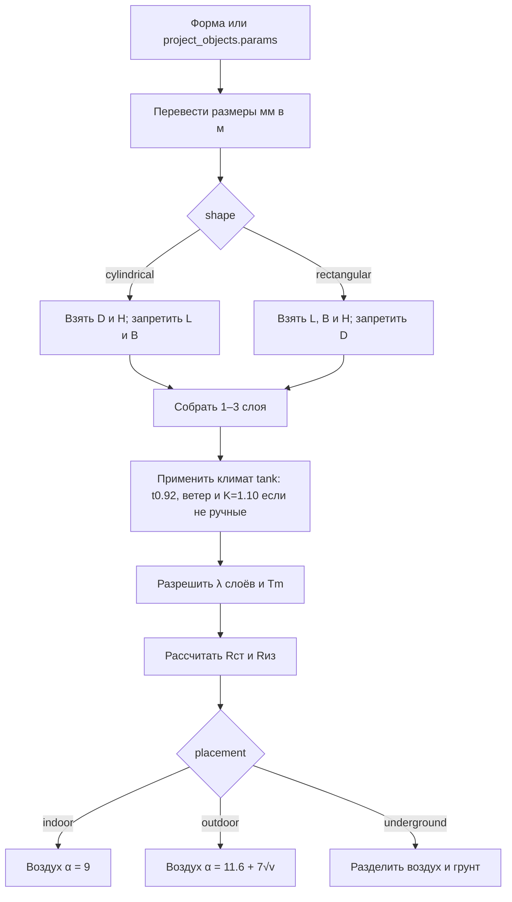
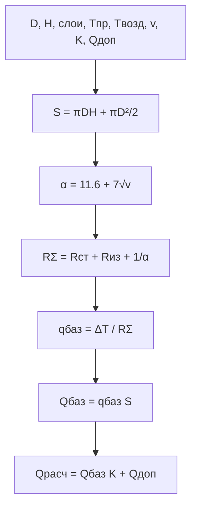
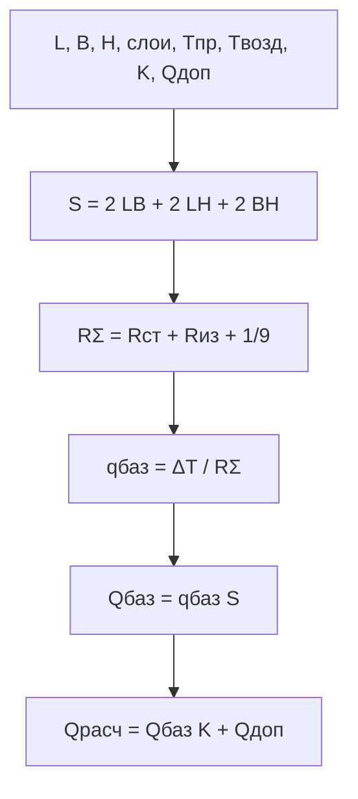
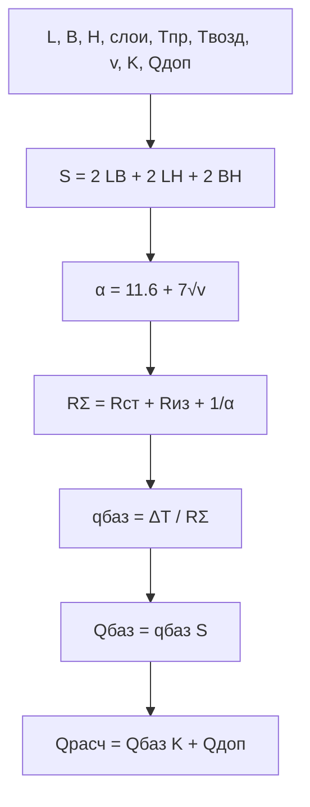
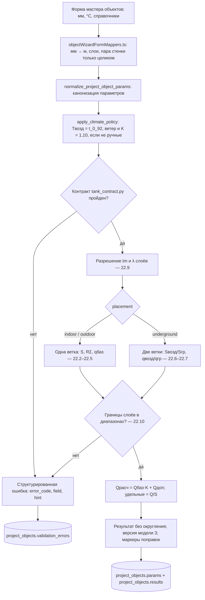
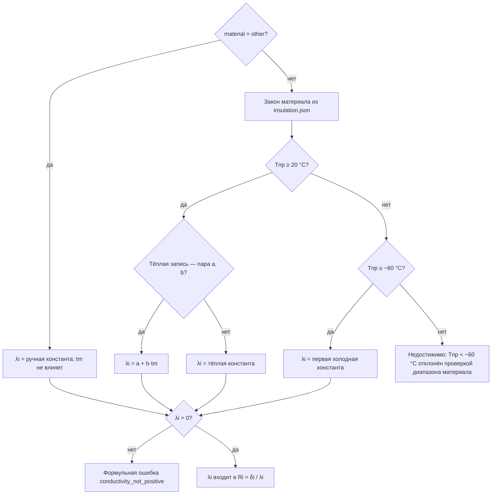
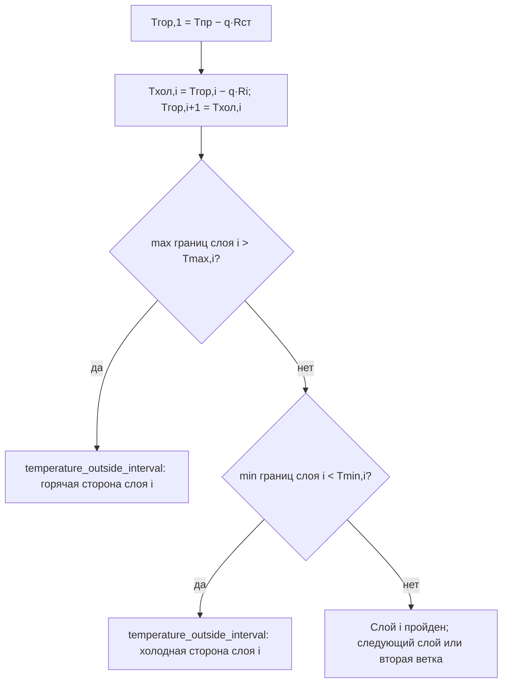

# Отчёт о фактическом расчёте теплопотерь резервуара

**Дата фиксации:** 2026-08-15  
**Проверено по коду:** HEAD 2b83d00  
**Статус:** снимок фактического поведения; не нормативная документация  
**Объект расчёта:** резервуар (`tank`), формульная модель `tank_heat_loss`, версия `3`  
**Аудитория:** продакт-оунер; описано текущее поведение («как есть»), не целевая методика  

Отчёт прослеживает путь данных от поля формы до сохранённого результата:
лейблы и имена полей, диапазоны frontend и backend, автозаполнение из
внутренних словарей, формулы и ветки расчёта, блокирующие ошибки, состав
результата. Зафиксировано текущее поведение кода, а не желаемая методика.

Путь данных:

    Форма (мм, °C)              лейблы и диапазоны          heatcalc-fields.default.json
      → payload API             мм → м, слои, пара стенки   objectWizardFormMappers.ts
      → климатическая политика  Tвозд=t_0_92, ветер, K=1,10 heat_loss_application.py
      → контракт входов         форма, размещение, пары     tank_contract.py
      → расчётное ядро          S, R, α, ветки воздух/грунт tank.py + tank_evaluation.py
      → публичный результат     без округления, маркеры     app/formulas/heat_loss/tank.py
      → объект проекта          project_objects.params / results / validation_errors

Сквозной пример (полный разбор — раздел 20.1): пользователь вводит цилиндр
2000×3000 мм, изоляцию 80 мм минераловатных плит 120 кг/м³, улицу с
\(T_{возд}=-30\) °C и ветром 3 м/с, K = 1,1. В API уходит
`shape=cylindrical`, `diameter=2.0`, `height=3.0`. Ядро считает
S = 25,133 м², q = 63,675 Вт/м²; в `project_objects.results` сохраняется
`total_heat_loss_design=1760.3471960366` Вт с полной float-точностью.

---

## 1. Краткий итог

| Вопрос | Фактическое состояние |
|---|---|
| Поддерживаемые формы | Цилиндр и параллелепипед |
| Неподдерживаемые формы | Сфера, произвольная ёмкость, днища специальной формы |
| Размещение | В помещении, на открытом воздухе, подземно/частично заглублённо |
| Модель стенки и изоляции | Установившаяся одномерная теплопроводность плоской стенки |
| Количество слоёв изоляции | 1–3 |
| Стенка резервуара | Необязательна; толщина и λ задаются только парой |
| Воздушное сопротивление | `Rвозд = 1/α` |
| Улица и надземная часть заглублённого резервуара | `α = 11,6 + 7√v` |
| Помещение | `α = 9 Вт/(м²·К)` |
| Грунтовая часть | `Rгр = h/λгр` |
| Коэффициент запаса | Ручной либо климатическая политика `K=1,10` |
| Дополнительная нагрузка | `Qдоп` прибавляется после умножения базовых потерь на K |
| Внутренние коэффициенты системы | Климат, изоляция и грунт участвуют через подготовленные значения; административные `safety_factor=1,1` и `ground_conductivity=1,5` формула резервуара не читает |
| Округление backend | Результаты резервуара возвращаются с полной `float`-точностью |

В коде явно сохранены три осознанные поправки к исходному документу:

1. воздушное сопротивление резервуара считается как удельное `1/α`;
2. температура воздуха и температура грунта считаются разными входами;
3. `Qдоп` прибавляется после коэффициента запаса.

В результате возвращаются маркеры:

```text
tank_external_resistance_is_areal_inverse_alpha
tank_air_and_ground_temperatures_are_separate
tank_additional_load_is_applied_after_safety_factor
```

---

## 2. Варианты расчёта

### 2.1. Варианты геометрии

| Лейбл формы | Значение `shape` | Обязательные размеры | Не принимаются |
|---|---|---|---|
| Цилиндрическая | `cylindrical` | `diameter`, `height` | `length`, `width` |
| Параллелепипед | `rectangular` | `length`, `width`, `height` | `diameter` |

Сферический резервуар текущим контрактом не поддерживается. Передача старого
значения формы приводит к ошибке ещё до выполнения формулы.

### 2.2. Варианты размещения

| Лейбл формы | `placement` | Температурные ветки | Внешнее сопротивление |
|---|---|---|---|
| В помещении | `indoor` | Только воздух | `1/9` |
| На открытом воздухе | `outdoor` | Только воздух | `1/(11,6+7√v)` |
| Подземно | `underground` | Отдельно воздух и грунт | Воздух: `1/(11,6+7√v)`; грунт: `h/λгр` |

`underground` в текущей реализации — модель частично заглублённого резервуара с
двумя параллельно учитываемыми участками поверхности, а не модель полностью
окружённой грунтом ёмкости.

---

## 3. Обозначения

| Обозначение | Величина | Единица |
|---|---|---:|
| `Tпр` | требуемая температура объекта/продукта | °C |
| `Tвозд` | температура воздуха | °C |
| `Tгр` | температура грунта | °C |
| `Tm` | расчётная температура для λ изоляции | °C |
| `D` | наружный диаметр цилиндра | м |
| `H` | полная высота резервуара | м |
| `L` | длина параллелепипеда | м |
| `B` | ширина параллелепипеда | м |
| `h` | высота части, контактирующей с грунтом | м |
| `δст` | толщина стенки | м |
| `λст` | теплопроводность стенки | Вт/(м·К) |
| `δi` | толщина слоя изоляции `i` | м |
| `λi` | теплопроводность слоя изоляции `i` | Вт/(м·К) |
| `λгр` | теплопроводность грунта | Вт/(м·К) |
| `v` | скорость ветра | м/с |
| `α` | коэффициент наружной теплоотдачи | Вт/(м²·К) |
| `Rст` | удельное сопротивление стенки | м²·К/Вт |
| `Ri` | удельное сопротивление слоя изоляции | м²·К/Вт |
| `Rиз` | сумма сопротивлений изоляции | м²·К/Вт |
| `Rвозд` | удельное сопротивление наружной теплоотдаче | м²·К/Вт |
| `Rгр` | принятое удельное сопротивление грунта | м²·К/Вт |
| `qвозд` | базовый поток через воздушную часть | Вт/м² |
| `qгр` | базовый поток через грунтовую часть | Вт/м² |
| `S` | полная площадь голой геометрии | м² |
| `Sвозд` | площадь, отнесённая к воздушной ветке | м² |
| `Sгр` | площадь, отнесённая к грунтовой ветке | м² |
| `K` | коэффициент запаса | безразмерный |
| `Qдоп` | вручную заданные дополнительные потери | Вт |
| `Qбаз` | базовые суммарные потери до K и Qдоп | Вт |
| `Qрасч` | проектные суммарные потери | Вт |

### 3.1. Как читать происхождение величин

В отчёте различаются источник, этап подготовки и место хранения значения.
Они не должны объединяться в одно слово «форма».

| Этап | На какой вопрос отвечает |
|---|---|
| Лейбл формы | Как поле называется именно в модальной форме резервуара; табличный лейбл может отличаться |
| Поле формы | Ключ значения во frontend-состоянии |
| Поле API/ядра | Канонический ключ после преобразования единиц и сборки слоёв |
| Первичный источник | Пользователь, климатический JSON, внутренний словарь, значение по умолчанию или вычисление |
| Разрешение и приоритет | Кто выбирает фактическое значение и что происходит при ручном переопределении |
| Маркер происхождения | Служебное поле `*_source` или правило политики; оно нужно для аудита, но не входит в уравнение |
| Участие | В какую ветвь, сопротивление, площадь, проверку или итог попадает значение |

Сохранённый объект — только этап хранения подготовленных значений. Например,
`ground_type` выбирается пользователем, `ground_conductivity` первоначально
приходит из внутреннего словаря грунтов либо вводится вручную, а формула
получает уже готовую `ground_conductivity`.

Перед формулами далее указываются:

- **Общепринятое название**, если оно действительно существует;
- **Смысл действия** — краткое объяснение роли шага.

Внутренние правила `Tm`, климатические политики, коэффициент запаса и
`Qдоп` не выдаются за фундаментальные законы: они помечаются как методические
или бизнес-правила.

---

## 4. Поля формы: геометрия и стенка

Диапазоны ниже разделены на frontend и backend намеренно: они не для всех полей
одинаковы.

| Лейбл модальной формы | Поле формы | Поле API/ядра | Обозначение | Frontend → backend | Первичный источник и разрешение | Маркер | Когда и как участвует |
|---|---|---|---:|---|---|---|---|
| Наименование | `name` | В формулу не передаётся | — | Текст, до 200 символов | Frontend формирует из параметров; пользователь может заменить | Нет | Только идентификация |
| Форма резервуара | `shape` | `shape` | — | `cylindrical/rectangular` | Пользователь | Нет | Всегда; выбирает формулу площади и допустимый набор размеров |
| Диаметр | `diameter_mm` | `diameter` | `D` | 100…30 000 мм → 0,1…30 м | Пользователь; mapper делит мм на 1000 | Нет | Только цилиндр; входит в площадь и проверку толщины стенки |
| Высота резервуара | `height_mm` | `height` | `H` | 100…50 000 мм → 0,1…50 м | Пользователь; mapper делит мм на 1000 | Нет | Обе формы; входит в площадь и ограничивает `h` |
| Длина резервуара | `length_mm` | `length` | `L` | 100…100 000 мм → 0,1…100 м | Пользователь; mapper делит мм на 1000 | Нет | Только параллелепипед; входит в площадь |
| Ширина резервуара | `width_mm` | `width` | `B` | 100…100 000 мм → 0,1…100 м | Пользователь; mapper делит мм на 1000 | Нет | Только параллелепипед; входит в площадь |
| Толщина стенки | `wall_thickness_mm` | `wall_thickness` | `δст` | 1…500 мм → 0,001…0,5 м | Пользователь; допустима только парой с `wall_lambda` | Наличие обоих полей фиксирует режим учёта стенки | Формирует `Rст=δст/λст`; без пары ядро использует нейтральное `Rст=0` |
| Теплопроводность стенки λ | `wall_lambda` | `wall_lambda` | `λст` | 0,001…400 → `0 < λ <= 500` Вт/(м·К) | Пользователь; отдельного справочника стенки резервуара нет | Аналогично толщине | Формирует `Rст` |

Если оба поля стенки не заполнены, ядро подставляет:

```text
wall_thickness = 0
wall_lambda = 1
Rст = 0/1 = 0
```

Это техническая нейтральная пара: она означает «сопротивление стенки не
учитывается».

Для цилиндра дополнительно требуется:

\[
\delta_{ст}<\frac D2
\]

Для параллелепипеда аналогичной связи между толщиной и размером нет.

---

## 5. Поля формы: размещение, температура и климат

| Лейбл модальной формы | Поле формы | Поле API/ядра | Обозначение | Frontend → backend | Первичный источник | Разрешение, приоритет и маркер | Как участвует |
|---|---|---|---:|---|---|---|---|
| Размещение | `placement` | `placement` | — | `indoor/outdoor/underground` | Пользователь | Отдельного source-маркера нет | Выбирает воздушную или двухветочную модель |
| Климат | `climate_key` | `climate_key` | — | Ключ одной из 539 строк JSON | Пользователь выбирает населённый пункт внутреннего климатического словаря | По ключу либо паре регион/город определяется одна строка | Сам в уравнение не входит; запускает подготовку воздуха и ветра |
| Регион | `climate_region` | `climate_region` | — | Текст | Внутренний климатический словарь после выбора | Метаданные/fallback поиска | В уравнение не входит |
| Населённый пункт | `climate_city` | `climate_city` | — | Текст | Внутренний климатический словарь после выбора | Метаданные/fallback поиска | В уравнение не входит |
| На форме скрыто; реестровый лейбл «Обеспеченность климата» | `climate_temperature_basis` | Метаданные `climate_temperature_basis` | — | `t_0_92/t_0_98/t_abs_min` | Backend-политика; пользователь в текущей модальной форме значение не выбирает | Для резервуара всегда `t_0_92`; правило `climate_policy_rule=non_pipe_cold_fiveday_0_92` | Объясняет выбор `Tвозд`, само в уравнение не входит |
| Требуемая температура объекта | `process_temperature` | `process_temperature` | `Tпр` | −90…600 °C → тот же диапазон | Пользователь | Только ручной ввод; source-маркера нет | Температурные напоры и выбор ветви λ |
| Температура окружающей среды | `ambient_temperature` | `ambient_temperature` | `Tвозд` | −70…70 °C → тот же диапазон | Пользователь либо `t_0_92` климатического JSON | Ручное значение с `ambient_temperature_source=manual` сохраняется при пассивном пересчёте; явный выбор климата делает источник `climate` | Воздушная ветка всех размещений |
| Скорость ветра | `wind_speed` | `wind_speed` | `v` | 0…20 м/с → тот же диапазон | Пользователь либо `wind_avg_cold`, иначе `wind_max_jan` климатического JSON | Ручное значение приоритетнее климата. Frontend заполняет интерактивно, backend независимо восстанавливает климатическое значение; `wind_speed_source=manual/climate` | α для `outdoor` и воздушной части `underground`; для `indoor` численно не влияет |
| Режим температуры изоляции (tm) | `insulation_temperature_basis` | `insulation_temperature_basis` | — | Enum зависит от `placement` | Пользователь либо frontend-default | Отдельного source-маркера нет | Выбирает методическое правило `Tm` |

Условия температур:

\[
T_{пр}>T_{возд}
\]

Для `underground` дополнительно:

\[
T_{пр}>T_{гр}
\]

Обратный поток тепла, когда воздух или грунт горячее объекта, текущая модель не
рассчитывает.

### 5.1. Климатическая политика резервуара

**Тип правила:** внутреннее бизнес-правило расчётных условий; устойчивого
общепринятого физического названия нет.

**Смысл действия:** автоматически выбрать расчётную температуру воздуха, ветер
и запас, сохранив явно ручные значения.

Независимо от формы и размеров резервуара backend выбирает:

\[
T_{возд}=t_{0,92}
\]

\[
K=1,10
\]

Служебное правило:

```text
non_pipe_cold_fiveday_0_92
```

Ручная температура с признаком `ambient_temperature_source=manual` сохраняется
при пассивных пересчётах. Явный выбор или повторный выбор климата на форме
заменяет её климатическим значением.

Скорость ветра на форме выбирается так:

\[
v=
\begin{cases}
wind\_avg\_cold, & \text{если заполнено}\\
wind\_max\_jan, & \text{иначе}
\end{cases}
\]

**Тип правила:** внутренняя климатическая политика, не физическая формула.

**Смысл действия:** получить расчётный ветер для воздушной поверхности и не
затереть явное ручное переопределение.

Frontend заполняет значение при выборе климата. Перед расчётом backend
независимо разрешает ту же климатическую строку и:

1. сохраняет явное ручное значение с `wind_speed_source=manual`;
2. иначе берёт `wind_avg_cold`, затем fallback `wind_max_jan`, и ставит
   `wind_speed_source=climate`;
3. применяет климатический ветер для `outdoor` и `underground`;
4. удаляет климатический ветер для `indoor`, где α постоянно и ветер не нужен.

Таким образом, расчёт резервуара больше не зависит от того, успел ли frontend
предварительно записать климатический ветер в payload.

### 5.2. Режимы `Tm`

**Тип правила:** методическое правило расчётной температуры изоляции, а не
фактическая средняя температура каждого слоя.

**Смысл действия:** дать внутреннему закону λ одну температуру до вычисления
реального распределения температур по слоям.

| Размещение | Варианты формы | Значение по умолчанию | Формула |
|---|---|---|---|
| В помещении | Помещение, Чердак, Подвал | `indoor` | `(Tпр+40)/2` |
| Открытый воздух | Лето, Зима | `outdoor_winter` | Зима: `Tпр/2`; лето: `(Tпр+40)/2` |
| Подземно | Канал, Тоннель, Техническое подполье | `channel` | `(Tпр+40)/2` |

---

## 6. Поля формы: изоляция

### 6.1. Количество слоёв

| Лейбл | Поле формы | Поле API/ядра | Frontend/backend | Первичный источник и разрешение | Участие |
|---|---|---|---|---|---|
| Количество слоёв изоляции | `insulation_layer_count` | Длина `insulation_layers` | 1–3 | Пользователь; frontend создаёт массив указанной длины | Само поле ядро не читает; определяет число сопротивлений `Ri` |

### 6.2. Поля каждого слоя

| Точный лейбл формы | Поле формы | Поле API/ядра | Обозначение | Frontend → backend | Первичный источник и разрешение | Как участвует |
|---|---|---|---:|---|---|---|
| Материал изоляции | `insulation_material` | `insulation_layers[0].material` | — | Код справочника или `other` | Пользователь выбирает код; backend разрешает закон λ и интервал во внутреннем словаре | Выбирает `λ1(Tm)` и допустимый интервал |
| Толщина изоляции | `insulation_thickness_mm` | `insulation_layers[0].thickness` | `δ1` | 0,01…500 мм → `0 < δ1 <= 0,5 м` | Пользователь; mapper делит мм на 1000 | Формирует `R1=δ1/λ1` |
| λ 1-го слоя | `first_insulation_lambda` | `insulation_layers[0].conductivity` | `λ1` | 0,001…400 → `0 < λ1 <= 400` | Ручной ввод только для `other`; иначе backend вычисляет λ из внутреннего закона | Входит в `R1` |
| Диапазон температур | `first_insulation_temperature_range` — составное поле; значения `first_insulation_temperature_min/max` | `insulation_layers[0].temperature_range` | `Tmin,1`, `Tmax,1` | Каждая граница −273…1000 °C; backend требует `Tmin < Tmax` | Ручное изменение переводит слой в `other`; для справочного материала обе границы даёт внутренний словарь | Проверяет горячую и холодную стороны; в тепловое уравнение не входит |
| Материал 2-го слоя | `second_insulation_material` | `insulation_layers[1].material` | — | Код справочника или `other` | Пользователь выбирает код; backend разрешает внутренний закон/интервал | Выбирает `λ2(Tm)` и допустимый интервал |
| Толщина 2-го слоя | `second_insulation_thickness_mm` | `insulation_layers[1].thickness` | `δ2` | 0,01…500 мм → `0 < δ2 <= 0,5 м` | Пользователь; mapper делит мм на 1000 | Формирует `R2` |
| λ 2-го слоя | `second_insulation_lambda` | `insulation_layers[1].conductivity` | `λ2` | 0,001…400 → `0 < λ2 <= 400` | Ручной ввод для `other` либо вычисление backend из справочника | Входит в `R2` |
| Диапазон температур | `second_insulation_temperature_range` — составное поле; значения `second_insulation_temperature_min/max` | `insulation_layers[1].temperature_range` | `Tmin,2`, `Tmax,2` | Каждая граница −273…1000 °C; backend требует `Tmin < Tmax` | Ручное изменение переводит слой в `other`; иначе внутренний словарь | Только проверка обеих границ |
| Материал 3-го слоя | `third_insulation_material` | `insulation_layers[2].material` | — | Код справочника или `other` | Пользователь выбирает код; backend разрешает внутренний закон/интервал | Выбирает `λ3(Tm)` и допустимый интервал |
| Толщина 3-го слоя | `third_insulation_thickness_mm` | `insulation_layers[2].thickness` | `δ3` | 0,01…500 мм → `0 < δ3 <= 0,5 м` | Пользователь; mapper делит мм на 1000 | Формирует `R3` |
| λ 3-го слоя | `third_insulation_lambda` | `insulation_layers[2].conductivity` | `λ3` | 0,001…400 → `0 < λ3 <= 400` | Ручной ввод для `other` либо вычисление backend из справочника | Входит в `R3` |
| Диапазон температур | `third_insulation_temperature_range` — составное поле; значения `third_insulation_temperature_min/max` | `insulation_layers[2].temperature_range` | `Tmin,3`, `Tmax,3` | Каждая граница −273…1000 °C; backend требует `Tmin < Tmax` | Ручное изменение переводит слой в `other`; иначе внутренний словарь | Только проверка обеих границ |

Справочный материал:

- пользователь выбирает код;
- λ и температурный диапазон берутся из внутреннего словаря изоляции;
- ручные `conductivity` и `temperature_range` передавать запрещено.

Материал `other`:

- пользователь задаёт постоянную λ;
- пользователь задаёт `Tmin` и `Tmax`;
- оба значения диапазона обязательны;
- λ не зависит от температуры.

### 6.3. Как определяется λ справочного слоя

**Тип формулы:** кусочно-заданная эмпирическая температурная зависимость λ из
внутреннего словаря.

**Смысл действия:** превратить код материала, `Tпр` и `Tm` в числовую λ для
закона Фурье и одновременно выбрать допустимую ветвь справочника.

В выборе λ участвуют две температуры:

- `Tпр` выбирает тёплую или холодную ветвь справочника;
- `Tm` подставляется в тёплую формулу.

При:

\[
T_{пр}\ge20^\circ C
\]

используется:

\[
\lambda_i=a_i+b_iT_m
\]

Если тёплая запись — одно число, λ постоянна.

При:

\[
-60\le T_{пр}<20^\circ C
\]

используется первая холодная константа. В справочнике есть и вторые холодные
значения ниже −60 °C, но все 30 выбираемых материалов имеют разрешённый диапазон
−60…400 °C, поэтому эта ветвь недостижима через валидный объект.

---

## 7. Текущий выбираемый справочник изоляции

В колонке «тёплая запись» пара означает `a; b` для `a+b·Tm`. В колонке
«холодная запись» пара означает значение для −60…19 °C и значение ниже −60 °C.

| Код | Материал | Плотность, кг/м³ | Тёплая запись | Холодная запись |
|---|---|---:|---|---|
| `mineral_wool_boards_120` | Плиты минераловатные прошивные | 120 | 0,045; 0,00021 | 0,044; 0,035 |
| `mineral_wool_boards_150` | Плиты минераловатные прошивные | 150 | 0,049; 0,00020 | 0,048; 0,037 |
| `mineral_wool_synthetic_65` | Плиты из минеральной ваты на синтетическом связующем | 65 | 0,040; 0,00029 | 0,039; 0,030 |
| `mineral_wool_synthetic_95` | То же | 95 | 0,043; 0,00022 | 0,042; 0,031 |
| `mineral_wool_synthetic_120` | То же | 120 | 0,044; 0,00021 | 0,043; 0,032 |
| `mineral_wool_synthetic_180` | То же | 180 | 0,052; 0,00020 | 0,051; 0,038 |
| `aeroflex_epdm_60` | Аэрофлекс, вспененный ЭПДМ | 60 | 0,034; 0,00020 | 0,033; 0,033 |
| `mineral_wool_cylinders_50` | Полуцилиндры и цилиндры минераловатные | 50 | 0,040; 0,00003 | 0,039; 0,029 |
| `mineral_wool_cylinders_80` | То же | 80 | 0,044; 0,00022 | 0,043; 0,032 |
| `mineral_wool_cylinders_100` | То же | 100 | 0,049; 0,00021 | 0,048; 0,036 |
| `mineral_wool_cylinders_150` | То же | 150 | 0,050; 0,00020 | 0,049; 0,035 |
| `mineral_wool_cylinders_200` | То же | 200 | 0,053; 0,00019 | 0,052; 0,038 |
| `mineral_wool_cord_200` | Шнур теплоизоляционный из минеральной ваты | 200 | 0,056; 0,00019 | 0,055; 0,040 |
| `fiberglass_mats_50` | Маты из стеклянного штапельного волокна | 50 | 0,040; 0,00030 | 0,039; 0,029 |
| `fiberglass_mats_70` | То же | 70 | 0,042; 0,00028 | 0,041; 0,030 |
| `superfine_glass_fiber_70` | Супертонкое стеклянное волокно | 70 | 0,033; 0,00014 | 0,032; 0,024 |
| `superfine_basalt_fiber_80` | Супертонкое базальтовое волокно | 80 | 0,032; 0,00019 | 0,031; 0,024 |
| `expanded_perlite_sand_110` | Песок перлитовый вспученный | 110 | 0,052; 0,00012 | 0,051; 0,038 |
| `expanded_perlite_sand_150` | То же | 150 | 0,055; 0,00012 | 0,054; 0,040 |
| `expanded_perlite_sand_225` | То же | 225 | 0,058; 0,00012 | 0,057; 0,042 |
| `polystyrene_products_30` | Изделия из пенополистирола | 30 | 0,033; 0,00018 | 0,032; 0,024 |
| `polystyrene_products_50` | То же | 50 | 0,036; 0,00018 | 0,035; 0,026 |
| `polystyrene_products_100` | То же | 100 | 0,041; 0,00018 | 0,040; 0,030 |
| `polyurethane_products_40` | Изделия из пенополиуретана | 40 | 0,030; 0,00015 | 0,029; 0,024 |
| `polyurethane_products_50` | То же | 50 | 0,032; 0,00015 | 0,031; 0,025 |
| `polyurethane_products_70` | То же | 70 | 0,037; 0,00015 | 0,036; 0,027 |
| `k_flex_ec` | Кайманфлекс K-Flex EC | 60–80 | 0,036 | 0,034 |
| `k_flex_st` | Кайманфлекс K-Flex ST | 60–80 | 0,036 | 0,034 |
| `k_flex_eco` | Кайманфлекс K-Flex ECO | 60–95 | 0,040 | 0,036 |
| `polyethylene_foam_50` | Изделия из пенополиэтилена | 50 | 0,035; 0,00018 | 0,033; 0,033 |

Шесть общих старых кодов (`mineral_wool`, `foam_glass`, `polyurethane`,
`polystyrene`, `aerogel`, `calcium_silicate`) остаются во внутреннем словаре для старых данных,
но отмечены как устаревшие и требуют повторного выбора конкретного материала.

---

## 8. Подземные поля и справочник грунта

Поля видимы только при `placement=underground`.

| Лейбл модальной формы | Поле формы | Поле API/ядра | Обозначение | Frontend/backend | Первичный источник и разрешение | Маркер | Как участвует |
|---|---|---|---:|---|---|---|---|
| Высота подземной части | `tank_buried_height` | `tank_buried_height` | `h` | 0,01…50 м; backend `0 < h <= 50` и `h <= H` | Пользователь | Нет | Делит поверхность на воздушную/грунтовую и задаёт `Rгр=h/λгр` |
| Температура грунта | `ground_temperature` | `ground_temperature` | `Tгр` | −70…70 °C | В текущей форме пользователь; backend-климатическая политика её не рассчитывает | `ground_temperature_source`; контракт допускает `manual/climate`, штатный путь — `manual` | Температурный напор грунтовой ветки |
| Тип грунта | `ground_type` | Метаданные `ground_type` | — | 29 строк либо `custom` | Пользователь выбирает строку внутреннего словаря грунтов | Код выбранной строки | Формула код не читает; frontend по нему получает λ |
| Теплопроводность грунта λ | `ground_conductivity` | `ground_conductivity` | `λгр` | 0,5…3,0 Вт/(м·К) | Значение выбранной строки внутреннего словаря либо ручной ввод для `custom` | `ground_conductivity_source=reference/manual` | `Rгр=h/λгр` |

Даже подземный резервуар обязан иметь:

- температуру воздуха;
- скорость ветра;
- температуру грунта;
- λ грунта;
- высоту заглублённой части.

Причина — у него всегда рассчитывается воздушная ветка поверхности.

### 8.1. Фактические строки грунтов

| Грунт | Код | Плотность, кг/м³ | Влажность, % | λ, Вт/(м·К) |
|---|---|---:|---:|---:|
| Песок | `pesok` | 1480 | 4 | 0,86 |
| Песок | `pesok` | 1480 | 5 | 1,11 |
| Песок | `pesok` | 1600 | 15 | 1,92 |
| Песок | `pesok` | 1600 | 23,8 | 1,92 |
| Суглинок | `suglinok` | 1100 | 8 | 0,71 |
| Суглинок | `suglinok` | 1100 | 15 | 0,90 |
| Суглинок | `suglinok` | 1200 | 8 | 0,83 |
| Суглинок | `suglinok` | 1200 | 15 | 1,04 |
| Суглинок | `suglinok` | 1300 | 8 | 0,98 |
| Суглинок | `suglinok` | 1300 | 15 | 1,20 |
| Суглинок | `suglinok` | 1300 | 8 | 1,12 |
| Суглинок | `suglinok` | 1400 | 15 | 1,36 |
| Суглинок | `suglinok` | 1400 | 20 | 1,63 |
| Суглинок | `suglinok` | 1400 | 8 | 1,27 |
| Суглинок | `suglinok` | 1500 | 15 | 1,56 |
| Суглинок | `suglinok` | 1500 | 20 | 1,86 |
| Суглинок | `suglinok` | 1600 | 8 | 1,45 |
| Суглинок | `suglinok` | 1600 | 15 | 1,78 |
| Суглинок | `suglinok` | 1600 | 5 | 1,75 |
| Суглинок | `suglinok` | 2000 | 10 | 2,56 |
| Суглинок | `suglinok` | 2000 | 11,5 | 2,68 |
| Глинистые | `glinistye` | 2000 | 8 | 0,72 |
| Глинистые | `glinistye` | 1300 | 18 | 1,08 |
| Глинистые | `glinistye` | 1300 | 40 | 1,66 |
| Глинистые | `glinistye` | 1300 | 8 | 1,00 |
| Глинистые | `glinistye` | 1500 | 18 | 1,46 |
| Глинистые | `glinistye` | 1500 | 40 | 2,00 |
| Глинистые | `glinistye` | 1600 | 8 | 1,13 |
| Глинистые | `glinistye` | 1600 | 27 | 1,93 |

В первой строке «Глинистые» плотность 2000 кг/м³ перенесена во внутренний словарь из
предыдущего значения исходной таблицы, потому что соответствующая ячейка XLSX
пуста. λ=0,72 взята непосредственно из исходной строки.

---

## 9. Коэффициент запаса и дополнительные потери

| Лейбл модальной формы | Поле формы/API | Обозначение | Frontend/backend | Первичный источник | Разрешение и маркер | Как участвует |
|---|---|---:|---|---|---|---|
| Коэффициент запаса (Kзап) | `safety_factor` | `K` | 1,05…1,70 на форме; 1,00…1,70 в backend | Пользователь, политика резервуара либо frontend-default | Приоритет: `manual` → политика 1,10 → обязательное подготовленное значение. `safety_factor_source=manual/default/climate_policy` | Умножает `Qбаз` |
| Дополнительные теплопотери | `q_additional` | `Qдоп` | От 0 Вт, без конечного верхнего лимита | Пользователь; при отсутствии подготовка использует 0 | Отдельного source-маркера нет | Прибавляется после K и увеличивает проектные суммарные и средние удельные потери |

Текущая форма префиллит K = 1,10 с `safety_factor_source=default`;
климатическая политика вправе перезаписать такое значение, ручной ввод — нет.

Фактическая формула:

**Тип действия:** инженерное постобрабатывающее правило; это не
общепринятый закон теплопередачи.

**Смысл действия:** сначала применить коэффициент запаса ко всем базовым
поверхностным потерям, затем добавить отдельную мощность неучтённых элементов.

\[
Q_{расч}=Q_{баз}K+Q_{доп}
\]

`Qдоп`:

- не входит в `Qбаз`;
- не умножается на K;
- входит в `Qрасч`;
- не изменяет базовые Вт/м²;
- изменяет проектные Вт/м², потому что они вычисляются как `Qрасч/S`.

Текущее описание поля на форме соответствует этой формуле: оно прямо говорит,
что `Qдоп` прибавляется после коэффициента запаса, влияет на проектные удельные
потери и не должно повторно учитывать днище, уже включённое в площадь.

---

## 10. Что берётся с формы и из внутренних словарей системы

| Источник | Фактические данные | Участие в резервуаре |
|---|---|---|
| Форма объекта | Ручная геометрия, температуры, размещение, выборы слоёв/грунта, стенка, ручные K и Qдоп | Первичные пользовательские входы и выборы |
| Frontend-подготовка | Перевод мм→м, сборка `insulation_layers`, интерактивное автозаполнение справочных значений | Формирует API payload, но не является первичным источником справочных величин |
| Backend-климатическая политика | Повторное разрешение климатической строки, приоритет ручных значений, установка source-маркеров | Делает расчёт независимым от порядка автозаполнения формы |
| Сохранённые параметры объекта | Канонические значения формы, подготовленные справочные значения и метаданные происхождения | Этап хранения; после повторной валидации идут в расчёт |
| Внутренний словарь климата | `t_0_92`, `t_0_98`, `t_abs_min`, `wind_avg_cold`, `wind_max_jan` | Для резервуара применяется `t_0_92`; ветер разрешают frontend и backend |
| Внутренний словарь изоляции | Закон λ и диапазон 30 выбираемых материалов | Разрешает λ слоёв |
| Внутренний словарь грунтов | 29 числовых λ грунтов | Заполняет `ground_conductivity` до формулы |
| Внутренние административные коэффициенты | Общесистемные значения, включая `safety_factor` и `ground_conductivity` | Формула резервуара не читает эти два значения |
| Профиль формул в коде | `αindoor=9`, `11,6`, `7`, опорные 40 °C | Используется непосредственно |

Технический формат хранения для этого отчёта несущественен: климат,
изоляция, грунт и системные коэффициенты далее называются внутренними
словарями и коэффициентами системы. Конкретные файлы перечислены в разделе 25
только для трассировки к реализации.

### 10.1. Фактическое участие внутренних коэффициентов

В текущем состоянии системы присутствуют:

| Ключ | Значение | Резервуар |
|---|---:|---|
| `safety_factor` | 1,1 | Не читается формулой резервуара; K уже обязателен во входном контракте |
| `ground_conductivity` | 1,5 | Не читается формулой резервуара; λ приходит с подготовленным объектом |

Все коммерческие и электротехнические коэффициенты также не участвуют в
теплопотерях резервуара.

### 10.2. Поля происхождения

Следующие значения сохраняются для аудита, но не входят непосредственно в
уравнения:

| Поле | Значения/назначение |
|---|---|
| `ambient_temperature_source` | `manual` или `climate` |
| `wind_speed_source` | `manual` или `climate` |
| `ground_temperature_source` | `manual` или `climate`; текущая форма ставит `manual`, backend-климатическая политика T грунта не рассчитывает |
| `ground_conductivity_source` | `manual` или `reference` |
| `safety_factor_source` | `manual`, `default`, `climate_policy` |
| `climate_policy_rule` | для резервуара `non_pipe_cold_fiveday_0_92` |
| `climate_key`, `climate_city`, `climate_region` | идентификация строки климата |

### 10.3. Что рассчитывается системой

- перевод введённых размеров и толщин из мм в м;
- климатическая температура воздуха, климатический ветер и K, если значения
  не зафиксированы как ручные;
- расчётная температура изоляции `Tm`;
- λ каждого справочного слоя при `Tm`;
- площадь всего резервуара, а для `underground` — отдельно воздушная и
  грунтовая площади;
- сопротивление стенки, каждого слоя, всей изоляции, воздуха и грунта;
- коэффициент наружной теплоотдачи α;
- температуры на границах слоёв;
- базовые удельные и суммарные потери;
- отдельно базовые мощности воздушной и грунтовой веток `underground`;
- проектные суммарные потери после K и Qдоп;
- проектные средние удельные потери;
- применённые значения, единицы, допущения и маркеры версии модели.

Полный перечень полей результата приведён в разделе 19. То, что присутствует
в объекте, но не входит в тепловую формулу, отдельно перечислено в разделе 21.

---

## 11. Перевод единиц

**Тип действия:** размерностное преобразование, не тепловая формула.

**Смысл действия:** привести геометрию и толщины к СИ до расчёта площадей и
сопротивлений.

Frontend принимает геометрию резервуара и стенку в миллиметрах:

\[
D=\frac{D_{мм}}{1000},\quad
H=\frac{H_{мм}}{1000},\quad
L=\frac{L_{мм}}{1000},\quad
B=\frac{B_{мм}}{1000}
\]

\[
\delta_{ст}=\frac{\delta_{ст,мм}}{1000},\quad
\delta_i=\frac{\delta_{i,мм}}{1000}
\]

`tank_buried_height` уже вводится в метрах. Температуры передаются в °C;
разность температур численно равна разности в К.

---

## 12. Названия и типы стандартных формул

В реализации используются следующие известные модели:

| Часть расчёта | Общепринятое название | Фактическая запись | Краткий смысл |
|---|---|---|---|
| Стенка и изоляция | Закон Фурье для установившейся одномерной теплопроводности через плоскую стенку | `R=δ/λ`, `q=ΔT/RΣ` | Превращает толщину и λ каждого слоя в удельное сопротивление |
| Сумма слоёв | Метод термических сопротивлений; последовательное соединение | `RΣ=Rст+ΣRi+Rвнеш` | Складывает последовательные температурные перепады одной ветки |
| Поверхность–воздух | Закон Ньютона–Рихмана через сопротивление теплоотдаче | `Rвозд=1/α` | Учитывает переход тепла от наружной поверхности к воздуху |
| Влияние ветра | Именованного универсального закона нет; эмпирическая корреляция из ТНП | `α=11,6+7√v` | Назначает эффективную наружную теплоотдачу по скорости ветра |
| Площадь | Формулы площади замкнутого кругового цилиндра и прямоугольного параллелепипеда | См. раздел 13 | Переводит удельный поток Вт/м² в суммарную мощность |
| Частичное заглубление | Принцип суперпозиции независимых тепловых потоков по участкам поверхности | `Qбаз=qвоздSвозд+qгрSгр` | Отдельно считает воздух и грунт, затем складывает мощности |
| Грунтовая ветка | Закон Фурье для условного плоского слоя грунта | `Rгр=h/λгр` | Принимает высоту заглубления за толщину плоского слоя; это упрощение текущей модели |
| Проектная нагрузка | Физического стандартного названия нет; инженерное постобрабатывающее правило | `Qрасч=Qбаз*K+Qдоп` | Сначала применяет запас, затем добавляет отдельную мощность |

Важно: для цилиндрического резервуара сопротивления стенки и изоляции не
рассчитываются по точному цилиндрическому логарифмическому закону. Текущая
модель сознательно использует плоскую стенку `δ/λ`, как записано в принятой
трактовке ТНП.

---

## 13. Расчёт площади поверхности

Используются исходные размеры резервуара без увеличения на толщину изоляции.
Поэтому поля результата называются `surface_area_bare` и
`heat_loss_per_m2_bare_*`.

**Общепринятое название:** геометрические формулы площади замкнутого кругового
цилиндра и прямоугольного параллелепипеда.

**Смысл действия:** определить площадь, по которой удельный поток Вт/м²
превращается в суммарную мощность; для `underground` дополнительно разделить её
между воздухом и грунтом.

### 13.1. Полный цилиндр

**Смысл действия:** сложить боковую поверхность и два плоских круглых торца.

Боковая поверхность:

\[
S_{бок}=\pi DH
\]

Два плоских торца:

\[
S_{торцы}=2\frac{\pi D^2}{4}=\frac{\pi D^2}{2}
\]

Полная площадь:

\[
\boxed{S=\pi DH+\frac{\pi D^2}{2}}
\]

### 13.2. Полный параллелепипед

**Смысл действия:** сложить площади трёх пар противоположных граней.

\[
\boxed{S=2(LB+LH+BH)}
\]

Эквивалентно:

\[
S=2LB+2(L+B)H
\]

### 13.3. Частично заглублённый цилиндр

**Тип действия:** геометрическое разбиение поверхности на два непересекающихся
участка.

**Смысл действия:** отнести верхний торец и надземную боковую часть к воздуху,
а нижний торец и заглублённую боковую часть — к грунту.

Воздушная высота:

\[
H_{возд}=H-h
\]

Верхний торец и боковая часть над грунтом:

\[
\boxed{S_{возд}=\frac{\pi D^2}{4}+\pi D(H-h)}
\]

Нижний торец и боковая часть в грунте:

\[
\boxed{S_{гр}=\frac{\pi D^2}{4}+\pi Dh}
\]

При этом:

\[
S_{возд}+S_{гр}=S
\]

### 13.4. Частично заглублённый параллелепипед

**Смысл действия:** тем же способом разделить верх/надземные стенки и
дно/заглублённые стенки прямоугольного резервуара.

Верх и боковые стенки над грунтом:

\[
\boxed{S_{возд}=LB+2(L+B)(H-h)}
\]

Дно и боковые стенки в грунте:

\[
\boxed{S_{гр}=LB+2(L+B)h}
\]

И снова:

\[
S_{возд}+S_{гр}=S
\]

При `h=H` верхняя крышка всё равно остаётся в воздушной ветке, а дно — в
грунтовой. Поэтому даже максимально заглублённый текущей формой резервуар
требует воздух и ветер.

---

## 14. Термические сопротивления

### 14.1. Стенка

**Общепринятое название:** закон Фурье для удельного сопротивления плоской
стенки.

**Смысл действия:** учесть перепад температуры в материале стенки; отсутствие
пары толщины/λ делает сопротивление нулевым.

Если пара стенки задана:

\[
R_{ст}=\frac{\delta_{ст}}{\lambda_{ст}}
\]

Если пара не задана:

\[
R_{ст}=0
\]

### 14.2. Слой изоляции

**Общепринятое название:** закон Фурье для многослойной плоской стенки;
последовательное соединение сопротивлений.

**Смысл действия:** превратить толщину и λ каждого слоя в `Ri` и сложить все
слои одной тепловой ветки.

Для каждого слоя:

\[
R_i=\frac{\delta_i}{\lambda_i}
\]

Сумма 1–3 слоёв:

\[
R_{из}=\sum_{i=1}^{N}R_i
\]

### 14.3. Воздух

**Общепринятое название:** закон Ньютона–Рихмана, записанный через удельное
сопротивление теплоотдаче `1/α`.

**Смысл действия:** учесть переход тепла с наружной поверхности в воздух;
эмпирическая ветровая корреляция определяет α на улице.

В помещении:

\[
\alpha=9
\]

На улице и для воздушной части `underground`:

\[
\alpha=11{,}6+7\sqrt v
\]

Удельное сопротивление:

\[
\boxed{R_{возд}=\frac1\alpha}
\]

Единица всех сопротивлений резервуара:

\[
[R]=\text{м}^2\cdot\text{К/Вт}
\]

### 14.4. Грунт

**Общепринятое название:** закон Фурье для условного плоского слоя грунта.

**Смысл действия:** представить грунт плоским слоем толщиной `h`. Это название
относится к математической форме `δ/λ`, а не подтверждает физическую
эквивалентность реальному трёхмерному грунту.

Текущая формула принимает толщину грунтовой плоской стенки равной высоте
заглубления:

\[
\boxed{R_{гр}=\frac h{\lambda_{гр}}}
\]

Это не цилиндрическая модель распространения тепла в массиве грунта, а
удельное плоское сопротивление.

---

## 15. Воздушный резервуар: помещение или улица

**Общепринятое название:** метод последовательных термических сопротивлений и
тепловой аналог закона Ома.

**Смысл действия:** получить единый поток Вт/м² через стенку, изоляцию и воздух,
умножить его на площадь, затем применить проектные добавки.

Полное удельное сопротивление:

\[
R_\Sigma=R_{ст}+R_{из}+R_{возд}
\]

Базовые удельные потери:

\[
\boxed{q_{баз}=\frac{T_{пр}-T_{возд}}{R_\Sigma}}
\]

Базовые суммарные потери:

\[
\boxed{Q_{баз}=q_{баз}S}
\]

Проектные суммарные потери:

\[
\boxed{Q_{расч}=Q_{баз}K+Q_{доп}}
\]

Проектные удельные потери:

\[
\boxed{q_{расч}=\frac{Q_{расч}}S}
\]

Отсюда:

\[
q_{расч}=q_{баз}K+\frac{Q_{доп}}S
\]

Разница между `indoor` и `outdoor` только в способе определения α. Площадь,
слои, температурный напор и порядок применения K/Qдоп одинаковы.

### 15.1. Полная формула воздушного цилиндра

**Название модели:** стационарная плоско-стеночная аппроксимация теплопередачи
замкнутого цилиндрического резервуара.

**Смысл действия:** объединить сопротивления и полную площадь цилиндра в одну
формулу проектной мощности.

\[
\boxed{
Q_{расч}=
\frac{T_{пр}-T_{возд}}
{\delta_{ст}/\lambda_{ст}+\sum_i\delta_i/\lambda_i+1/\alpha}
\left(\pi DH+\frac{\pi D^2}{2}\right)K+Q_{доп}
}
\]

### 15.2. Полная формула воздушного параллелепипеда

**Название модели:** стационарная одномерная теплопередача через плоские грани
прямоугольного резервуара.

**Смысл действия:** применить один удельный поток ко всей площади шести граней.

\[
\boxed{
Q_{расч}=
\frac{T_{пр}-T_{возд}}
{\delta_{ст}/\lambda_{ст}+\sum_i\delta_i/\lambda_i+1/\alpha}
\cdot2(LB+LH+BH)K+Q_{доп}
}
\]

---

## 16. Частично заглублённый резервуар

**Общепринятое название:** принцип суперпозиции независимых тепловых потоков по
участкам поверхности.

**Смысл действия:** отдельно посчитать мощность через воздушный и грунтовый
участки с разными температурами и внешними сопротивлениями, затем сложить их.

Воздушное сопротивление ветки:

\[
R_{\Sigma,возд}=R_{ст}+R_{из}+R_{возд}
\]

Грунтовое сопротивление ветки:

\[
R_{\Sigma,гр}=R_{ст}+R_{из}+R_{гр}
\]

Поток через воздушную часть:

\[
\boxed{q_{возд}=\frac{T_{пр}-T_{возд}}{R_{\Sigma,возд}}}
\]

Поток через грунтовую часть:

\[
\boxed{q_{гр}=\frac{T_{пр}-T_{гр}}{R_{\Sigma,гр}}}
\]

Мощности веток:

\[
Q_{возд,баз}=q_{возд}S_{возд}
\]

\[
Q_{гр,баз}=q_{гр}S_{гр}
\]

Базовая сумма:

\[
\boxed{Q_{баз}=Q_{возд,баз}+Q_{гр,баз}}
\]

Проектная сумма:

\[
\boxed{Q_{расч}=(q_{возд}S_{возд}+q_{гр}S_{гр})K+Q_{доп}}
\]

Публичные удельные значения вычисляются как средние по полной площади:

\[
q_{баз,ср}=\frac{Q_{баз}}{S_{возд}+S_{гр}}
\]

\[
q_{расч,ср}=\frac{Q_{расч}}{S_{возд}+S_{гр}}
\]

Единого `thermal_resistance_areal_bare` для заглублённой ветки нет, поэтому в
результате оно равно `null`. Отдельно возвращаются воздушное и грунтовое
сопротивления и мощности.

### 16.1. Полная формула заглублённого цилиндра

**Название модели:** двухзонная стационарная модель частично заглублённого
цилиндра в плоско-стеночной аппроксимации.

**Смысл действия:** применить воздушную и грунтовую ветки к их частям площади.

\[
\boxed{
Q_{расч}=\left[
\frac{T_{пр}-T_{возд}}
{R_{ст}+R_{из}+1/\alpha}
\left(\frac{\pi D^2}{4}+\pi D(H-h)\right)
+
\frac{T_{пр}-T_{гр}}
{R_{ст}+R_{из}+h/\lambda_{гр}}
\left(\frac{\pi D^2}{4}+\pi Dh\right)
\right]K+Q_{доп}
}
\]

### 16.2. Полная формула заглублённого параллелепипеда

**Название модели:** двухзонная стационарная модель частично заглублённого
прямоугольного резервуара.

**Смысл действия:** сложить независимые мощности надземных и заглублённых
граней.

\[
\boxed{
Q_{расч}=\left[
\frac{T_{пр}-T_{возд}}
{R_{ст}+R_{из}+1/\alpha}
\left(LB+2(L+B)(H-h)\right)
+
\frac{T_{пр}-T_{гр}}
{R_{ст}+R_{из}+h/\lambda_{гр}}
\left(LB+2(L+B)h\right)
\right]K+Q_{доп}
}
\]

---

## 17. Температуры на границах изоляции

**Общепринятое название:** распределение температур по последовательной цепи
термических сопротивлений.

**Смысл действия:** восстановить горячую и холодную стороны каждого слоя по
падению `q·Ri` и проверить весь температурный интервал материала.

Для воздушной ветки температура после стенки:

\[
T_{гор,1}=T_{пр}-q_{возд}R_{ст}
\]

Для грунтовой ветки:

\[
T_{гор,1,гр}=T_{пр}-q_{гр}R_{ст}
\]

Для каждого слоя соответствующей ветки:

\[
T_{хол,i}=T_{гор,i}-qR_i
\]

\[
T_{гор,i+1}=T_{хол,i}
\]

Текущий валидатор проверяет обе границы каждого слоя против диапазона
материала:

\[
T_{гор,i}\le T_{max,i},
\qquad
T_{хол,i}\ge T_{min,i}
\]

Сначала горячая граница сверяется с максимумом; если она в норме, холодная
сверяется с минимумом. В сообщении об ошибке называется нарушенная граница —
«горячая» или «холодная» сторона слоя. Для `underground` проверка выполняется
отдельно по воздушной и грунтовой веткам.

Числовой пример из раздела 20.1 (\(q=63{,}675\) Вт/м²,
\(R_{ст}=0{,}00016\), \(R_1=1{,}528176\)):

\[
T_{гор,1}=70-63{,}675\cdot0{,}00016=69{,}99\ °C
\]

\[
T_{хол,1}=69{,}99-63{,}675\cdot1{,}528176=-27{,}31\ °C
\]

Диапазон материала −60…400 °C: обе границы внутри, расчёт проходит.

---

## 18. Полная последовательность текущего расчёта

| Фаза | Что происходит | Зачем |
|---|---|---|
| Нормализация | Размеры переводятся в СИ, поля слоёв собираются в массив, отсекаются размеры чужой формы | Создать однозначный канонический вход |
| Разрешение источников | Выбираются ручные/климатические воздух и ветер, K, λ и интервалы материалов | Получить одно фактическое значение с объяснимым происхождением |
| Валидация | Проверяются диапазоны, форма, размещение, пары полей и материалы | Остановить расчёт до появления бессмысленных площадей или сопротивлений |
| Геометрия и сопротивления | Считаются площади и цепи воздушной/грунтовой веток | Подготовить множитель площади и знаменатель теплового потока |
| Потоки и границы | Считаются Вт/м², мощности участков и температуры сторон слоёв | Получить физический базовый результат и проверить применимость изоляции |
| Проектная обработка | К применяется к базовой сумме, затем добавляется `Qдоп` | Сформировать проектную нагрузку без двойного применения добавок |
| Аудит результата | Возвращаются applied-значения, единицы, допущения и source-corrections | Сделать результат воспроизводимым |

1. Форма получает и валидирует видимые поля.
2. Миллиметры переводятся в метры.
3. По `shape` передаётся только допустимый набор размеров.
4. Поля стенки передаются только при наличии обоих значений.
5. Отдельные поля 1–3 слоёв собираются в `insulation_layers`.
6. Backend применяет политику `t_0_92`, климатический ветер и `K=1,10`, если
   соответствующие значения не ручные.
7. Frontend также заполняет воздух и ветер для немедленной обратной связи, но
   backend повторяет разрешение климата и не зависит от этого порядка.
8. Проверяются диапазоны, форма, placement, обязательные и запрещённые поля.
9. Проверяется пара стенки.
10. Для каждого справочного слоя разрешается закон λ и диапазон.
11. Рассчитывается `Tm`.
12. По `Tпр` выбирается температурная ветвь λ, при необходимости в неё
    подставляется `Tm`.
13. Рассчитываются `Rст`, `Ri`, `Rиз`.
14. По форме рассчитывается полная площадь.
15. Для `indoor` берётся `α=9`.
16. Для `outdoor/underground` рассчитывается `α=11,6+7√v`.
17. Для воздушного резервуара рассчитываются `RΣ`, `qбаз`, `Qбаз`.
18. Для `underground` площадь разделяется на `Sвозд` и `Sгр`.
19. Для `underground` рассчитываются две ветки `qвозд` и `qгр`.
20. Рассчитываются температуры на границах слоёв.
21. Проверяются границы каждого слоя: горячая — на максимум, холодная — на
    минимум диапазона материала.
22. Суммируются базовые потери.
23. Один раз применяется K.
24. После K прибавляется `Qдоп`.
25. Вычисляются базовые и проектные удельные значения.
26. Формируется результат с входными единицами, применёнными коэффициентами,
    допущениями и `source_corrections`.

---

## 19. Результаты расчёта

| Результат | Поле | Единица | Воздух | Underground |
|---|---|---:|---|---|
| Базовые суммарные потери | `total_heat_loss_base` | Вт | Да | Да |
| Проектные суммарные потери | `total_heat_loss_design` | Вт | Да | Да |
| Базовые средние удельные | `heat_loss_per_m2_bare_base` | Вт/м² | Да | Да |
| Проектные средние удельные | `heat_loss_per_m2_bare_design` | Вт/м² | Да | Да |
| Полная голая площадь | `surface_area_bare` | м² | Да | Да |
| Единое полное сопротивление | `thermal_resistance_areal_bare` | м²·К/Вт | Число | `null` |
| Сопротивление стенки | `wall_resistance_areal_bare` | м²·К/Вт | Да | Да |
| Сопротивление изоляции | `insulation_resistance_areal_bare` | м²·К/Вт | Да | Да |
| Воздушное сопротивление | `external_resistance_areal_bare` | м²·К/Вт | Да | Да |
| Сопротивление грунта | `ground_resistance_areal_bare` | м²·К/Вт | `null` | Да |
| Воздушная площадь | `air_surface_area` | м² | `null` | Да |
| Грунтовая площадь | `ground_surface_area` | м² | `null` | Да |
| Базовая мощность воздуха | `heat_loss_air_base` | Вт | `null` | Да |
| Базовая мощность грунта | `heat_loss_ground_base` | Вт | `null` | Да |
| Применённая α | `alpha_vnesh_applied` | Вт/(м²·К) | Да | Да |
| Применённый ветер | `wind_speed_applied` | м/с | Только outdoor | Да |
| Применённая λ грунта | `ground_conductivity_applied` | Вт/(м·К) | `null` | Да |
| Применённый K | `safety_factor_applied` | — | Да | Да |
| Применённое Qдоп | `q_additional_applied` | Вт | Да | Да |

Дополнительно возвращаются:

- `process_temperature_applied`, `ambient_temperature_applied`,
  `ground_temperature_applied`;
- материал, толщина, λ, источник λ, `Tm` и сопротивление каждого слоя;
- `formula_model=tank_heat_loss` и `formula_model_version=3`;
- допущение `plane_wall_resistance_for_cylindrical_and_rectangular_tank`;
- словари входных и выходных единиц;
- три маркера исправлений источника.

Backend резервуара не округляет эти числа. Видимое округление выполняется уже
при отображении или экспорте.

Успешный результат сохраняется в `project_objects.results`, канонизированные
входы — в `project_objects.params`. При блокирующей ошибке заполняется
`project_objects.validation_errors`, а `results` не обновляется.

---

## 20. Числовые контрольные примеры

### 20.1. Цилиндр на открытом воздухе

Исходные данные:

| Величина | Значение |
|---|---:|
| `D` | 2 м |
| `H` | 3 м |
| `Tпр` | 70 °C |
| `Tвозд` | −30 °C |
| Ветер | 3 м/с |
| Стенка | 8 мм, λ=50 Вт/(м·К) |
| Изоляция | 80 мм, `mineral_wool_boards_120` |
| Режим `Tm` | `outdoor_winter` |
| K | 1,1 |
| Qдоп | 0 Вт |

Промежуточные значения:

\[
S=8\pi=25{,}1327412287\text{ м}^2
\]

\[
T_m=35^\circ C
\]

\[
\lambda_{из}=0{,}045+0{,}00021\cdot35=0{,}05235
\]

\[
R_{ст}=0{,}008/50=0{,}00016
\]

\[
R_{из}=0{,}08/0{,}05235=1{,}5281757402
\]

\[
\alpha=23{,}724355653,\quad R_{возд}=0{,}0421507760
\]

Результат:

\[
q_{баз}=63{,}6745358653\text{ Вт/м}^2
\]

\[
Q_{баз}=1600{,}3156327606\text{ Вт}
\]

\[
Q_{расч}=1760{,}3471960366\text{ Вт}
\]

### 20.2. Частично заглублённый параллелепипед

Исходные данные:

| Величина | Значение |
|---|---:|
| `L × B × H` | 4 × 2 × 2 м |
| `h` | 1 м |
| `Tпр` | 70 °C |
| `Tвозд` | −20 °C |
| `Tгр` | 5 °C |
| Ветер | 3 м/с |
| λ грунта | 1,5 Вт/(м·К) |
| Стенка | 8 мм, λ=50 Вт/(м·К) |
| Изоляция | 80 мм, ручная λ=0,04 |
| K | 1,2 |
| Qдоп | 17 Вт |

\[
S_{возд}=20\text{ м}^2,\quad S_{гр}=20\text{ м}^2
\]

\[
Q_{возд,баз}=881{,}3546014568\text{ Вт}
\]

\[
Q_{гр,баз}=487{,}4707517549\text{ Вт}
\]

\[
Q_{баз}=1368{,}8253532117\text{ Вт}
\]

\[
Q_{расч}=1368{,}8253532117\cdot1{,}2+17
=1659{,}5904238541\text{ Вт}
\]

---

## 21. Поля объекта, не участвующие в тепловой формуле

| Точный лейбл/смысл | Поле | Источник | Диапазон/значения | Почему не участвует непосредственно |
|---|---|---|---|---|
| Наименование | `name` | Frontend-автогенерация либо пользователь | До 200 символов | Только идентификация |
| Материал покрытия | `insulation_cover_material` | Пользователь | Select | Спецификация; эмиссия покрытия текущей моделью не учитывается |
| Максимально допустимая температура продукта | `max_process_temperature` | Пользователь | −90…600 °C | Эксплуатационный предел, не расчётная `Tпр` |
| Среда | `environment` | Пользователь | `normal/aggressive` | Подбор исполнения кабеля |
| Классификация зоны | `zone_classification` | Пользователь | `safe/explosive` | Электротехническая часть |
| Температурная группа | `temperature_group` | Пользователь | T1…T6 | Электротехническая часть |
| Минимальная температура включения | `min_switch_temperature` | Пользователь | −40…10 °C | Управление электрообогревом |
| Пропарка | `steam_tracing` | Пользователь | Да/нет | Эксплуатационные метаданные |
| Температура пропарки | `vapor_temperature` | Пользователь при «Да» | 90…200 °C | Кабельные ограничения; не подменяет `Tпр` |
| Температура поддержания | `maintain_temperature` | Пользователь в кабельном блоке | −90…600 °C | Электрический расчёт; теплопотери читают `process_temperature` |
| Высота обогрева резервуара | `heating_height` | Пользователь | От 0,001 м | Геометрия раскладки кабеля, не площадь теплопередачи резервуара |
| Шаг укладки резервуара | `laying_step` | Пользователь | 0,1…0,4 м | Раскладка кабеля |
| Тип грунта | `ground_type` | Пользователь выбирает внутреннюю строку | 29 строк/`custom` | Только подготавливает числовую `ground_conductivity` |
| Климатические идентификаторы | `climate_key/city/region` | Внутренний климатический словарь после выбора | Ключ и текст | Только находят строку для воздуха/ветра |
| Поля происхождения | `*_source`, `climate_policy_rule` | Frontend/backend-подготовка | Enum/строка | Аудитируют источник; формула читает готовые числа, а не маркеры |

Объём резервуара также не является тепловым входом текущей модели. Расчёт
использует площадь поверхности, а не объём или массу продукта.

---

## 22. Блочные алгоритмы вариантов резервуара

### 22.1. Общая подготовка



### 22.2. Цилиндр в помещении

```mermaid
flowchart TD
    A[D, H, слои, Tпр, Tвозд, K, Qдоп] --> B[S = πDH + πD²/2]
    B --> C[RΣ = Rст + Rиз + 1/9]
    C --> D[qбаз = (Tпр - Tвозд) / RΣ]
    D --> E[Qбаз = qбаз S]
    E --> F[Qрасч = Qбаз K + Qдоп]
    F --> G[qрасч = Qрасч / S]
```

### 22.3. Цилиндр на открытом воздухе



### 22.4. Параллелепипед в помещении



### 22.5. Параллелепипед на открытом воздухе



### 22.6. Частично заглублённый цилиндр

```mermaid
flowchart TD
    A[D, H, h, Tвозд, Tгр, v, λгр, слои] --> B[Sвозд = верхний торец + πD(H-h)]
    A --> C[Sгр = нижний торец + πDh]
    B --> D[qвозд через Rст + Rиз + 1/α]
    C --> E[qгр через Rст + Rиз + h/λгр]
    D --> F[Qбаз = qвозд Sвозд + qгр Sгр]
    E --> F
    F --> G[Qрасч = Qбаз K + Qдоп]
```

### 22.7. Частично заглублённый параллелепипед

```mermaid
flowchart TD
    A[L, B, H, h, Tвозд, Tгр, v, λгр, слои] --> C[Sвозд = LB + 2 (L+B) (H-h)]
    A --> D[Sгр = LB + 2 (L+B) h]
    C --> E[qвозд через Rст + Rиз + 1/α]
    D --> F[qгр через Rст + Rиз + h/λгр]
    E --> G[Qбаз = qвозд Sвозд + qгр Sгр]
    F --> G
    G --> H[Qрасч = Qбаз K + Qдоп]
```

### 22.8. Сквозной алгоритм: от формы до сохранённого результата

Схема объединяет все слои приложения, включая ветку ошибок. Варианты
геометрии и размещения раскрыты в 22.2–22.7.



### 22.9. Алгоритм разрешения λ слоя изоляции

Ядро общее с трубой: материал `other` даёт ручную константу, справочный
материал ветвится по Tпр, tm подставляется в тёплую формулу (раздел 6.3).
Стенка резервуара справочника не имеет — только ручная пара δст/λст
(раздел 14.1), поэтому отдельной схемы для неё нет.



### 22.10. Алгоритм проверки границ слоёв

Выполняется после вычисления потока. Для `underground` проверка проходит
дважды: отдельно по qвозд и по qгр (раздел 17; проверяются обе границы).



---

## 23. Отдельный раздел ошибок

### 23.1. Формат ошибки объекта

При блокирующей ошибке сохраняется структура:

```json
{
  "error_code": "код",
  "category": "validation или formula",
  "message": "сообщение",
  "field": "поле или null",
  "fields": {"поле": "сообщение"},
  "hint": "что проверить"
}
```

### 23.2. Диапазоны и количество слоёв

| Код | Смысл |
|---|---|
| `below_min_inclusive` / `below_min_exclusive` | Ниже допустимого минимума |
| `above_max_inclusive` / `above_max_exclusive` | Выше допустимого максимума |
| `not_finite` | Недопустимое нечисловое значение |
| `sequence_too_short` | Нет слоя изоляции |
| `sequence_too_long` | Более трёх слоёв |

Frontend показывает более короткие сообщения: «Укажите значение», «Выберите
значение», «Минимальное значение — …», «Максимальное значение — …».

### 23.3. Форма и геометрия

| Код | Причина |
|---|---|
| `unsupported_tank_shape` | Форма не `cylindrical/rectangular` |
| `cylindrical_tank_requires_diameter_and_height` | У цилиндра нет D или H |
| `rectangular_tank_requires_length_width_and_height` | Нет L, B или H |
| `cylindrical_tank_forbids_length_and_width` | Цилиндру переданы L/B |
| `rectangular_tank_forbids_diameter` | Параллелепипеду передан D |
| `tank_wall_properties_must_be_paired` | Задано только одно поле стенки |
| `wall_exceeds_tank_radius` | Стенка цилиндра не меньше радиуса |
| `invalid_buried_height` | `h <= 0` или `h > H` |

### 23.4. Размещение и температуры

| Код | Причина |
|---|---|
| `air_tank_ambient_temperature_required` | Нет T воздуха у indoor/outdoor |
| `outdoor_wind_speed_required` | Нет ветра у outdoor |
| `air_tank_forbids_ground_parameters` | Воздушной ветке переданы T/λ грунта |
| `air_tank_forbids_buried_height` | Воздушной ветке передано h |
| `underground_field_required` | У underground нет T воздуха, ветра, T грунта, λ грунта или h |
| `process_temperature_not_above_ambient` | `Tпр <= Tвозд` |
| `process_temperature_not_above_ground` | `Tпр <= Tгр` |
| `insulation_basis_not_allowed_for_placement` | Режим `Tm` не соответствует placement |

Для отсутствующего ветра underground backend сейчас формирует специальный
текст: «Для underground tank auto требуется wind_speed».

### 23.5. Изоляция

| Код | Причина |
|---|---|
| `unknown_insulation_material` | Неизвестный код |
| `unselectable_insulation_material` | Устаревший общий материал |
| `missing_insulation_interval` | Нет диапазона во внутреннем словаре |
| `temperature_outside_interval` | `Tпр` либо рассчитанная горячая/холодная граница вне допустимого интервала материала |
| `manual_layer_conductivity_required` | Для `other` нет λ |
| `manual_layer_temperature_range_required` | Для `other` нет диапазона |
| `invalid_temperature_interval` | `Tmin >= Tmax` |
| `reference_layer_has_manual_properties` | Справочному слою переданы ручные свойства |
| `unavailable_conductivity_branch` | Нельзя вычислить λ выбранной ветви |
| `conductivity_law_required` | Внутренняя подготовка не получила закон λ |

### 23.6. Формульные аварии

Неположительная рассчитанная λ, невалидный профиль или бесконечный итог дают
ошибку формульного уровня. Это не штатный путь в форме, но возможный путь для
прямого некорректного API-вызова или повреждённого справочника.

---

## 24. Основание фактического отчёта

Снимок составлен трассировкой текущей цепочки данных:

1. лейбл и поле формы;
2. преобразование формы в API;
3. климатическая и справочная подготовка;
4. backend-контракт;
5. расчётное ядро для площади, сопротивлений и мощности;
6. формирование и сохранение результата.

Два примера в разделе 20 вручную раскрывают путь чисел по записанным формулам.
Они являются иллюстрациями отчёта, а не доказательством нормативной точности
модели.

---

## 25. Источники фактического поведения

### 25.1. Frontend

- [Реестр полей, лейблы и диапазоны](../frontend/src/config/heatcalc-fields.default.json)
- [Преобразование формы в API](../frontend/src/utils/objectWizardFormMappers.ts)
- [Условия видимости и обязательности](../frontend/src/domain/heatCalcFieldVisibilityRules.ts)
- [Frontend-валидация полей](../frontend/src/domain/heatCalcFieldRules.ts)
- [Синхронизация климата и материалов](../frontend/src/components/wizard/objectWizardFormSyncMappers.ts)
- [Политика климатической обеспеченности](../frontend/src/components/wizard/objectWizardClimateModel.ts)

### 25.2. Backend и ядро

- [Климатическая политика и применение коэффициентов](../backend/app/services/heat_loss_application.py)
- [API-контракт входов и результатов](../backend/app/schemas/heat_loss.py)
- [Подготовка резервуара](../backend/app/formulas/heat_loss/tank_preparation.py)
- [Разрешение λ и запуск веток](../backend/packages/heat-loss-core/src/heatcalc_heat_loss_core/tank_evaluation.py)
- [Формулы площади, сопротивлений и мощности](../backend/packages/heat-loss-core/src/heatcalc_heat_loss_core/tank.py)
- [Проверки сочетаний полей](../backend/packages/heat-loss-core/src/heatcalc_heat_loss_core/tank_contract.py)
- [Диапазоны](../backend/packages/heat-loss-core/src/heatcalc_heat_loss_core/validation.py)
- [Формирование результата](../backend/app/formulas/heat_loss/tank.py)

### 25.3. Внутренние словари и коэффициенты

- [Изоляция](../backend/app/reference_data/insulation.json)
- [Климат](../backend/app/reference_data/climate.json)
- [Грунты](../backend/app/reference_data/soil_conductivity.json)
- [Хранилище дополнительных внутренних коэффициентов](../backend/app/models/coefficient.py)

### 25.4. Исходные ТНП

- `ТНП/Блок теплопотери и выбор кабеля/теплопротери в резервуарах 30.04.docx`
- `ТНП/Блок теплопотери и выбор кабеля/переменные резервуар.xlsx`
- `ТНП/Внутренние справочники777/Теплоизоляция.docx`
- `ТНП/Внутренние справочники777/теплопроводность грунта.xlsx`
- `ТНП/1_Кейс_«Расчёт спецификации для неавторизованных пользователей» (1).pdf`

---

## 26. Промышленная точность текущей модели

Раздел добавлен 2026-08-15 по итогам аудита реализации
(см. `heat-loss-verification-report.md`). Он описывает, какую точность даёт
текущая модель как она есть: что она учитывает, что сознательно не
учитывает и во сколько это обходится численно. Контрольные примеры показывают
воспроизводимость записанных формул для выбранных входов, но не доказывают
нормативную или физическую точность. Подраздел 26.4 — справочный перечень;
действующие причины неполного соответствия и путь к эталону вынесены в
заключительные разделы 27–28.

### 26.1. Плоская стенка для цилиндра: количественная оценка

Принятое приближение `δ/λ` с отнесением потока к голой площади систематически
**занижает** потери боковой поверхности цилиндра:

\[
\frac{Q_{\text{плоск}}}{Q_{\text{цил}}}
=
\frac{\ln(1+x)}{x},
\qquad
x=\frac{\delta_{\text{из}}}{r}
\]

| \(\delta_{\text{из}}/r\) | Занижение боковых потерь |
|---:|---:|
| 0,05 | 2,4 % |
| 0,08 | 3,8 % |
| 0,10 | 4,7 % |
| 0,15 | 6,8 % |
| 0,20 | 8,8 % |
| 0,30 | 12,5 % |

В контрольном примере §20.1 (D=2 м, изоляция 80 мм; боковая поверхность —
75 % площади) итоговое занижение ≈2,8 %. Для малых резервуаров с толстой
изоляцией ошибка достигает 10 % и более. Направление ошибки —
неконсервативное (потери занижены); частично покрывается K=1,10. Для
параллелепипеда плоская модель геометрически точна.

### 26.2. Чувствительность результата к составляющим

Доли удельных сопротивлений в примере §20.1: изоляция 97,3 %, воздух 2,7 %,
стенка 0,01 %. Как и у трубы, ошибка λ изоляции переносится в \(Q\) почти
один к одному, ошибка α почти не видна, вклад стенки пренебрежимо мал.
Правило \(T_m\) вместо фактической средней температуры слоя даёт те же
систематические 3…5 % на λ, что и у трубы (§38.3 отчёта трубы); границы
слоёв ядро уже вычисляет, но для λ не использует.

### 26.3. Систематические упрощения, специфичные для резервуара

1. **Плоские торцы.** Реальные днища (эллиптические, торосферические,
   конические) имеют площадь на ~8…30 % больше плоского диска — площадь и
   потери занижены. Qдоп формально позволяет это учесть, но одним числом и
   вручную.
2. **\(R_{\text{гр}}=h/\lambda_{\text{гр}}\) без геометрического фактора**
   (см. §14.4). Высота заглубления как «толщина плоской стенки
   грунта» — самое грубое место модели: нет растекания тепла в массиве,
   ошибка не оценивается без эталонной модели и может быть кратной. Трубная
   arcosh-модель существенно строже.
3. **Нет уровня заполнения продукта.** Весь резервуар считается при
   \(T_{\text{пр}}\); стенка над зеркалом жидкости (паровая подушка) реально
   теряет заметно меньше. Для частично заполненных резервуаров модель
   консервативна с неизвестным запасом.
4. **Нет продуктового (внутреннего) сопротивления** — для жидкостей с
   перемешиванием допустимо, для вязких продуктов и газовой фазы завышает
   потери.
5. **α не зависит от размера.** Одна корреляция 11,6+7√v для любого
   характерного размера; для крупных резервуаров форсированная конвекция
   зависит от габарита. Вклад ограничен долей \(R_{\text{возд}}\) (~3 %).
6. **Верхняя крышка всегда в воздухе** даже при \(h=H\) (см. §13.3–13.4) — модели
   полностью обвалованного или засыпанного резервуара нет.

### 26.4. Известные способы повышения точности (справочно; решение за владельцем методики)

Перечень не является описанием текущего поведения и не содержит
рекомендаций: он фиксирует, какие изменения известны и что каждое из них
даёт, чтобы владелец методики мог принимать решения. Отсортировано по
соотношению эффекта и стоимости.

| # | Изменение | Ожидаемый эффект | Стоимость |
|---|---|---|---|
| 1 | Цилиндрический закон \(r\ln(r_2/r_1)/\lambda\) для боковой стенки цилиндра | Устраняет систематическое занижение 2…12 % | Низкая, только ядро; ломает golden-значения |
| 2 | Типы днищ с коэффициентами площади (плоское/эллиптическое/коническое) | Убирает занижение площади торцов | Средняя: поле + справочник |
| 3 | Shape-factor для заглублённой части вместо \(h/\lambda_{\text{гр}}\) | Единственное кратное по ошибке место модели | Средняя; требует выбора эталонной методики |
| 4 | Итерация λ по фактической средней температуре слоя | 3…5 % на λ, синхронно с трубой | Низкая |
| 5 | Уровень заполнения: раздельные ветки «жидкость/паровая подушка» | Точность частично заполненных резервуаров | Высокая: новое поле и ветвление |
| 6 | ε покрытия в α (раздельные конвекция и излучение) | До ~3 % | Средняя |
| 7 | Разбивка Qдоп по типам (штуцера, опоры, люки) со справочными добавками | Воспроизводимость вместо ручной оценки | Средняя |
| 8 | Golden-сверка с ISO 12241 / сторонним калькулятором на полном наборе входов | Подтверждение класса точности; воспроизводимого golden-набора сейчас нет | Низкая |

### 26.5. Осознанные решения, зафиксированные в коде

Следующие свойства модели — не упрощения, а намеренные решения, помеченные
в каждом результате:

- плоская стенка для обеих форм — допущение
  `plane_wall_resistance_for_cylindrical_and_rectangular_tank`;
- удельное воздушное сопротивление `1/α` — маркер
  `tank_external_resistance_is_areal_inverse_alpha`;
- раздельные температуры воздуха и грунта — маркер
  `tank_air_and_ground_temperatures_are_separate`;
- Qдоп прибавляется после K — маркер
  `tank_additional_load_is_applied_after_safety_factor`;
- backend не округляет результат; текущее поведение формул зафиксировано
  полем `formula_model_version=3`.

---

## 27. Почему текущий расчёт резервуара не является эталонным

Ниже перечислены действующие на HEAD 2b83d00 проблемы и ограничения. Это
отдельный список от ошибок входного контракта: валидный расчёт может успешно
завершиться и всё равно содержать перечисленные методические упрощения.

| Область | Текущее состояние | Почему это мешает 100-процентному соответствию |
|---|---|---|
| Нормативная база | Код фиксирует принятую трактовку ТНП, но нет утверждённой редакции единого эталонного стандарта и допуска сравнения | Нельзя формально определить, с чем именно должно быть 100 % совпадение |
| Цилиндрическая стенка | Для цилиндра и параллелепипеда используется одинаковое `δ/λ` | Боковая поверхность цилиндра должна сравниваться с цилиндрическим законом; текущая модель систематически занижает её вклад |
| Геометрия | Только замкнутый цилиндр с плоскими торцами или параллелепипед | Нет ориентации цилиндра, эллиптических/торосферических/конических днищ, люков и сложной геометрии |
| Площадь | Используется голая геометрия без наружного увеличения изоляцией | Это осознанный контракт текущих удельных результатов, но он требует нормативного подтверждения для каждой поверхности |
| Грунт | `Rгр=h/λгр` | Высота заглубления используется как толщина плоского слоя; нет shape-factor, поверхности грунта, слоистости и грунтовых вод |
| Заполнение | Весь резервуар считается при одной `Tпр` | Не учитываются уровень жидкости, паровая подушка, внутренний коэффициент теплоотдачи и перемешивание |
| Наружная теплоотдача | `α=9` либо `11,6+7√v` для всех поверхностей | Не разделены естественная/вынужденная конвекция и излучение; нет ориентации, размера и эмиссии покрытия |
| Свойства изоляции | λ определяется один раз по методическому `Tm` | Границы слоёв проверяются, но λ не уточняется по их фактической средней температуре и состоянию изоляции |
| Дополнительные потери | Одно ручное `Qдоп` | Нельзя воспроизводимо проверить вклад штуцеров, опор, фланцев, люков и мостиков тепла |
| Источники климата | Одинаковое правило воздуха/ветра реализуют frontend и backend | Backend обеспечивает независимость расчёта, но два владельца одной политики создают риск будущего расхождения |
| Точность результата | Backend возвращает полный `float` | Число выглядит точнее исходных λ, температур, геометрии и упрощённой модели; бюджет неопределённости не публикуется |
| Подтверждение | Есть внутренние числовые примеры | Они подтверждают реализацию текущих формул, но нет независимого эталонного набора по всем формам и размещениям |

---

## 28. Что необходимо сделать, чтобы приблизиться к эталонному теплорасчёту

Под «эталонным» понимается утверждённая и независимо проверенная модель для
конкретной области применения, а не математически абсолютная точность.

### 28.1. Зафиксировать методику и область применения

1. Выбрать основной нормативный документ и конкретную редакцию; письменно
   закрепить все отклонения текущей модели от него.
2. Определить поддерживаемые типы резервуаров: вертикальный/горизонтальный
   цилиндр, форма днищ, открытая/закрытая крыша, частично или полностью
   заглублённый объект.
3. Утвердить, к какой площади относятся удельные потери: голой, наружной по
   изоляции или отдельно по каждой поверхности.
4. Назначить допустимые отклонения для площадей, сопротивлений, потоков веток,
   температур границ и итоговой мощности.

### 28.2. Довести физическую модель

1. Для боковой поверхности цилиндра использовать радиальный цилиндрический
   закон Фурье; плоскую модель оставить для плоских граней и торцов, если это
   подтверждено методикой.
2. Добавить типы днищ и фактические площади либо нормативные коэффициенты их
   формы.
3. Заменить `h/λгр` утверждённой моделью теплопередачи заглублённой ёмкости с
   геометрическим фактором, поверхностной границей, слоистым грунтом,
   влажностью и грунтовыми водами.
4. Разделить конвекцию и излучение для стенок, крыши и днища; учитывать
   ориентацию, характерный размер, ветер, температуру поверхности и эмиссию
   покрытия.
5. Итерационно рассчитывать λ каждого слоя по фактической средней температуре
   до заданной сходимости; учесть влажность, старение и уплотнение изоляции.
6. Добавить уровень заполнения и отдельные внутренние сопротивления для
   жидкости и газовой зоны; определить влияние перемешивания.
7. Разложить `Qдоп` на типизированные элементы с прослеживаемой формулой или
   коэффициентом: опоры, штуцера, люки, фланцы и другие мостики тепла.
8. Если требуется расчёт нагрева/остывания, добавить нестационарный тепловой
   баланс с теплоёмкостью продукта, металла и изоляции.

### 28.3. Обеспечить прослеживаемость данных

1. Для каждого λ, климатического числа и коэффициента хранить первичный
   источник, редакцию, единицу, диапазон применимости, дату и владельца.
2. Оставить одного владельца правил автозаполнения; frontend должен показывать
   разрешённое backend значение либо использовать общий исполняемый источник
   правил без дублирования.
3. Хранить отдельно выбор пользователя, применённое числовое значение,
   source-маркер и ручное переопределение.
4. Для неопределённых свойств публиковать диапазон или сценарии, а не только
   одно значение с полной float-точностью.

### 28.4. Провести независимую проверку

1. Подготовить эталонные задачи для цилиндра и параллелепипеда в помещении, на
   улице и при каждом варианте заглубления.
2. В каждой задаче сверять не только `Q`, но и площадь, λ слоёв, α, каждое
   сопротивление, температуры границ и мощности веток.
3. Сопоставить результаты с опубликованными нормативными примерами или
   независимым признанным инструментом с зафиксированными версией и настройками.
4. Проверить размерности, энергетический баланс, монотонность и предельные
   случаи; отдельно провести анализ чувствительности и неопределённости.
5. При наличии объектов или стенда выполнить валидацию измерениями с учётом
   состояния изоляции и погрешности приборов.

### 28.5. Признак достижения эталона

Расчёт можно принять как эталонный для заявленной области, когда одновременно:

- утверждены стандарт, его редакция, допущения и область применимости;
- каждая исходная величина и коэффициент имеют прослеживаемый источник;
- все ветки проходят независимые задачи в заранее установленном допуске;
- публикуется бюджет неопределённости и корректное округление;
- ограничения видны пользователю рядом с результатом;
- изменение формулы, справочника или политики повышает версию модели и требует
  повторной методической приёмки.
