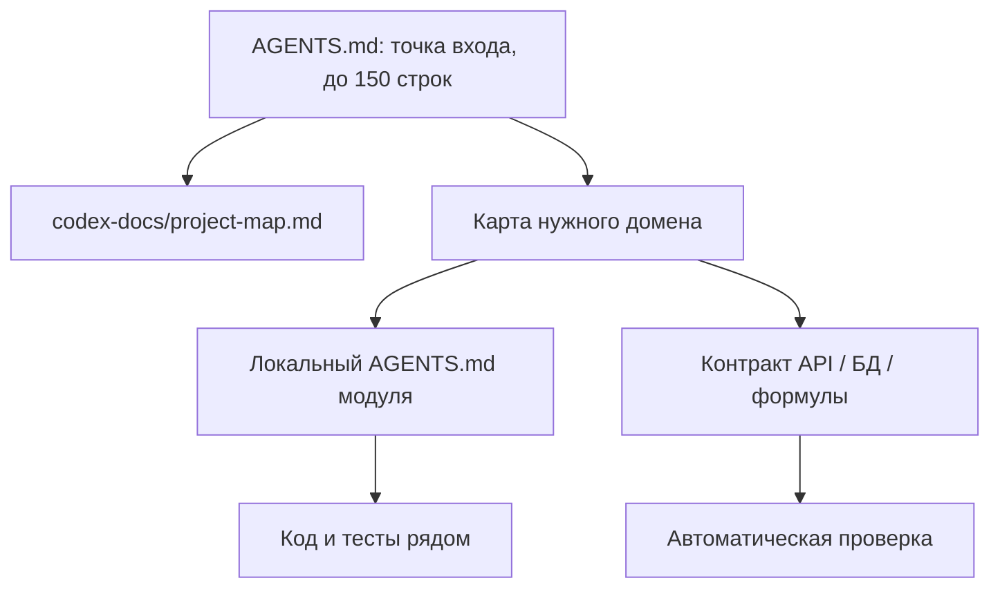

# Архитектура, максимально понятная AI-агенту

## Цель

Сделать репозиторий таким, чтобы новый AI-агент мог за несколько минут:

1. понять назначение системы и основной пользовательский поток;
2. найти единственный источник истины для нужного контракта;
3. определить минимальный набор файлов для изменения;
4. увидеть допустимые направления зависимостей;
5. проверить результат одной документированной командой.

Понятная агенту архитектура полезна и человеку: она уменьшает время поиска,
случайное дублирование логики и изменения с неполным охватом.

## Что сейчас затрудняет работу агента

- Корневой `CLAUDE.MD`, `backend/CLAUDE.MD` и `frontend/CLAUDE.MD` содержат
  сотни строк. В них одновременно находятся навигация, правила, примеры кода,
  текущий статус и исторические детали.
- Одни и те же сведения повторяются в `README.md`, `CLAUDE.MD`,
  `codex-docs/`, `docs/api.md`, SRS и QA-документах. Агенту трудно понять,
  какой вариант актуален.
- Структура кода в основном послойная (`api` → `services` → `models`), поэтому
  одна бизнес-возможность размазана по многим каталогам без локальной карты.
- Критические правила известны из текста, но не всегда выражены как
  проверяемые границы импортов, схемы или тесты контрактов.
- Датированные аудиты и актуальные инструкции находятся рядом, но имеют разный
  жизненный цикл. По имени файла это не всегда очевидно.

## Главный принцип

Агент не должен восстанавливать архитектуру по косвенным признакам. Каждый
важный факт должен быть либо:

- виден в короткой карте;
- расположен рядом с кодом, к которому относится;
- выражен исполняемым контрактом: типом, схемой, тестом или проверкой CI.

Документация объясняет **почему** и **где**, код показывает **как**, а тесты
доказывают **что правило соблюдено**.

## Предлагаемая модель документации



### 1. Короткий корневой `AGENTS.md`

Добавить нейтральную точку входа для разных AI-инструментов. В ней оставить
только сведения, необходимые почти для любой задачи:

- назначение продукта в 5–10 строках;
- основной поток `теплорасчёт → электрорасчёт → спецификация → отчёт`;
- карту доменов и ссылки на их локальные инструкции;
- источники истины по API, БД, формулам, ролям и UI;
- инварианты, нарушение которых опасно;
- стандартные команды проверки;
- правило не трогать чужие незакоммиченные изменения.

`CLAUDE.MD` можно сохранить как совместимое имя, но не поддерживать в нём
отдельную копию тех же правил. Лучше сделать его коротким указателем на
`AGENTS.md` и профильные документы либо генерировать оба файла из одного
источника.

### 2. Локальные карты доменов

Для каждого крупного бизнес-контура создать короткую карту, например:

```text
docs/domains/
  heat-loss.md
  electrical.md
  specification.md
  reporting.md
  projects-and-access.md
  reference-data.md
```

Каждая карта отвечает на одинаковые вопросы:

| Раздел | Что в нём должно быть |
|---|---|
| Назначение | Какую бизнес-задачу решает домен |
| Входы и выходы | DTO, единицы измерения, ошибки, побочные эффекты |
| Владение данными | Главные таблицы, JSON-поля, справочники |
| Точка входа | API endpoint, страница или background task |
| Путь выполнения | Router → service/use case → domain → repository |
| Инварианты | Правила, которые нельзя нарушать |
| Зависимости | Что разрешено импортировать и вызывать |
| Проверка | Точные unit, integration и e2e-команды |
| Связанные решения | Ссылки на ADR, а не пересказ решения |

Документ должен перечислять не все файлы, а 5–15 ключевых точек входа.
Подробности агент найдёт через `rg` от этих точек.

### 3. Инструкции рядом с кодом

Вместо больших справочников о всём backend/frontend добавить небольшие
`AGENTS.md` только в каталогах с особыми правилами:

```text
backend/app/formulas/AGENTS.md
backend/app/services/AGENTS.md
backend/app/reference_data/AGENTS.md
frontend/src/pages/electrical/AGENTS.md
frontend/src/components/wizard/AGENTS.md
e2e/AGENTS.md
```

Локальный файл должен содержать только правила своей области: единицы,
инварианты, запретные зависимости, обязательные тесты и частые ошибки. Он не
повторяет стек проекта и общие правила из корня.

### 4. Явная иерархия источников истины

За каждым типом знания закрепить один канонический файл:

| Знание | Канонический источник |
|---|---|
| Требуемое поведение | `docs/srs/` |
| Бизнес-алгоритмы и формулы | `docs/business-logic-contract.md` + код формул |
| HTTP-контракты | OpenAPI из FastAPI; `docs/api.md` — пояснения и сценарии |
| Схема данных | Alembic + SQLAlchemy; `docs/db_schema.md` — карта и решения |
| Архитектурные решения | `docs/adr/` |
| Проверка поведения | тесты и `docs/qa/` |
| Текущие ограничения | один недатированный backlog/status-файл |
| Историческое состояние | `docs/audit/YYYY-MM-DD-*` |

Во всех остальных документах давать ссылку, а не копировать содержание.
Каждый статусный документ должен содержать поля `Актуально на`, `Владелец`
или `Источник обновления` и `Заменён документом`, если он устарел.

## Предлагаемая архитектура кода

Полная перестройка каталогов не обязательна. Сначала нужно сделать текущие
границы видимыми, затем постепенно группировать изменения вокруг доменов.

### Backend: явный путь выполнения

Для каждой операции придерживаться одного направления:

```text
API router
  → application use case / service
    → pure domain logic or formula
      → repository / external adapter
```

Правила границ:

- router отвечает только за HTTP, авторизацию, валидацию DTO и вызов use case;
- use case оркестрирует транзакцию и побочные эффекты;
- формулы и доменные правила не импортируют FastAPI, SQLAlchemy или HTTP DTO;
- доступ к БД не прячется внутри формулы;
- один use case имеет явные вход, результат и набор доменных ошибок;
- междоменные вызовы идут через публичный интерфейс домена, а не через его
  внутренние модели и приватные функции.

Новые возможности лучше добавлять вертикальным срезом. Например, все точки
входа electrical-функции перечисляются в `docs/domains/electrical.md`, даже
если физически пока остаются в `api/`, `services/`, `models/` и `formulas/`.
Перемещать старый код только ради новой структуры не нужно.

### Frontend: разделить серверное, доменное и UI-состояние

Для каждой страницы показывать одну и ту же цепочку:

```text
route/page
  → feature hook / use case
    → API client + query keys
      → presentational components
```

Зафиксировать следующие границы:

- `src/api/` знает HTTP DTO, но не управляет UI;
- TanStack Query владеет серверным состоянием;
- Zustand хранит только действительно глобальное клиентское состояние;
- локальное состояние компонента хранит временное состояние интерфейса;
- бизнес-вычисления не дублируются с backend;
- преобразования единиц и DTO находятся в именованных адаптерах и имеют тесты;
- компонент страницы оркестрирует, а не содержит одновременно API, расчёты,
  таблицу, модалки и форматирование.

Для больших экранов стоит завести каталоги возможностей, не создавая общую
абстракцию раньше времени:

```text
frontend/src/features/
  heat-loss/
  electrical/
  specification/
  reporting/
```

У каждой feature — публичный `index.ts`; импорт её внутренних файлов снаружи
запрещён. Это даёт агенту обозримую границу и уменьшает число кандидатов для
изменения.

## Контракты, которые агент должен видеть сразу

В корневой и доменных картах выделить небольшой блок `Инварианты`. Для TLT
минимальный набор такой:

- геометрия вводится в миллиметрах, а API и формулы используют метры;
- окончательные расчёты выполняются только на backend;
- область данных всегда определяется ролью и владельцем/гостевой сессией;
- публичная идентичность ЭР — UUID, номер `1…5` является compatibility-слоем;
- спецификация и отчёт должны использовать тот же scope ЭР, что и расчёт;
- изменение формулы требует граничных unit-тестов и проверки бизнес-контракта;
- изменение модели требует миграции и проверки обратной совместимости;
- mutation обязана явно обновлять или инвалидировать связанные query keys.

Каждому инварианту желательно присвоить стабильный идентификатор, например
`UNIT-001`, `AUTH-002`, `ER-004`. Этот идентификатор повторяется в тесте,
доменной карте и сообщении проверки. Тогда агент может найти все доказательства
одной командой `rg 'ER-004'`.

## Машиночитаемые подсказки

Текстовые карты дополнить небольшими файлами, которые можно проверять:

- `CODEOWNERS` или аналогичная карта владения областями;
- правила импортов для backend и frontend;
- JSON Schema/OpenAPI для внешних форматов;
- единый реестр query keys и route names;
- манифест справочников: версия, единицы, источник, checksum;
- команды `make check-<domain>` для точечной проверки;
- `scripts/check-doc-links.*` для битых ссылок;
- проверка CI, что миграция, API schema и generated docs не расходятся.

Генерируемые данные нужно явно обрамлять маркерами, как уже сделано для
счётчиков тестов в `README.md`. Агент должен понимать, какой блок можно править
руками, а какой обновляется скриптом.

## Шаблон задачи для агента

Для повторяемых изменений использовать короткий обязательный маршрут:

1. Открыть корневой `AGENTS.md` и карту нужного домена.
2. Проверить `git status --short` и не затрагивать чужие изменения.
3. Найти точку входа и пройти цепочку до тестов.
4. Назвать затрагиваемые инварианты и источники истины.
5. Сделать минимальное изменение внутри одной архитектурной границы.
6. Запустить точечную проверку домена, затем общую проверку по риску.
7. Обновить канонический документ, только если изменился контракт.
8. В отчёте перечислить изменение, доказательство и оставшийся риск.

## План внедрения без большого рефакторинга

### Этап 1 — навигация

- Создать корневой `AGENTS.md` до 150 строк.
- Сократить `CLAUDE.MD` до совместимого указателя или определить механизм его
  синхронизации.
- Добавить карты шести основных доменов.
- Ввести явную таблицу источников истины и пометить исторические документы.

**Критерий готовности:** незнакомый с проектом агент за 10 минут называет
точки изменения и тесты для одного сценария каждого домена.

### Этап 2 — проверяемые границы

- Добавить правила импортов и публичные интерфейсы feature/domain.
- Ввести стабильные идентификаторы критических инвариантов.
- Добавить `make check-heat`, `make check-electrical`, `make check-spec` и
  аналогичные агрегирующие команды.
- Проверять ссылки и рассинхронизацию generated-документации в CI.

**Критерий готовности:** нарушение направления зависимости или критического
контракта обнаруживается автоматически.

### Этап 3 — постепенные вертикальные срезы

- При значимом изменении выделять use case и публичный интерфейс домена.
- Большие frontend-страницы переносить в feature-каталоги по мере работы над
  ними, а не отдельным массовым рефакторингом.
- Решения с долгим сроком жизни фиксировать короткими ADR.
- Удалять дублирующую документацию после появления канонического источника.

**Критерий готовности:** типовая функция локализована в одном домене, а путь от
UI/API до теста восстанавливается по одной карте.

## Как измерять понятность

Архитектура стала понятнее, если улучшаются измеримые показатели:

| Метрика | Целевое значение |
|---|---|
| Время до нахождения точек изменения | до 10 минут |
| Число обязательных стартовых документов | не более 3 |
| Размер корневой инструкции | до 150 строк |
| Число источников истины на один контракт | ровно 1 |
| Команда точечной проверки домена | ровно 1 документированная команда |
| Необнаруженные нарушения границ | 0 в CI |
| Ссылки из карты домена на несуществующие файлы | 0 |

## Чего делать не стоит

- Не создавать ещё один полный пересказ архитектуры.
- Не дублировать API и схему БД вручную там, где их можно сгенерировать.
- Не смешивать текущий статус, требования и архитектурные решения в одном
  постоянно растущем файле.
- Не проводить массовое перемещение файлов без изменения поведения: это
  создаёт шум, конфликты и ломает историю.
- Не вводить абстрактные `common`, `shared`, `utils` без владельца и правил
  допустимых зависимостей.
- Не считать документацию достаточной, если критическое правило можно выразить
  тестом, типом или CI-проверкой.

## Первые пять практических действий

1. Создать короткий корневой `AGENTS.md` на основе стабильной части
   `codex-docs/project-map.md` и `development-guide.md`.
2. Написать пилотную карту `docs/domains/electrical.md`, потому что этот контур
   содержит наиболее сложные scope-, UUID- и compatibility-контракты.
3. Выделить и пронумеровать 8–12 критических инвариантов проекта.
4. Добавить одну команду `make check-electrical`, объединяющую релевантные
   backend, frontend и integration-тесты.
5. После пилота применить тот же шаблон к heat-loss, specification и reporting,
   удаляя обнаруженное дублирование.

Такой порядок сначала улучшает понимание текущей системы, затем добавляет
автоматические ограждения и только после этого меняет физическую структуру
кода. Это даёт пользу агентам сразу и не требует рискованного переписывания.

## Статус внедрения (frontend, 2026-07-22)

**Этап 1 (навигация) — сделано для frontend-контура:**

- корневой `AGENTS.md`;
- `frontend/AGENTS.md`;
- локальные `frontend/src/pages/electrical|heatcalc/AGENTS.md`,
  `frontend/src/components/wizard/AGENTS.md`;
- карты `docs/domains/{heat-loss,electrical,specification,reporting}.md`;
- срез и target model: `docs/architecture/frontend-agent-architecture.md`;
- architecture gate: `frontend` script `npm run test:architecture`
  (heat↔electrical isolation + components→pages allowlist + nav files).

**Ещё не сделано (этапы 2–3):**

- `make check-electrical` / `check-heat` full-stack aggregates;
- backend local `AGENTS.md` (formulas/services/reference_data);
- public barrels + shrink of inverted `components→pages` allowlist;
- mass-free gradual move only on feature work (no bulk `features/` rewrite).
