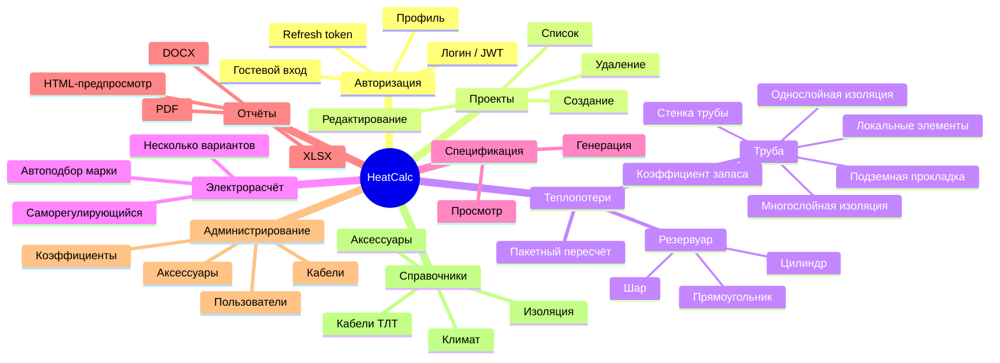
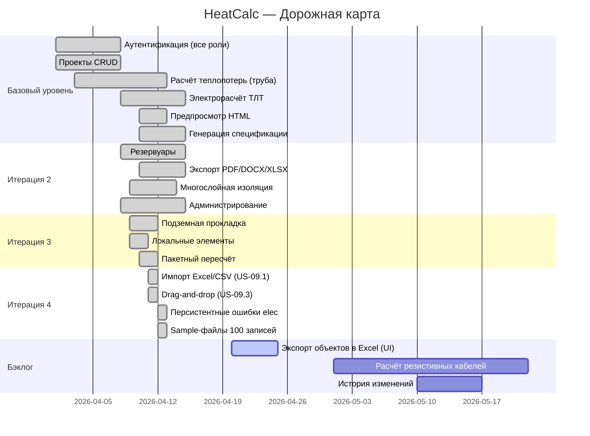

# Карта пользовательских историй (User Story Map)

## Методология

User Story Map (Jeff Patton, 2014) организует истории по двум осям:
- **Горизонталь (хребет / backbone)** — последовательность действий пользователя (User Activities)
- **Вертикаль (рёбра)** — детализация от базового до расширенного функционала

Горизонтальные срезы (Slice) соответствуют итерациям / релизам.

---

## Диаграмма карты

```
BACKBONE (Пользовательские активности)
━━━━━━━━━━━━━━━━━━━━━━━━━━━━━━━━━━━━━━━━━━━━━━━━━━━━━━━━━━━━━━━━━━━━━━━━━━━━
1. ВОЙТИ         2. СОЗДАТЬ        3. ДОБАВИТЬ       4. РАССЧИТАТЬ     5. ОФОРМИТЬ
   В СИСТЕМУ        ПРОЕКТ            ОБЪЕКТ            ЭЛЕКТРО           ОТЧЁТ
━━━━━━━━━━━━━━━━━━━━━━━━━━━━━━━━━━━━━━━━━━━━━━━━━━━━━━━━━━━━━━━━━━━━━━━━━━━━

┌─ Базовый уровень (Итерация 1) ─────────────────────────────────────────────┐
│                                                                             │
│  Гостевой     Создать         Добавить        Подобрать      Предпросмотр  │
│  вход         проект          трубу           кабель ТЛТ     HTML          │
│  (US-01.1)    (US-02.1)       (US-03.1)       (US-04.1)      (US-06.1)     │
│                               Расчёт тепло-                                │
│  Логин        Список          потерь авто     Автоподбор      Генерация    │
│  сотрудника   проектов        (US-03.2)       марки           спецификации │
│  (US-01.2)    (US-02.2)                       (US-04.1)       (US-05.1)    │
└─────────────────────────────────────────────────────────────────────────────┘

┌─ Итерация 2 ───────────────────────────────────────────────────────────────┐
│                                                                             │
│  Обновление   Редактиро-      Добавить        Несколько       Экспорт      │
│  токена       вание           резервуар       вариантов       PDF/DOCX/    │
│  (US-01.3)    проекта         (US-03.5)       расчёта         XLSX         │
│               (US-02.3)                       (US-04.2)       (US-06.2–4)  │
│  Просмотр     Удаление        Многослойная    Список          Просмотр     │
│  профиля      проекта         изоляция        кабелей         спецификации │
│  (US-01.4)    (US-02.4)       (US-03.3)       (US-04.3)       (US-05.2)    │
└─────────────────────────────────────────────────────────────────────────────┘

┌─ Итерация 3 ───────────────────────────────────────────────────────────────┐
│                                                                             │
│  —            —               Подземная       —               —            │
│                               прокладка                                    │
│                               (US-03.4)                                    │
│                               Локальные       —               —            │
│                               элементы                                     │
│                               (US-03.7)                                    │
│                               Пакетный                                     │
│                               пересчёт                                     │
│                               (US-03.6)                                    │
└─────────────────────────────────────────────────────────────────────────────┘

┌─ Итерация 4 (закрытие ТЗ 4.1.3) ──────────────────────────────────────────┐
│                                                                             │
│  —            —               Импорт из       Персистентные    —          │
│                               Excel/CSV       ошибки elec-                │
│                               (US-09.1)       расчёта                     │
│                               Drag-and-drop   (US-09.12)                  │
│                               сортировка                                  │
│                               (US-09.3)                                   │
│                               Sample-файлы                                │
│                               100 записей                                 │
└─────────────────────────────────────────────────────────────────────────────┘

┌─ ADMIN TRACK (параллельно) ─────────────────────────────────────────────────┐
│                                                                             │
│  —            —               Управление      Управление      Управление   │
│                               коэффициентами  кабелями        аксессуарами │
│                               (US-07.2)       (US-07.3)       (US-07.4)    │
│                               Управление                                   │
│                               пользователями                               │
│                               (US-07.1)                                    │
│                               Справочники     Расширенный     —            │
│                               (US-08.1–2)     каталог                      │
│                                               (US-08.3)                    │
└─────────────────────────────────────────────────────────────────────────────┘
```

---

## Ходящий скелет (Walking Skeleton)

Минимальный end-to-end сценарий, доказывающий работу системы:

```
1. Гостевой вход → session_id
2. Создание проекта
3. Добавление трубопровода DN100, L=100м, -30°C / +80°C, минвата 50мм
4. Автоматический расчёт: heat_loss_per_meter > 0
5. Электрорасчёт: кабель ТЛТ-25 выбран автоматически
6. Генерация спецификации: позиции с кабелем и аксессуарами
7. Предпросмотр отчёта: HTML отображается
```

Этот сценарий покрывает **7 эпиков из 8** и является критерием «зелёного» статуса системы.

---

## Мозговая карта функций системы



---

## Дорожная карта (Roadmap)


