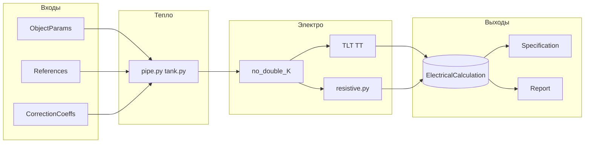

# Отчёт: сильные и слабые стороны бизнес-логики

> [!WARNING]
> Исторический инженерный срез от 2026-05-20. Упоминания fixed `CO1..CO4` и
> readiness-проценты не использовать как текущий контракт без повторной
> проверки по коду, тестам и `codex-docs/requirements-map.md`.

**Дата среза:** 2026-05-20  
**Назначение:** инженерная оценка расчётного контура приложения ТЛТ для заказчика и команды разработки.

**Связанные документы:**

| Документ | Роль |
|---|---|
| [docs/business-logic-contract.md](../business-logic-contract.md) | Действующий контракт формул и алгоритмов |
| [docs/qa/business-logic-coverage.md](../qa/business-logic-coverage.md) | Матрица покрытия контракта тестами |
| [docs/tnp/project-reconciliation-audit.md](../tnp/project-reconciliation-audit.md) | Сверка ТНП с кодом |
| [docs/analysis/FORMULA_AUDIT.md](FORMULA_AUDIT.md) | Исторический перекрёстный аудит `formules.md` vs код |
| [docs/analysis/open-business-decisions.md](open-business-decisions.md) | Открытые Q и блокеры приёмки |
| [docs/tz-compliance.md](../tz-compliance.md) | Сверка с ТЗ и % готовности |

---

## 1. Область и метод

### Что входит в «бизнес-логику»

- **Формулы теплопотерь:** трубопровод, резервуар (цилиндр / параллелепипед / шар), грунт, многослойная изоляция, `lambda(tm)`.
- **Алгоритмы электрорасчёта:** ТЛТ, ТТН/ТТВ/ТТХ, ТТ Р1 (`single_core`), ТТ Р3 (`three_core`); навив; политика no-double-K.
- **Справочники:** климат, изоляция, материалы трубы, грунт, каталоги кабелей, расширенная БД сотрудника.
- **Сквозные policy:** `variant_number` (CO1..CO4), выбор базы кабелей, batch-расчёт, сохранение ошибок, `cable_snapshot`.
- **Производные контуры:** автоспецификация, отчёт (HTML/PDF/DOCX/XLSX), импорт/экспорт объектов и проектов.

### Что сознательно не входит

- Вёрстка UI, RBAC (кроме влияния на отчёт), инфраструктура Docker, чисто косметические UX-детали без расчётного эффекта.

### Метод оценки

1. Сверка с [business-logic-contract.md](../business-logic-contract.md) и ТНП (`docs/tnp/`).
2. Проверка evidence: `backend/app/tests/` (unit + integration), QA-agent oracle, E2E Playwright.
3. Фиксация gap по правилу [full-version-rule.md](../context/full-version-rule.md): частичная реализация = дефект или `Needs business decision`, а не «достаточно для релиза».

**Тестовый контур на дату среза:** 1191 backend · 372 frontend vitest · 64 e2e (см. `README.md`, блок `AUTO:test-counts`).

---

## 2. Сводная оценка

| Область | Сильная сторона (кратко) | Главный риск | Зрелость |
|---|---|---|---|
| Теплопотери | ТНП-физика, `lambda(tm)`, климат, подземный резервуар | Generic-импорт изоляции, production-данные справочников | Высокая |
| ТЛТ / ТТН/ТТВ/ТТХ | Контракт, oracle, no-double-K, T3/нитки | — | Высокая |
| ТТ Р1 / ТТ Р3 | VSDX auto, паспортное сопротивление | Thermal `p3` в БД, legacy-поля каталога | Средне-высокая |
| MI / skin | Тип в модели | `NotImplementedError` в расчёте | Низкая |
| CO / batch | `variant_number`, persist failed, отмена задач | Edge cases массового пересчёта | Высокая |
| Спецификация | CO, extended DB, группировка | Нормы комплектации, Q-G | Средне-высокая |
| Отчёт | 5 секций, мастер, экспорт | Q-01..Q-25 Open | Средняя |
| Трассируемость | `audit_events`, `cable_snapshot` | Нет снапшота K/λ в результате расчёта | Средняя |
| Импорт/экспорт | XLSX/CSV, построчные ошибки | Draft-материалы после импорта | Средне-высокая |

**Итог:** ядро (труба/резервуар + ТЛТ/ТТ/резистив) **инженерно сильное и покрыто тестами**. Слабое место — **хвост полной версии** (MI, skin, pump/platform/other) и **неутверждённые продуктовые развилки** (отчёт, SEC, коммерческие данные БД), а не базовая математика теплопотерь.

---

## 3. Сильные стороны

### 3.1. Контракт и трассируемость

- Единая иерархия источников: контракт → ТНП → correctness-review → registry QA-agent → код → тесты.
- Machine-readable дублирование: `codex-docs/business-formula-contracts.json`, `qa-agent/examples/tlt-formulas.registry.yaml`.
- Правило Full Version не позволяет маскировать частичную реализацию как «базовую поставку».

### 3.2. Теплотехника

| Элемент | Реализация | Evidence |
|---|---|---|
| Многослойная цилиндрическая стенка трубы | `backend/app/formulas/heat_loss/pipe.py` | `test_pipe_heat_loss.py` |
| Грунт (`arccosh`) | `pipe.py` | unit + integration |
| Резервуар: плоская стенка, `Rвнеш = 1/α` | `tank.py` | `test_tank_heat_loss.py` |
| Подземный резервуар `S_air` / `S_ground` | `tank.py` | unit |
| `lambda(tm)` + конкретный код материала | loader + `insulation_materials` | REF-INS-01, oracle |
| Климат `K` и T до расчёта | `CalculationService` resolver | `tlt_climate_safety_factor` |
| Ветер по СНиП: `α = 11.6 + 7√v` | `pipe.py`, `tank.py` | [pitfalls.md](../context/pitfalls.md) |

Generic-семьи изоляции (`mineral_wool` без плотности) **не допускаются** в расчёт — снижает риск «тихого» неверного λ.

### 3.3. Электротехника

**No-double-K.** В электроподбор передаётся удельная мощность **без** уже применённого запаса K; запас применяется один раз в формуле кабеля. Защита от завышения мощности и занижения марки кабеля.

**ТЛТ.** Подбор по трём условиям (P, T_min, T_max); auto-нитки 1..3 с полями `requested/applied/source`; ток по паспортному напряжению выбранной марки, не по общему U CO.

**ТТН/ТТВ/ТТХ.** Серия по T1/T2; паспортная мощность `q_b(T3) = q1·T3 + q2`; при отсутствии T3 — fallback на T1; `N = ceil(Pоб/Pi)` без искусственного потолка 3; суффикс СТ/СР по `aggressive_product`.

**ТТ Р1 / ТТ Р3.** Первичный параметр — `resistance_ohm_km` (для высокоомных марок медная модель по S даёт порядковую ошибку). Full-version auto: перебор `M`, схемы U (петля/звезда), `p2/p3`, `L1/L2`, лимит 65 А с policy из `correction_coefficients`.

**Навив.** `Kn_max(D)` — hard-limit для явного и геометрического коэффициента.

**CO1..CO4.** `variant_number` проходит через расчёт, спецификацию, project IO, отчёт.

**Устойчивость batch.** Ошибка по объекту не обрывает пакет: `_upsert_failed_electrical`, структурированный payload (`build_electrical_error_payload`). Пользователь видит причину после reload.

**Устаревание каталога.** `cable_snapshot` и сравнение с актуальной строкой справочника — снижает риск «старый расчёт + новый прайс».

### 3.4. Справочники и данные

- Версионируемые JSON в репозитории + runtime-проекция изоляции в PostgreSQL.
- 539 климатических пунктов; грунты; `λ(T)` материалов трубы.
- Расширенная БД кабелей/аксессуаров для сотрудника с админ-CRUD.

### 3.5. Тестирование и верификация

- Плотное unit/integration покрытие формул и `CalculationService`.
- Property-based (Hypothesis) на устойчивость части формул.
- Независимый deterministic oracle в QA-agent для климата, навивa, резистивного подбора, ТТ.
- Регрессионные gates: `scripts/formula-qa.sh`, `scripts/codex-functional-audit.sh contracts|calc`.

### 3.6. Схема расчётного потока

---

## 4. Слабые стороны и риски

### 4.1. Пробелы полной версии (Needs implementation)

| Область | Симптом | Риск для пользователя |
|---|---|---|
| `mineral` | `backend/app/formulas/electrical/mineral.py` → `NotImplementedError` | Выбор типа «кабель MI» без результата или с ошибкой после batch |
| `skin` | Нет расчётной методики (Q-E в SRS) | То же для скин-систем |
| `pump`, `platform`, `other` | `ObjectType` в enum, нет форм и формул | Невозможность расширить проект beyond труба/резервуар |

Закрытие блокируется **поставкой методик ТНП** от заказчика, а не только доработкой кода.

### 4.2. Зависимость от решений заказчика (Needs business decision)

| Блок | Объём | Влияние |
|---|---|---|
| Отчёт Q-01..Q-25 | Состав, титул, ошибочные объекты, multi-CO, шаблон PDF/DOCX | ~75% зрелости SRS-07; рабочий шаблон есть, корпоративный вид — нет |
| SEC-A/B/C | Шифрование формул/справочников, обфускация frontend | ~68% раздела 5 ТЗ до подписи SEC-A |
| CAB-MIN / CAB-SKIN | Методики MI и skin | Блокирует 100% по п. 4.3.2 ТЗ |

Реестр: [open-business-decisions.md](open-business-decisions.md).

### 4.3. Технические и эксплуатационные риски

| ID | Риск | Деталь | Митигация сегодня |
|---|---|---|---|
| RES-P3 | Резистивный thermal cap | `p3` ограничен справочником: `ТТ Р1=40 Вт/м`, `ТТ Р3=50 Вт/м`; production БД может переопределить type-specific коэффициентами | Справочные cap закреплены тестами pure formula/service/reference-data |
| REF-R3-01 | Legacy поля ТТ Р3 | `max_linear_power_w_m=50` подтвержден как hard default cap; `standard_supply_voltage_v` остается legacy без финального источника | Не использовать `standard_supply_voltage_v` в UI как жёсткую границу без отдельного источника |
| DOC-DRIFT | `formules.md` vs код | Устаревшие примеры (R_ins, линейный ветер); код по СНиП корректен | Опираться на business-logic-contract, не на старые примеры |
| REPRO | Воспроизводимость | `audit_events` фиксируют действия, но **нет снапшота** применённых K, λ, версии справочника в `HeatCalculation`/`ElectricalCalculation` | Ручной разбор по текущим справочникам |
| IMP-GEN | Импорт | Generic-названия изоляции → draft, нужно уточнение в форме | Валидация + подсветка в UI |
| CO-REP | Multi-CO в отчёте | Q-22, Q-23 не закрыты | Отчёт по активному CO |
| RANK | Коммерческий ranking | Auto-подбор по технике есть; цена/склад/приоритет в extended DB — предварительная модель | Ручной выбор марки |

### 4.4. Слабости процесса (не дефект формулы)

- Исторический дрейф кратких статус-доков (`TO_DO.md`) — смягчён реестрами от 2026-05-20; нужна дисциплина `sync-docs` и контракта при каждом изменении формулы.
- E2E в основном на Chromium; Firefox/Edge/Яндекс — ручная приёмка по ТЗ 4.1.1.
- PDF/DOCX не проверяются автоматическим snapshot сравнением с эталоном.
- Полный справочник кодов ошибок — черновик [error-codes.md](../error-codes.md), не закрыт DOC-ERR.

---

## 5. Матрица по контурам

### 5.1. Теплопотери

| | |
|---|---|
| **Сильно** | Физика, климат, грунт, 1–3 слоя, подземный бак, отсечение generic-изоляции |
| **Слабо** | Нет pump/platform/other; импорт требует доработки материала |
| **Рекомендация** | Не ослаблять контракт generic-материалов; чек-лист импорта в приёмке |

### 5.2. Электрорасчёт

| | |
|---|---|
| **Сильно** | ТЛТ, ТТ, резистивный VSDX, no-double-K, CO, batch+errors, snapshot |
| **Слабо** | MI, skin; production `p3`; коммерческий ranking |
| **Рекомендация** | Скрыть или явно пометить неподдержанные типы кабеля до появления формул |

### 5.3. Спецификация

| | |
|---|---|
| **Сильно** | Автогенерация по CO, extended DB, группировка, ручные позиции |
| **Слабо** | Правила комплектации аксессуаров не финализированы |
| **Рекомендация** | Согласовать Q-G с заказчиком до production-наполнения extended DB |

### 5.4. Отчёт

| | |
|---|---|
| **Сильно** | HTML preview, PDF/DOCX/XLSX, мастер секций, RBAC экспорта |
| **Слабо** | 25+ открытых Q; нет утверждённого корпоративного шаблона |
| **Рекомендация** | Пакетное закрытие Q-01..Q-14 перед приёмкой полной версии |

### 5.5. Импорт / обмен

| | |
|---|---|
| **Сильно** | XLSX/CSV объектов, CSV проектов, построчные ошибки, round-trip |
| **Слабо** | Draft после generic-импорта; нет единых machine-кодов ошибок импорта |
| **Рекомендация** | В приёмке проверять сценарий «импорт → уточнение материала → пересчёт» |

---

## 6. Рекомендации (приоритеты)

| Приоритет | Действие | Связь с реестром |
|---|---|---|
| **P0** | Поставить методики MI, skin или убрать тип из расчётного UI | CAB-MIN, CAB-SKIN |
| **P0** | Получить формулы pump/platform/other или исключить из scope ТЗ | OBJ-* |
| **P0** | Подписать SEC-A (или выбрать Б/С) | SEC-* |
| **P1** | Закрыть Q-01..Q-14 по отчёту | REPORT |
| **P1** | Снапшот коэффициентов и справочников в результате расчёта | REPRO |
| **P1** | Решить, нужны ли production overrides для резистивного `p3` сверх справочных `40/50 Вт/м` | RES-P3 |
| **P2** | Завершить `docs/error-codes.md` | DOC-ERR |
| **P2** | Синхронизировать `formules.md` с контрактом или пометить как архив | DOC-DRIFT |

Подробный трекер: [open-business-decisions.md](open-business-decisions.md).

---

## 7. Ограничения отчёта

Данный отчёт **не заменяет**:

- полный прогон ПМИ во всех браузерах ТЗ;
- визуальную приёмку PDF/DOCX по корпоративному шаблону;
- нагрузочное тестирование batch на проектах > 50 объектов;
- аудит production-наполнения extended DB (цены, остатки, сроки).

Оценка основана на документации, коде и автотестах на **2026-05-20**. При изменении контракта формул отчёт следует обновить вместе с [business-logic-contract.md](../business-logic-contract.md).

---

## 8. Связь с % готовности по ТЗ

См. [docs/tz-compliance.md](../tz-compliance.md): взвешенная готовность **~85%** по полному ТЗ. Разрыв между «сильной» расчётной математикой ядра и «слабой» приёмкой без оговорок объясняется в основном строками §4.1–4.2 настоящего отчёта, а не качеством теплопотерь трубы/резервуара.
