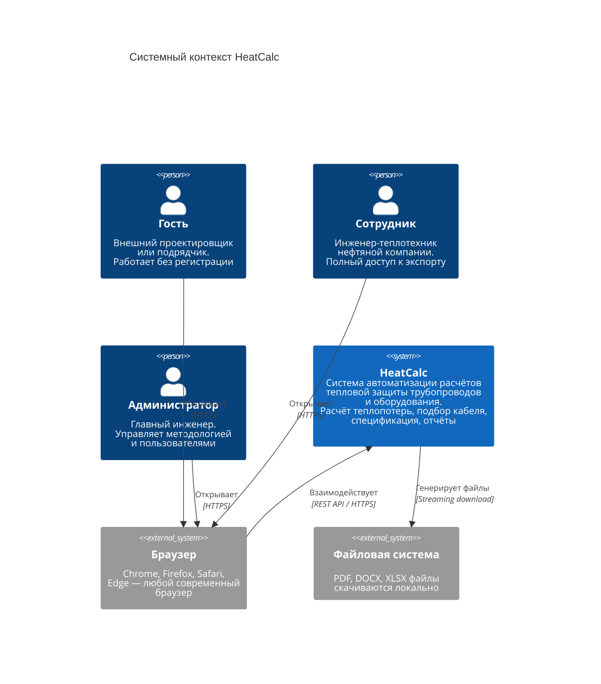
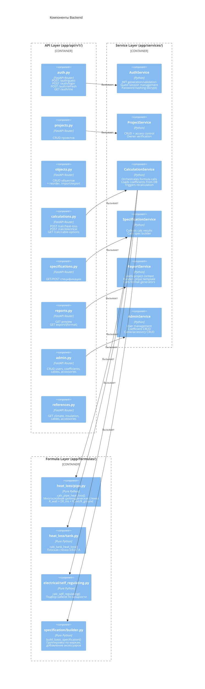
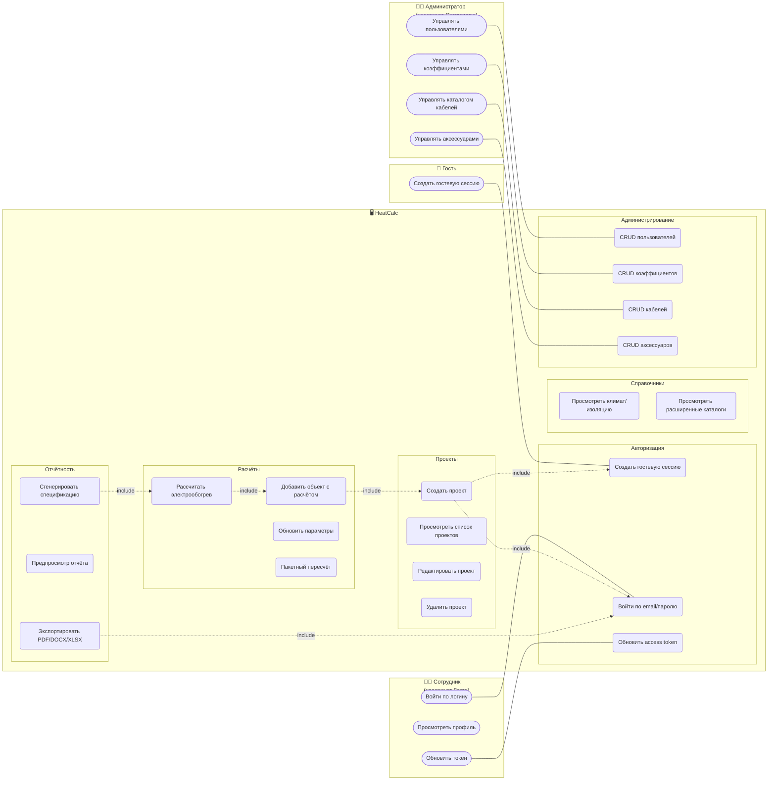
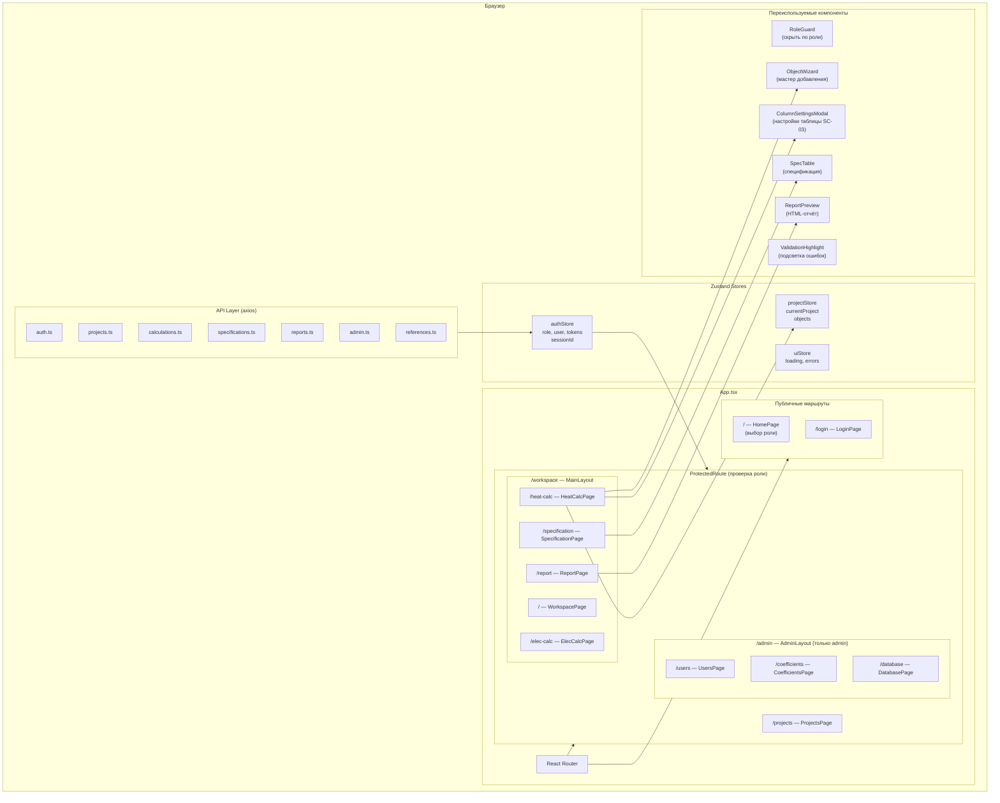

# Контекстные диаграммы

## 1. Диаграмма C4: Уровень 1 — Системный контекст

### Описание

Диаграмма показывает систему HeatCalc в контексте её пользователей и внешних зависимостей. На этом уровне мы не рассматриваем внутреннее устройство системы — только кто с ней взаимодействует и что она делает.

**Ключевые наблюдения:**
- Система не интегрирована с внешними ERP/PLM-системами в текущем контуре
- Все три роли пользователей взаимодействуют через единый браузерный клиент
- Нет интеграции с корпоративными каталогами кабелей (данные загружаются вручную администратором)



---

## 2. Диаграмма C4: Уровень 2 — Контейнеры

### Описание

Этот уровень раскрывает, из каких крупных блоков (контейнеров) состоит система. Каждый контейнер — это отдельно развёртываемый компонент со своими технологиями.

**Ключевые архитектурные решения:**
- **SPA + REST API** — фронтенд и бэкенд разделены; это позволяет независимо масштабировать и развёртывать компоненты
- **JWT-аутентификация** — stateless; бэкенд не хранит серверные сессии
- **Гостевые сессии** — хранятся в БД, идентифицируются через HTTP-заголовок `X-Session-Id`
- **Справочники** — JSON остаётся версионируемым источником; теплоизоляция дополнительно сидируется в PostgreSQL (`insulation_materials`) и отдаётся через `/references/insulation` из БД

```mermaid
C4Container
    title Контейнеры HeatCalc

    Person(user, "Пользователь", "Гость / Сотрудник / Администратор")

    Container_Boundary(frontend, "Frontend (SPA)") {
        Container(spa, "React SPA", "React 18, Vite,<br/>Ant Design 5, Zustand,<br/>React Query, React Router",
                  "Единое веб-приложение.<br/>Маршрутизация по ролям.<br/>Хранение токенов в localStorage.")
    }

    Container_Boundary(backend, "Backend (API)") {
        Container(api, "FastAPI Application", "Python 3.11, FastAPI,<br/>Uvicorn, SQLAlchemy 2.x,<br/>Pydantic v2",
                  "REST API. Авторизация JWT.<br/>Бизнес-логика расчётов.<br/>Генерация отчётов.")
        Container(formulas, "Расчётный движок", "Python: чистые функции",
                  "Формулы теплопотерь<br/>(труба, резервуар).<br/>Электрорасчёт.<br/>Билдер спецификации.")
        Container(refs, "Справочники", "JSON + DB projection",
                  "climate.json, insulation.json,<br/>cables_tlt.json, accessories.json.<br/>insulation.json сидируется<br/>в insulation_materials.")
    }

    ContainerDb(db, "PostgreSQL 16", "Реляционная СУБД",
                "Пользователи, проекты, объекты,<br/>расчёты, спецификации,<br/>коэффициенты, insulation_materials,<br/>расширенные каталоги.")

    Rel(user, spa, "Использует", "HTTPS / браузер")
    Rel(spa, api, "REST API вызовы", "JSON / HTTPS")
    Rel(api, formulas, "Вызывает напрямую", "Python функции")
    Rel(api, refs, "Читает справочники", "LRU-кэш")
    Rel(api, db, "Читает / пишет", "asyncpg / SQL")
```

---

## 3. Диаграмма C4: Уровень 3 — Компоненты Backend

### Описание

Детализация внутреннего устройства FastAPI-приложения по слоям. Это помогает понять, где находится та или иная логика, и как слои взаимодействуют.

**Принципы слоирования:**
- **API Layer** — тонкие endpoint-функции. Только HTTP-привязка (валидация входа, формирование ответа)
- **Service Layer** — вся бизнес-логика. Оркестрирует вызовы к BД и формулам
- **Formula Layer** — чистые функции без зависимостей на БД; легко тестируемы изолированно
- **Data Layer** — ORM-модели SQLAlchemy



---

## 4. Use Case Диаграмма

### Описание

Use Case диаграмма показывает все варианты использования системы в разрезе ролей. Прямоугольником обозначена граница системы. Стрелки «include» показывают обязательные предусловия.



---

## 5. Компонентная диаграмма Frontend

### Описание

Frontend построен как SPA (Single Page Application) на React. Состояние разделено на три независимых Zustand-стора. Маршрутизация защищена компонентом `ProtectedRoute`, проверяющим роль пользователя.


