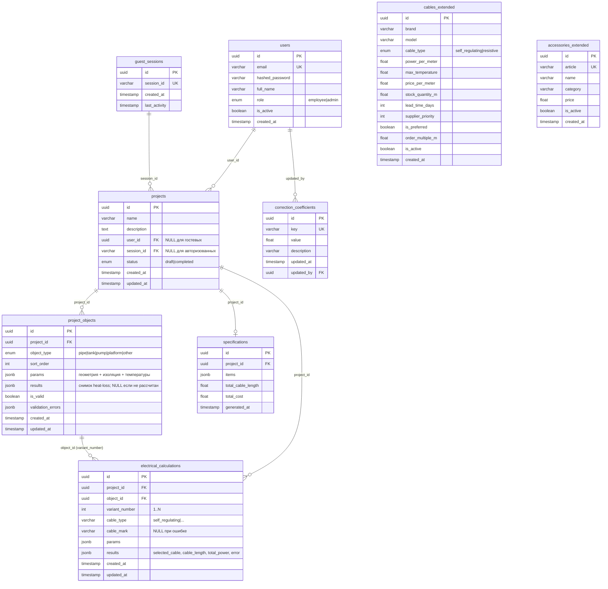
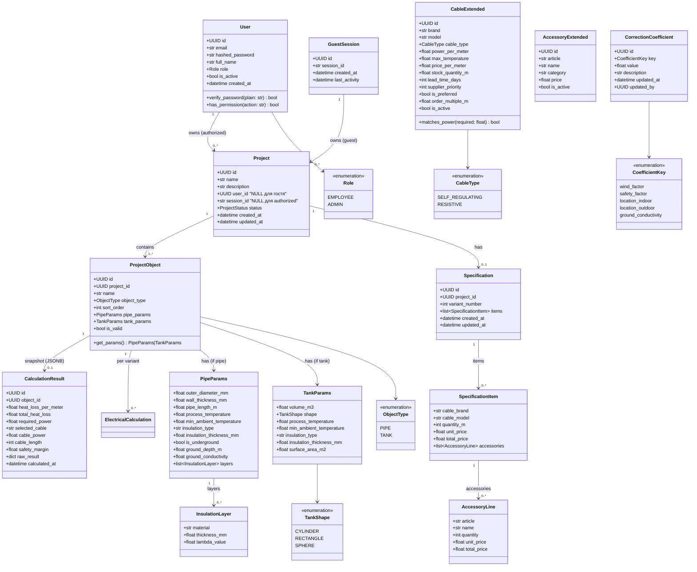
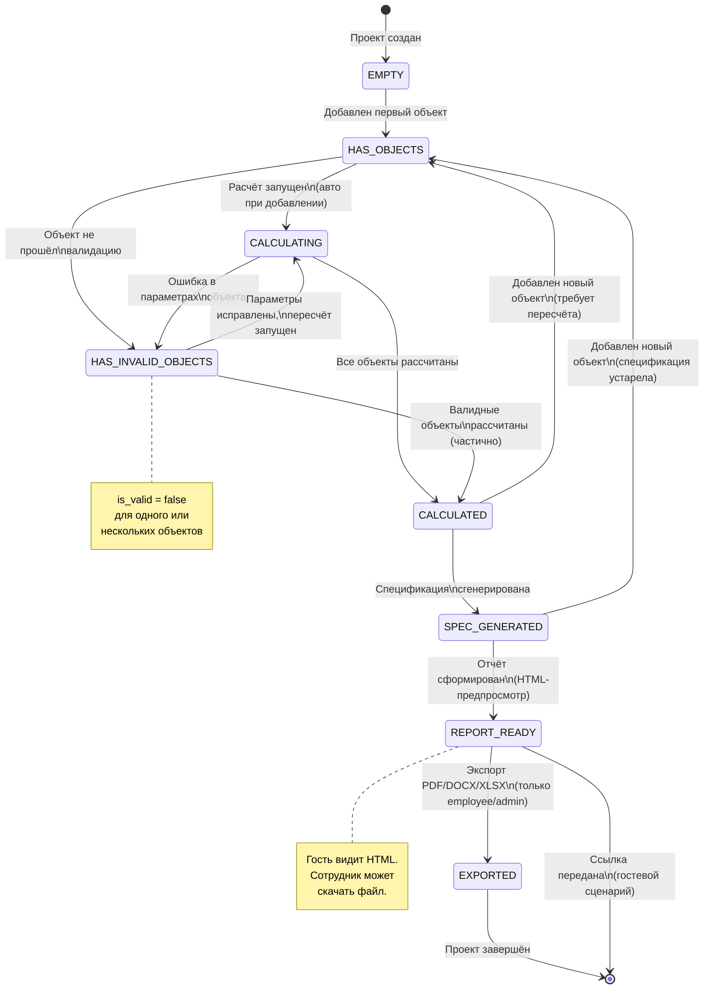
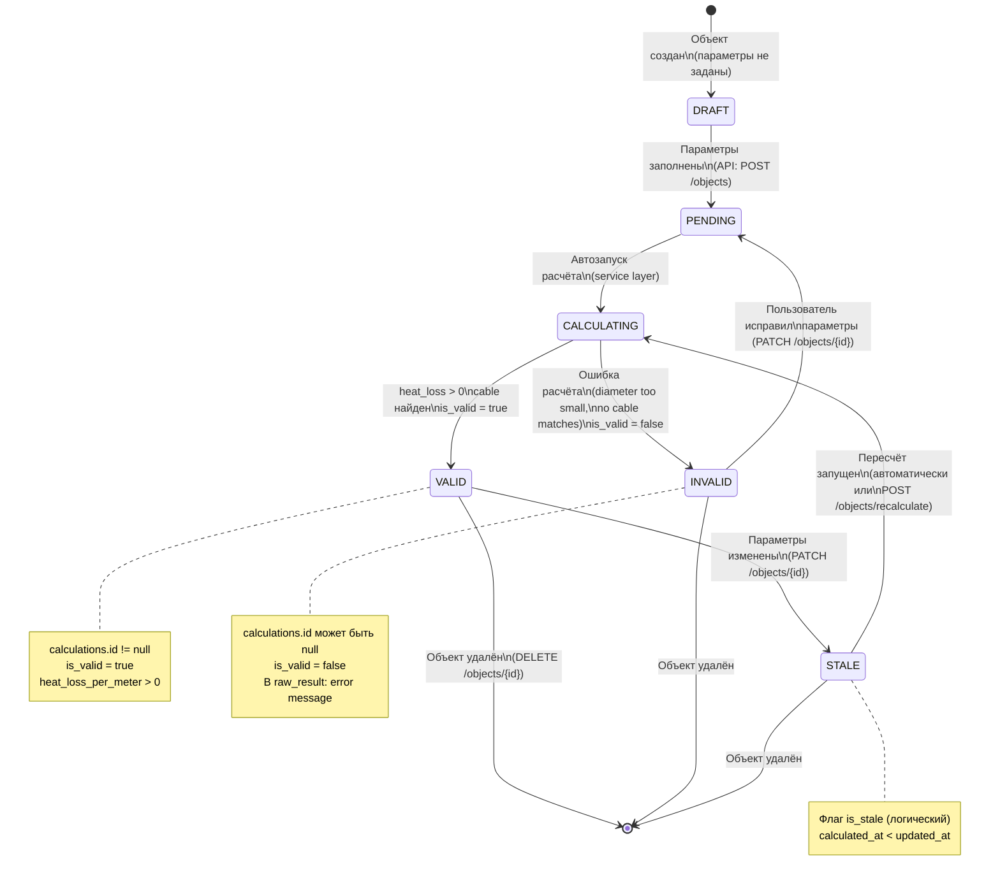
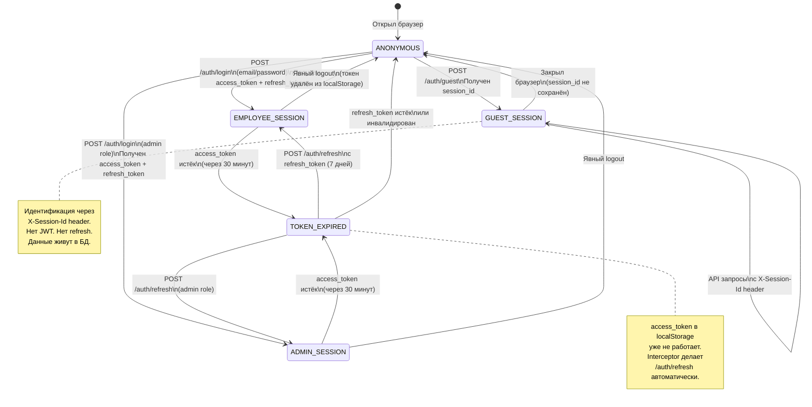

# Доменные диаграммы

## 1. ER-диаграмма (Entity-Relationship)

### Описание

Диаграмма показывает все сущности базы данных, их атрибуты и связи. Система содержит **9 основных таблиц**, разделённых на четыре группы:

- **Идентификация:** `users`, `guest_sessions`
- **Проектная иерархия:** `projects` → `project_objects` → `electrical_calculations` → `specifications`
- **Справочники:** `correction_coefficients`, `cables_extended`, `accessories_extended`

**Ключевые архитектурные решения:**
- Пользователь и гость — разные таблицы. `User.role ∈ {employee, admin}`. Гость = запись в `guest_sessions`; проект привязывается либо к `projects.user_id`, либо к `projects.session_id` (CHECK: одно из двух не NULL).
- Результаты теплотехнического расчёта хранятся **внутри** `project_objects.results` (JSONB). Отдельной таблицы `calculations` нет — это сознательный трейдофф: для текущей модели достаточно последнего снимка результата.
- Электротехнический расчёт — отдельная таблица `electrical_calculations`, поскольку поддерживаются несколько вариантов на объект (`variant_number`). Upsert по `(object_id, variant_number)`.
- При ошибке электрорасчёта запись всё равно создаётся: `cable_mark = NULL`, `results = {"error": "..."}` — чтобы причина была видна после reload.
- `specifications` сохраняет полный JSON со списком позиций, что позволяет регенерировать отчёты без повторного обхода объектов.

---

## 2. UML-диаграмма классов (Domain Model)

### Описание

Диаграмма показывает объектную модель домена — классы, их атрибуты, методы и связи. Это концептуальная модель; реализация через SQLAlchemy ORM + Pydantic-схемы следует тем же паттернам.

**Принципы модели:**
- `PipeParams` и `TankParams` — value objects, не имеют собственной идентичности вне объекта. В БД хранятся в `ProjectObject.params` (JSONB).
- Результат теплотехнического расчёта хранится как JSONB в `ProjectObject.results` (не отдельная таблица). Диаграмма классов ниже показывает концептуальную модель; `CalculationResult` — это структура внутри JSONB, не SQL-таблица.
- `ElectricalCalculation` — полноценная SQL-таблица: поддерживает несколько вариантов на объект (`variant_number`) и персистит ошибки расчёта.
- `SpecificationItem` — строка спецификации, агрегирует данные кабеля + аксессуаров по позиции.

---

## 3. Диаграмма состояний: Жизненный цикл проекта

### Описание

Проект в системе проходит через несколько состояний от создания до формирования финального отчёта. Переходы инициируются действиями пользователя или автоматическими пересчётами.

**Ключевые правила:**
- Проект всегда доступен для просмотра в любом состоянии
- Экспорт отчёта требует состояния `REPORT_READY` (хотя бы один расчёт + спецификация)
- Состояние `HAS_INVALID_OBJECTS` — предупредительное, не блокирует отчёт по валидным объектам

---

## 4. Диаграмма состояний: Жизненный цикл расчёта объекта

### Описание

Каждый `ProjectObject` имеет собственный жизненный цикл расчёта. Состояния хранятся через флаг `is_valid` и наличие/отсутствие связанной записи `calculations`.

---

## 5. Диаграмма состояний: Жизненный цикл сессии пользователя

### Описание

Пользователь взаимодействует с системой через одну из трёх ролевых сессий. Переходы между состояниями управляются JWT-токенами и HTTP-заголовками.

