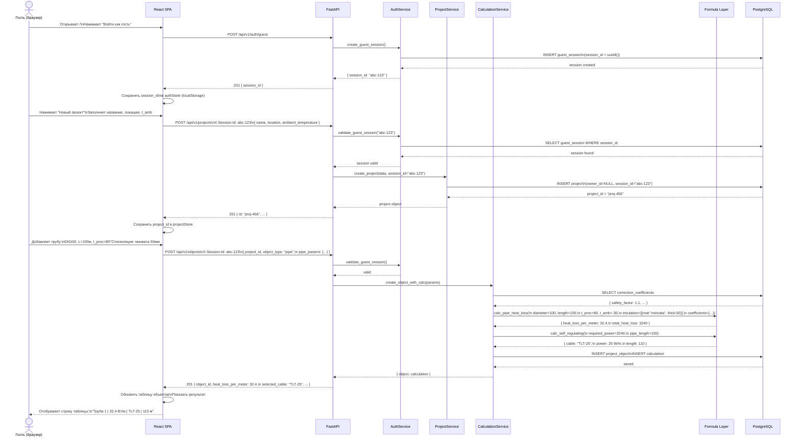
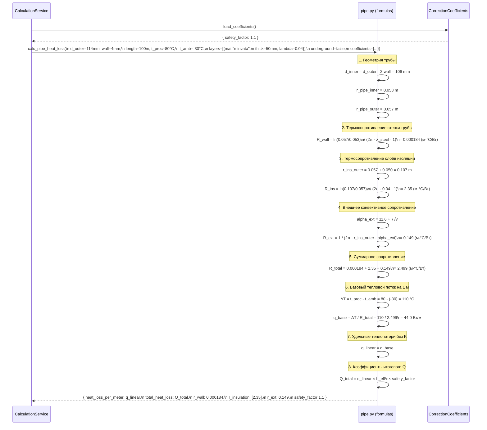
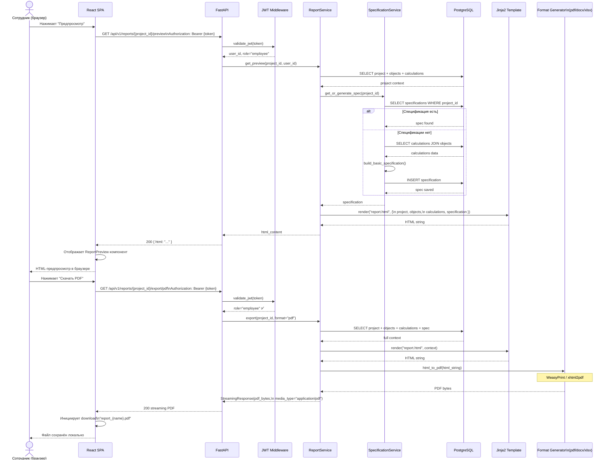
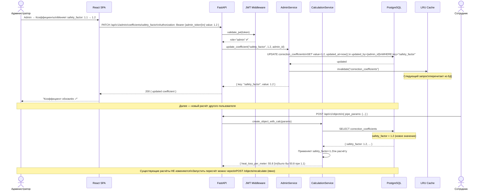
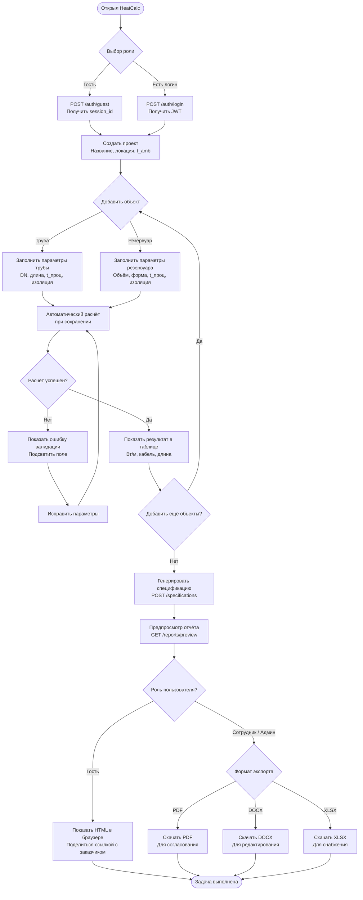
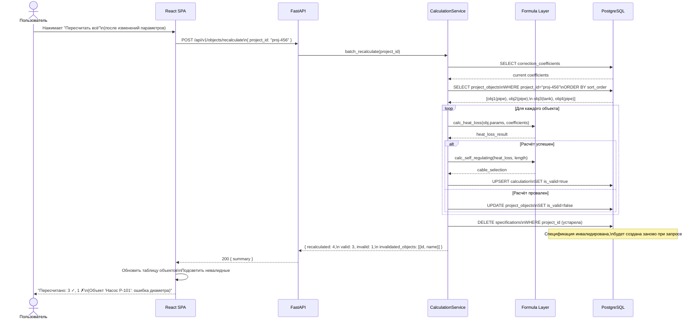

# Диаграммы процессов

## 1. Диаграмма последовательности: Гостевой вход и первый расчёт

### Описание

Показывает полный поток для самого частого сценария гостя: от открытия браузера до получения результата расчёта. Акцент — на отсутствии JWT и идентификации через `X-Session-Id`.

**Ключевые моменты:**
- Сессия создаётся в БД (таблица хранит session_id и метаданные)
- Каждый запрос гостя несёт заголовок `X-Session-Id` вместо `Authorization: Bearer`
- Расчёт теплопотерь запускается автоматически при создании объекта (внутри service layer)
- Гость получает результат в теле ответа на тот же запрос создания объекта



---

## 2. Диаграмма последовательности: Расчёт теплопотерь трубы (детальный)

### Описание

Детализирует алгоритм вычисления теплопотерь для надземной трубы с многослойной изоляцией. Показывает, как Formula Layer применяет коэффициенты из БД.

**Физическая модель:**
- Многослойная цилиндрическая стенка (закон Фурье в цилиндрических координатах)
- Термическое сопротивление: `R = ln(r_outer/r_inner) / (2π·λ·L)`
- Суммарное сопротивление: `R_total = R_wall + ΣR_insulation + R_ext`
- Теплопоток: `Q = ΔT / R_total`



---

## 3. Диаграмма последовательности: Генерация отчёта

### Описание

Показывает полный поток генерации отчёта от запроса до получения файла. Ключевой момент: для генерации файла (PDF/DOCX/XLSX) нужна роль `employee` или `admin`, тогда как HTML-предпросмотр доступен всем.



---

## 4. Диаграмма последовательности: Изменение коэффициента администратором

### Описание

Показывает, как изменение коэффициента администратором влияет на последующие расчёты. Подчёркивает важность: существующие расчёты **не пересчитываются** автоматически — только новые используют новый коэффициент.



---

## 5. Диаграмма активности: Полный сценарий гостя

### Описание

Диаграмма активности (Activity Diagram в нотации BPMN-style) показывает пошаговый путь внешнего проектировщика от входа до получения результата. Swim lanes разделяют ответственность между пользователем, браузером и системой.



---

## 6. Диаграмма активности: Сценарий проверки расчётов сотрудником

### Описание

Сотрудник проверяет расчёты подрядчика только после явной передачи проекта в рабочий контур. Гостевые проекты подрядчиков без передачи не раскрываются в проводнике.

```mermaid
flowchart TD
    Start([Уведомление: подрядчик\nсдал расчёты]) --> Login[Войти по логину/паролю\nПолучить JWT]

    Login --> OpenProjects[Открыть список проектов сотрудников\nGET /projects]

    OpenProjects --> FindProject[Найти переданный рабочий проект\nпо названию / дате]

    FindProject --> ReviewObjects[Просмотреть список объектов\nGET /objects?project_id=...]

    ReviewObjects --> CheckValid{Есть объекты\nс is_valid=false?}

    CheckValid -->|Да| MarkForReview[Отметить проблемные объекты\nКопировать список замечаний]
    MarkForReview --> ContactContractor[Передать замечания подрядчику\n(вне системы: email/звонок)]
    ContactContractor --> WaitFix[Ждать исправлений]
    WaitFix --> ReviewObjects

    CheckValid -->|Нет, все валидны| CheckResults[Проверить результаты расчётов\nСравнить с нормативами]

    CheckResults --> ResultsOK{Результаты\nкорректны?}

    ResultsOK -->|Нет, подозрительные значения| CheckCoefficients[Проверить коэффициенты\nAdmin → Коэффициенты]
    CheckCoefficients --> RecalculateManual[Запустить пересчёт\nPOST /objects/recalculate]
    RecalculateManual --> CheckResults

    ResultsOK -->|Да| GenerateSpec[Сгенерировать/обновить\nспецификацию]

    GenerateSpec --> PreviewHTML[Предпросмотр HTML-отчёта]

    PreviewHTML --> FinalCheck{Отчёт соответствует\nтребованиям?}

    FinalCheck -->|Нет| EditProjectMeta[Скорректировать метаданные\nпроекта (название, описание)]
    EditProjectMeta --> PreviewHTML

    FinalCheck -->|Да| ExportPDF[Экспорт PDF\nGET /reports/export/pdf]

    ExportPDF --> SendToChief[Отправить PDF\nглавному инженеру на подпись\n(вне системы)]

    SendToChief --> ExportXLSX[Экспорт XLSX\nДля отдела снабжения]

    ExportXLSX --> End([Проект передан в работу])
```

---

## 7. Диаграмма последовательности: Пакетный пересчёт

### Описание

Когда пользователь изменяет параметры нескольких объектов подряд или когда администратор обновил коэффициенты, может потребоваться пересчёт всех объектов проекта за одну операцию.


