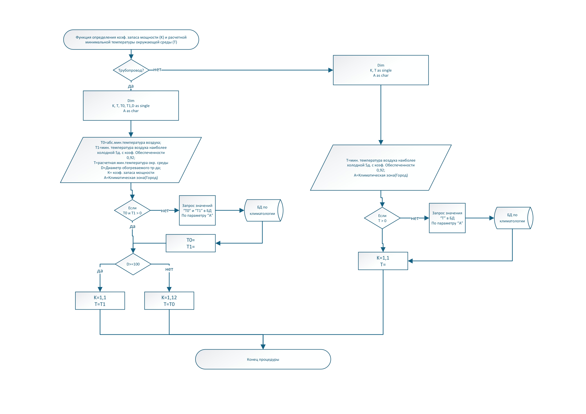
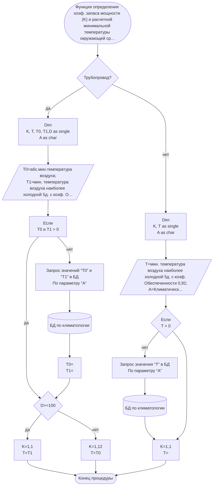

# Алгоритм: климат и коэффициент запаса

Источник VSDX: `Алгоритмы/алгоритм климат.vsdx`
Источник PDF: `Алгоритмы/алгоритм климат.pdf`

## Машинно извлеченная схема

- Узлов с текстом: `18`.
- Переходов Begin→End: `21`.
- JSON: [`generated/climate.json`](generated/climate.json).
- Mermaid: [`generated/climate.mmd`](generated/climate.mmd).

## Узлы

| ID | Тип | Текст |
|---|---|---|
| S1 | Start/End | Функция определения коэф. запаса мощности (K) и расчетной минимальной температуры окружающей среды (T) |
| S5 | Decision | Трубопровод? |
| S53 | Process | Dim K, Т as single A as char |
| S3 | Process | Dim K, Т, T0, T1,D as single A as char |
| S2 | Data | Т0=абс.мин.температура воздуха; Т1=мин. температура воздуха наиболее холодной 5д. с коэф. Обеспеченности 0,92; Т=расчетная мин.температура окр. среды D=Диаметр обогреваемого тр-да; К= коэф. запаса мощности A=Климатическая зона(Город) |
| S37 | Data | Т=мин. температура воздуха наиболее холодной 5д. с коэф. Обеспеченности 0,92; A=Климатическая зона(Город) |
| S16 | Shape | Если T0 и T1 > 0 |
| S7 | Database | БД по климатологии |
| S20 | Shape | Запрос значений “T0” и “T1” в БД По параметру “А” |
| S41 | Decision | Если T > 0 |
| S38 | Database | БД по климатологии |
| S43 | Process | Запрос значения “T” в БД По параметру “А” |
| S61 | Process | Т0= T1= |
| S47 | Process | K=1,1 T= |
| S9 | Decision | D>=100 |
| S10 | Process | K=1,1 T=T1 |
| S33 | Process | K=1,12 T=T0 |
| S57 | Start/End | Конец процедуры |

## Переходы

| # | Откуда | Условие/подпись | Куда | Connector |
|---|---|---|---|---|
| 1 | S1: Функция определения коэф. запаса мощности (K) и расчетной минимальной температуры окруж... |  | S5: Трубопровод? | S6 |
| 2 | S5: Трубопровод? | да | S3: Dim / K, Т, T0, T1,D as single / A as char | S8 |
| 3 | S16: Если / T0 и T1 > 0 | нет | S20: Запрос значений “T0” и “T1” в БД / По параметру “А” | S21 |
| 4 | S20: Запрос значений “T0” и “T1” в БД / По параметру “А” |  | S7: БД по климатологии | S23 |
| 5 | S2: Т0=абс.мин.температура воздуха; / Т1=мин. температура воздуха наиболее холодной 5д. с к... |  | S16: Если / T0 и T1 > 0 | S25 |
| 6 | S3: Dim / K, Т, T0, T1,D as single / A as char |  | S2: Т0=абс.мин.температура воздуха; / Т1=мин. температура воздуха наиболее холодной 5д. с к... | S26 |
| 7 | S16: Если / T0 и T1 > 0 | да | S9: D>=100 | S27 |
| 8 | S9: D>=100 | да | S10: K=1,1 / T=T1 | S34 |
| 9 | S9: D>=100 | нет | S33: K=1,12 / T=T0 | S35 |
| 10 | S7: БД по климатологии |  | S61: Т0= / T1= | S36 |
| 11 | S41: Если / T > 0 | нет | S43: Запрос значения “T” в БД / По параметру “А” | S42 |
| 12 | S43: Запрос значения “T” в БД / По параметру “А” |  | S38: БД по климатологии | S44 |
| 13 | S37: Т=мин. температура воздуха наиболее холодной 5д. с коэф. Обеспеченности 0,92; / A=Клима... |  | S41: Если / T > 0 | S45 |
| 14 | S38: БД по климатологии |  | S47: K=1,1 / T= | S50 |
| 15 | S41: Если / T > 0 |  | S47: K=1,1 / T= | S51 |
| 16 | S5: Трубопровод? | нет | S53: Dim / K, Т as single / A as char | S52 |
| 17 | S53: Dim / K, Т as single / A as char |  | S37: Т=мин. температура воздуха наиболее холодной 5д. с коэф. Обеспеченности 0,92; / A=Клима... | S54 |
| 18 | S10: K=1,1 / T=T1 |  | S57: Конец процедуры | S58 |
| 19 | S33: K=1,12 / T=T0 |  | S57: Конец процедуры | S59 |
| 20 | S47: K=1,1 / T= |  | S57: Конец процедуры | S60 |
| 21 | S61: Т0= / T1= |  | S9: D>=100 | S63 |

## Интерпретация для реализации

- Для трубопровода алгоритм выбирает расчетную температуру и коэффициент запаса по диаметру.
- Если `T0`/`T1` не заданы, они берутся из климатической базы по параметру `A`.
- По схеме: для `D >= 100` используется `K = 1,1`, `T = T1`; для меньших диаметров используется ветка `K = 1,12`, `T = T0`.
- Для не-труб используется минимальная температура наиболее холодной пятидневки с обеспеченностью `0,92`; итоговый коэффициент `K = 1,1`.

## QA-заметки

- Порог `D = 100` должен быть явно зафиксирован в миллиметрах.
- Нужны boundary cases для `D = 99, 100, 101` и для отсутствующих значений `T0`, `T1`, `T`.
- В QA-agent правило закреплено как deterministic oracle `tlt_climate_safety_factor`.
- В backend правило применяется в `CalculationService` до расчета теплопотерь:
  оно нормализует `safety_factor` и, если указан `climate_city`, расчетную
  `ambient_temperature`.
