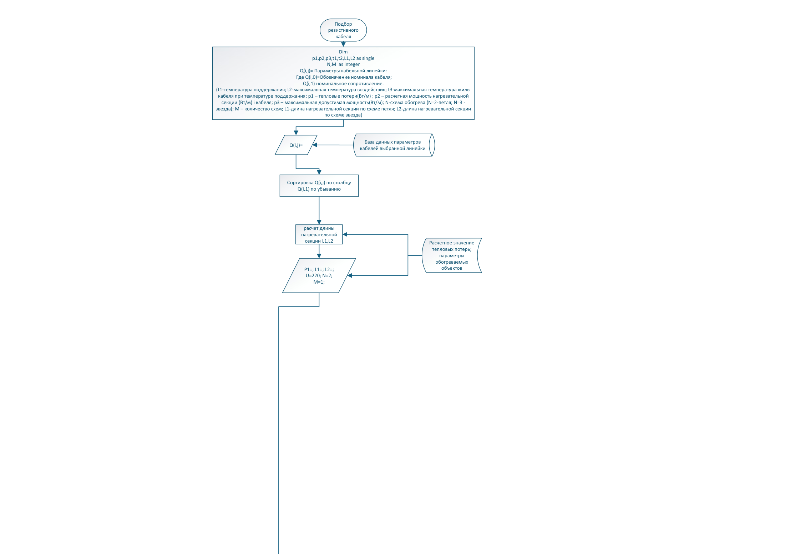
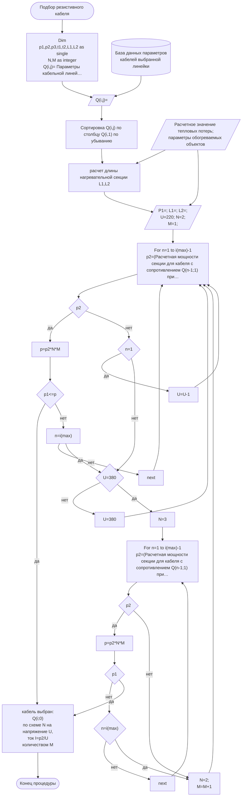

# Алгоритм: подбор резистивного кабеля

Источник VSDX: `Алгоритмы/Алгоритм подбора резистив.vsdx`
Источник PDF: `Алгоритмы/Алгоритм подбора резистив.pdf`

## Машинно извлеченная схема

- Узлов с текстом: `28`.
- Переходов Begin→End: `36`.
- JSON: [`generated/resistive-selection.json`](generated/resistive-selection.json).
- Mermaid: [`generated/resistive-selection.mmd`](generated/resistive-selection.mmd).

## Узлы

| ID | Тип | Текст |
|---|---|---|
| S1 | Start/End | Подбор резистивного кабеля |
| S4 | Process | Dim p1,p2,p3,t1,t2,L1,L2 as single N,M as integer Q(i,j)= Параметры кабельной линейки: Где Q(i,0)=Обозначение номинала кабеля; Q(i,1) номинальное сопротивление. (t1-температура поддержания; t2-максимальная температура воздействия; t3-максимальная температура жилы кабеля при температуре поддержания; p1 – тепловые потери(Вт/м) ; p2 – расчетная мощность нагревательной секции (Вт/м) i кабеля; p3 – максимальная допустимая мощность(Вт/м); N-схема обогрева (N=2-петля; N=3 - звезда); M – количество схем; L1-длина нагревательной секции по схеме петля; L2-длина нагревательной секции по схеме звезда) |
| S3 | Data | Q(i,j)= |
| S2 | Database | База данных параметров кабелей выбранной линейки |
| S14 | Process | Сортировка Q(i,j) по столбцу Q(i,1) по убыванию |
| S48 | Process | расчет длины нагревательной секции L1,L2 |
| S19 | External Data | Расчетное значение тепловых потерь; параметры обогреваемых объектов |
| S20 | Data | P1=; L1=; L2=; U=220; N=2; M=1; |
| S23 | Shape | For n=1 to i(max)-1 p2=(Расчетная мощности секции для кабеля с сопротивлением Q(n-1;1) при t1 длиной L1); p3= при максимально допустимой t3 и максимальным током 65А |
| S41 | Decision | p2<p3 |
| S75 | Decision | n=1 |
| S124 | Process | U=U-1 |
| S111 | Process | p=p2*N*M |
| S33 | Shape | U=380 |
| S25 | Decision | p1<=p |
| S27 | Shape | n=i(max) |
| S63 | Decision | U=380 |
| S82 | Process | N=3 |
| S119 | Process | N=2; M=M+1 |
| S29 | Shape | next |
| S84 | Process | For n=1 to i(max)-1 p2=(Расчетная мощности секции для кабеля с сопротивлением Q(n-1;1) при t1 длиной L2) p3= при максимально допустимой t3 и максимальным током 65А |
| S93 | Decision | p2<p3 |
| S120 | Process | p=p2*N*M |
| S86 | Decision | p1
Q(i;0) по схеме N на напряжение U, ток I=p2/U количеством M |
| S87 | Decision | n=i(max) |
| S89 | Process | next |
| S45 | Start/End | Конец процедуры |

## Переходы

| # | Откуда | Условие/подпись | Куда | Connector |
|---|---|---|---|---|
| 1 | S1: Подбор резистивного кабеля |  | S4: Dim / p1,p2,p3,t1,t2,L1,L2 as single / N,M as integer / Q(i,j)= Параметры кабельной лин... | S5 |
| 2 | S4: Dim / p1,p2,p3,t1,t2,L1,L2 as single / N,M as integer / Q(i,j)= Параметры кабельной лин... |  | S3: Q(i,j)= | S6 |
| 3 | S2: База данных параметров / кабелей выбранной линейки |  | S3: Q(i,j)= | S7 |
| 4 | S3: Q(i,j)= |  | S14: Сортировка Q(i,j) по столбцу Q(i,1) по убыванию | S17 |
| 5 | S14: Сортировка Q(i,j) по столбцу Q(i,1) по убыванию |  | S48: расчет длины нагревательной секции L1,L2 | S21 |
| 6 | S19: Расчетное значение тепловых потерь; / параметры обогреваемых объектов |  | S48: расчет длины нагревательной секции L1,L2 | S22 |
| 7 | S23: For n=1 to i(max)-1 / p2=(Расчетная мощности секции для кабеля с сопротивлением Q(n-1;1... |  | S41: p2<p3 | S26 |
| 8 | S27: n=i(max) | нет | S29: next | S30 |
| 9 | S27: n=i(max) | да | S63: U=380 | S34 |
| 10 | S29: next |  | S23: For n=1 to i(max)-1 / p2=(Расчетная мощности секции для кабеля с сопротивлением Q(n-1;1... | S35 |
| 11 | S60: кабель выбран: / Q(i;0) / по схеме N на напряжение U, / ток I=p2/U / количеством M |  | S45: Конец процедуры | S61 |
| 12 | S25: p1<=p | да | S60: кабель выбран: / Q(i;0) / по схеме N на напряжение U, / ток I=p2/U / количеством M | S62 |
| 13 | S63: U=380 | нет | S33: U=380 | S64 |
| 14 | S33: U=380 |  | S23: For n=1 to i(max)-1 / p2=(Расчетная мощности секции для кабеля с сопротивлением Q(n-1;1... | S66 |
| 15 | S41: p2<p3 | да | S111: p=p2*N*M | S73 |
| 16 | S25: p1<=p | нет | S27: n=i(max) | S81 |
| 17 | S63: U=380 | да | S82: N=3 | S83 |
| 18 | S84: For n=1 to i(max)-1 / p2=(Расчетная мощности секции для кабеля с сопротивлением Q(n-1;1... |  | S93: p2<p3 | S85 |
| 19 | S87: n=i(max) | нет | S89: next | S88 |
| 20 | S87: n=i(max) | да | S119: N=2; / M=M+1 | S90 |
| 21 | S89: next |  | S84: For n=1 to i(max)-1 / p2=(Расчетная мощности секции для кабеля с сопротивлением Q(n-1;1... | S92 |
| 22 | S93: p2<p3 | да | S120: p=p2*N*M | S101 |
| 23 | S86: p1<p | нет | S87: n=i(max) | S103 |
| 24 | S82: N=3 |  | S84: For n=1 to i(max)-1 / p2=(Расчетная мощности секции для кабеля с сопротивлением Q(n-1;1... | S106 |
| 25 | S20: P1=; L1=; L2=; / U=220; N=2; / M=1; |  | S23: For n=1 to i(max)-1 / p2=(Расчетная мощности секции для кабеля с сопротивлением Q(n-1;1... | S108 |
| 26 | S41: p2<p3 | нет | S75: n=1 | S110 |
| 27 | S111: p=p2*N*M |  | S25: p1<=p | S112 |
| 28 | S48: расчет длины нагревательной секции L1,L2 |  | S20: P1=; L1=; L2=; / U=220; N=2; / M=1; | S116 |
| 29 | S19: Расчетное значение тепловых потерь; / параметры обогреваемых объектов |  | S20: P1=; L1=; L2=; / U=220; N=2; / M=1; | S117 |
| 30 | S86: p1<p | да | S60: кабель выбран: / Q(i;0) / по схеме N на напряжение U, / ток I=p2/U / количеством M | S118 |
| 31 | S120: p=p2*N*M |  | S86: p1<p | S121 |
| 32 | S119: N=2; / M=M+1 |  | S23: For n=1 to i(max)-1 / p2=(Расчетная мощности секции для кабеля с сопротивлением Q(n-1;1... | S123 |
| 33 | S75: n=1 | да | S124: U=U-1 | S125 |
| 34 | S124: U=U-1 |  | S23: For n=1 to i(max)-1 / p2=(Расчетная мощности секции для кабеля с сопротивлением Q(n-1;1... | S126 |
| 35 | S75: n=1 | нет | S63: U=380 | S128 |
| 36 | S93: p2<p3 | нет | S119: N=2; / M=M+1 | S134 |

## Интерпретация для реализации

- Алгоритм загружает параметры выбранной кабельной линейки `Q(i,j)` и сортирует их по сопротивлению `Q(i,1)` по убыванию.
- Далее рассчитываются длины нагревательных секций `L1`, `L2`, мощность секции `p2` и максимально допустимая мощность `p3`.
- Кабель выбирается при выполнении ограничений по теплопотерям, допустимой мощности, напряжению и схеме соединения.
- Схема содержит отдельные ветки для `U = 220`, `U = 380`, `N = 2`, `N = 3` и количества схем `M`.

## QA-заметки

- Нужны deterministic cases для каждой схемы соединения, уже реализованной в backend.
- Отдельно проверить near-threshold подбор: выбранное сечение/сопротивление должно быть минимально достаточным, а не просто первым подходящим.
