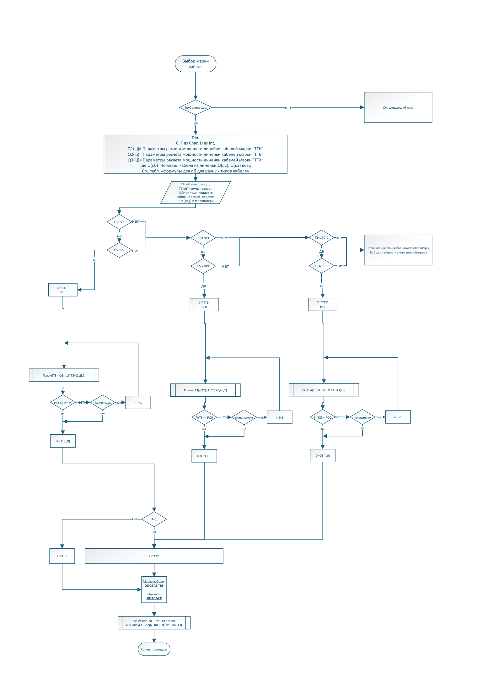
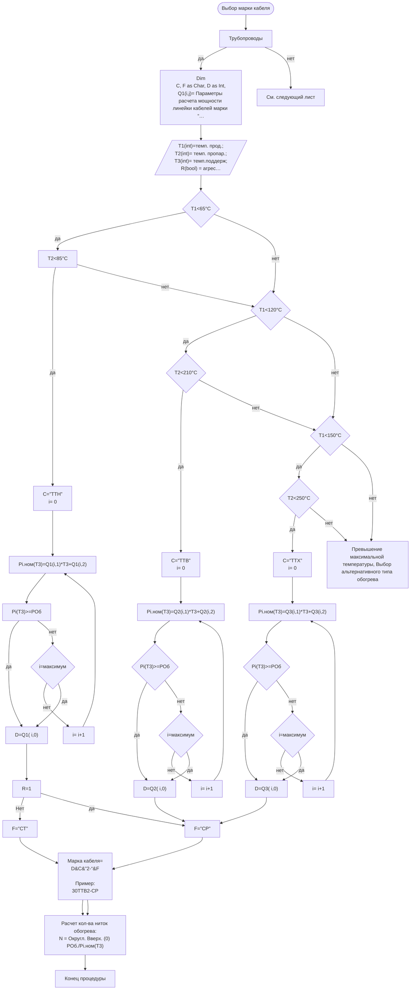

# Алгоритм: выбор саморегулирующегося кабеля для трубопровода

Источник VSDX: `Алгоритмы/Алгоритм Самрег.трубы.vsdx`
Источник PDF: `Алгоритмы/Алгоритм Самрег. трубы.pdf`

## Машинно извлеченная схема

- Узлов с текстом: `36`.
- Переходов Begin→End: `48`.
- JSON: [`generated/self-regulating-pipe-selection.json`](generated/self-regulating-pipe-selection.json).
- Mermaid: [`generated/self-regulating-pipe-selection.mmd`](generated/self-regulating-pipe-selection.mmd).

## Узлы

| ID | Тип | Текст |
|---|---|---|
| S1 | Start/End | Выбор марки кабеля |
| S40 | Shape | Трубопроводы |
| S168 | Process | См. следующий лист |
| S89 | Shape | Dim C, F as Char, D as Int, Q1(i,j)= Параметры расчета мощности линейки кабелей марки “ТТН” Q2(i,j)= Параметры расчета мощности линейки кабелей марки “ТТВ” Q3(i,j)= Параметры расчета мощности линейки кабелей марки “ТТХ” Где Q(i,0)=Номинал кабеля из линейки;Q(i,1), Q(i,2) коэф. См. табл. «формулы для qб для разных типов кабеля» |
| S7 | Data | T1(int)=темп. прод.; T2(int)= темп. пропар.; T3(int)= темп.поддерж; R(bool) = агресс. продукт PОб(sing) = теплопотери |
| S13 | Decision | Т1<65°C |
| S147 | Decision | Т1<150°C |
| S123 | Decision | Т1<120°C |
| S155 | Process | Превышение максимальной температуры, Выбор альтернативного типа обогрева |
| S15 | Shape | Т2<85°C |
| S149 | Decision | Т2<250°C |
| S125 | Decision | Т2<210°C |
| S87 | Process | C=”ТТН” i= 0 |
| S144 | Process | C=”ТТХ” i= 0 |
| S120 | Process | C=”ТТВ” i= 0 |
| S30 | Subprocess | Pi.ном(T3)=Q1(i,1)*T3+Q1(i,2) |
| S134 | Subprocess | Pi.ном(T3)=Q3(i,1)*T3+Q3(i,2) |
| S110 | Subprocess | Pi.ном(T3)=Q2(i,1)*T3+Q2(i,2) |
| S35 | Shape | Pi(T3)>=PОб |
| S57 | Decision | i=максимум |
| S55 | Shape | i= i+1 |
| S136 | Decision | Pi(T3)>=PОб |
| S139 | Decision | i=максимум |
| S138 | Process | i= i+1 |
| S112 | Decision | Pi(T3)>=PОб |
| S115 | Decision | i=максимум |
| S114 | Process | i= i+1 |
| S104 | Process | D=Q1( i,0) |
| S146 | Process | D=Q3( i,0) |
| S122 | Process | D=Q2( i,0) |
| S49 | Shape | R=1 |
| S68 | Process | F=”СР” |
| S51 | Process | F=”СТ” |
| S95 | Process | Марка кабеля= D&C&”2-“&F  Пример: 30ТТВ2-СР |
| S71 | Shape | Расчет кол-ва ниток обогрева: N = Округл. Вверх. (0) PОб./Pi.ном(Т3) |
| S77 | Shape | Конец процедуры |

## Переходы

| # | Откуда | Условие/подпись | Куда | Connector |
|---|---|---|---|---|
| 1 | S7: T1(int)=темп. прод.; / T2(int)= темп. пропар.; / T3(int)= темп.поддерж; / R(bool) = агр... |  | S13: Т1<65°C | S11 |
| 2 | S13: Т1<65°C | да | S15: Т2<85°C | S16 |
| 3 | S15: Т2<85°C | да | S87: C=”ТТН” / i= 0 | S23 |
| 4 | S30: Pi.ном(T3)=Q1(i,1)*T3+Q1(i,2) |  | S35: Pi(T3)>=PОб | S36 |
| 5 | S1: Выбор марки кабеля |  | S40: Трубопроводы | S41 |
| 6 | S40: Трубопроводы | да | S89: Dim / C, F as Char, D as Int, / Q1(i,j)= Параметры расчета мощности линейки кабелей мар... | S44 |
| 7 | S35: Pi(T3)>=PОб | да | S104: D=Q1( i,0) | S50 |
| 8 | S49: R=1 | Нет | S51: F=”СТ” | S52 |
| 9 | S55: i= i+1 |  | S30: Pi.ном(T3)=Q1(i,1)*T3+Q1(i,2) | S60; inferred target |
| 10 | S35: Pi(T3)>=PОб | нет | S57: i=максимум | S63 |
| 11 | S57: i=максимум | нет | S55: i= i+1 | S64 |
| 12 | S49: R=1 | да | S68: F=”СР” | S69 |
| 13 | S57: i=максимум | да | S104: D=Q1( i,0) | S70; inferred target |
| 14 | S68: F=”СР” |  | S95: Марка кабеля= / D&C&”2-“&F /  / Пример: / 30ТТВ2-СР | S75 |
| 15 | S51: F=”СТ” |  | S95: Марка кабеля= / D&C&”2-“&F /  / Пример: / 30ТТВ2-СР | S76 |
| 16 | S71: Расчет кол-ва ниток обогрева: / N = Округл. Вверх. (0) PОб./Pi.ном(Т3) |  | S77: Конец процедуры | S78 |
| 17 | S87: C=”ТТН” / i= 0 |  | S30: Pi.ном(T3)=Q1(i,1)*T3+Q1(i,2) | S88 |
| 18 | S89: Dim / C, F as Char, D as Int, / Q1(i,j)= Параметры расчета мощности линейки кабелей мар... |  | S7: T1(int)=темп. прод.; / T2(int)= темп. пропар.; / T3(int)= темп.поддерж; / R(bool) = агр... | S90 |
| 19 | S95: Марка кабеля= / D&C&”2-“&F /  / Пример: / 30ТТВ2-СР |  | S71: Расчет кол-ва ниток обогрева: / N = Округл. Вверх. (0) PОб./Pi.ном(Т3) | S96 |
| 20 | S95: Марка кабеля= / D&C&”2-“&F /  / Пример: / 30ТТВ2-СР |  | S71: Расчет кол-ва ниток обогрева: / N = Округл. Вверх. (0) PОб./Pi.ном(Т3) | S97 |
| 21 | S104: D=Q1( i,0) |  | S49: R=1 | S105 |
| 22 | S110: Pi.ном(T3)=Q2(i,1)*T3+Q2(i,2) |  | S112: Pi(T3)>=PОб | S111 |
| 23 | S112: Pi(T3)>=PОб | да | S122: D=Q2( i,0) | S113 |
| 24 | S114: i= i+1 |  | S110: Pi.ном(T3)=Q2(i,1)*T3+Q2(i,2) | S116; inferred target |
| 25 | S112: Pi(T3)>=PОб | нет | S115: i=максимум | S117 |
| 26 | S115: i=максимум | нет | S114: i= i+1 | S118 |
| 27 | S115: i=максимум | да | S122: D=Q2( i,0) | S119; inferred target |
| 28 | S120: C=”ТТВ” / i= 0 |  | S110: Pi.ном(T3)=Q2(i,1)*T3+Q2(i,2) | S121 |
| 29 | S123: Т1<120°C | да | S125: Т2<210°C | S124 |
| 30 | S13: Т1<65°C | нет | S123: Т1<120°C | S126 |
| 31 | S125: Т2<210°C | да | S120: C=”ТТВ” / i= 0 | S128 |
| 32 | S15: Т2<85°C | нет | S123: Т1<120°C | S129 |
| 33 | S122: D=Q2( i,0) |  | S68: F=”СР” | S132 |
| 34 | S134: Pi.ном(T3)=Q3(i,1)*T3+Q3(i,2) |  | S136: Pi(T3)>=PОб | S135 |
| 35 | S136: Pi(T3)>=PОб | да | S146: D=Q3( i,0) | S137 |
| 36 | S138: i= i+1 |  | S134: Pi.ном(T3)=Q3(i,1)*T3+Q3(i,2) | S140; inferred target |
| 37 | S136: Pi(T3)>=PОб | нет | S139: i=максимум | S141 |
| 38 | S139: i=максимум | нет | S138: i= i+1 | S142 |
| 39 | S139: i=максимум | да | S146: D=Q3( i,0) | S143; inferred target |
| 40 | S144: C=”ТТХ” / i= 0 |  | S134: Pi.ном(T3)=Q3(i,1)*T3+Q3(i,2) | S145 |
| 41 | S147: Т1<150°C | да | S149: Т2<250°C | S148 |
| 42 | S149: Т2<250°C | да | S144: C=”ТТХ” / i= 0 | S150 |
| 43 | S123: Т1<120°C | нет | S147: Т1<150°C | S151 |
| 44 | S125: Т2<210°C | нет | S147: Т1<150°C | S152 |
| 45 | S147: Т1<150°C | нет | S155: Превышение максимальной температуры, Выбор альтернативного типа обогрева | S156 |
| 46 | S149: Т2<250°C | нет | S155: Превышение максимальной температуры, Выбор альтернативного типа обогрева | S157 |
| 47 | S146: D=Q3( i,0) |  | S68: F=”СР” | S165 |
| 48 | S40: Трубопроводы | нет | S168: См. следующий лист | S166 |

## Интерпретация для реализации

- Алгоритм выбирает серию `ТТН`, `ТТВ` или `ТТХ` по температурам продукта и пропарки.
- Для выбранной серии перебираются номиналы кабеля и считается `Pi.ном(T3) = Q(i,1) * T3 + Q(i,2)`.
- Подходящим считается кабель, у которого `Pi(T3) >= Pоб`.
- Суффикс марки зависит от агрессивности продукта: `СР` для агрессивного продукта (`R=1`), иначе `СТ` — подтверждено первоисточником `Расчет_спецификации_трубы_самрег29_05_26.xlsx` (фикс 2026-06-07).
- Количество ниток считается как округление вверх `Pоб / Pi.ном(T3)`.
- В текущем API `maintain_temperature` передает T3; если старый клиент его не
  передал, backend использует `T3=T1` как совместимый fallback.

## QA-заметки

- Температурные пределы трактуются как включительные паспортные максимумы: `<=65`, `<=85`, `<=120`, `<=210`, `<=150`, `<=250`.
- Нужно зафиксировать единицы `Pоб`: Вт/м или суммарная мощность. Для выбора кабеля корректнее удельная требуемая мощность.
