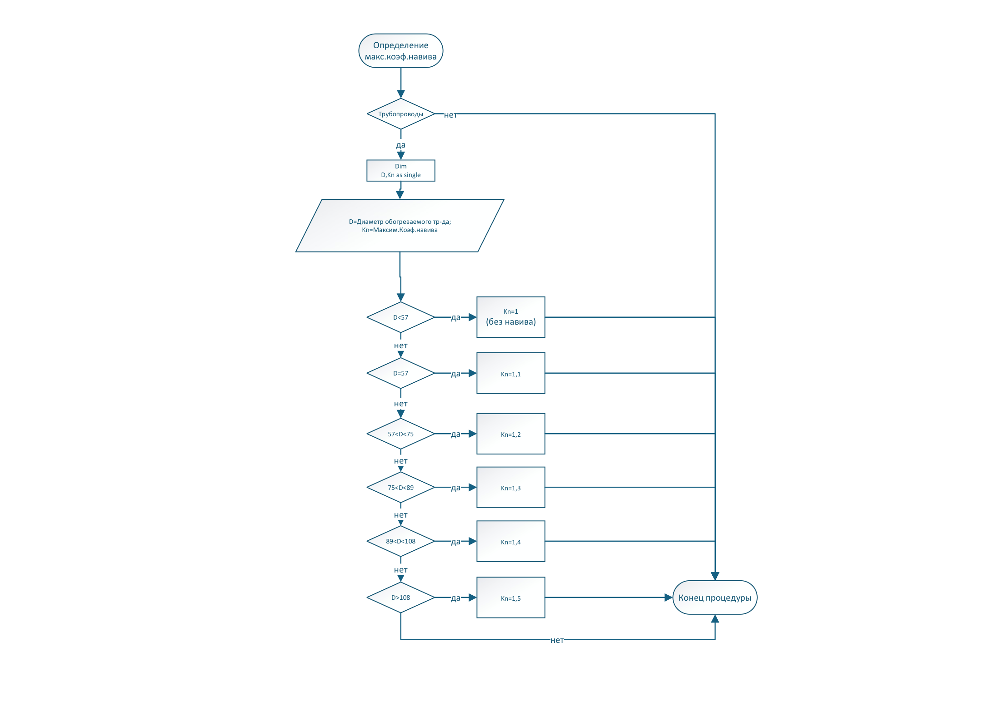
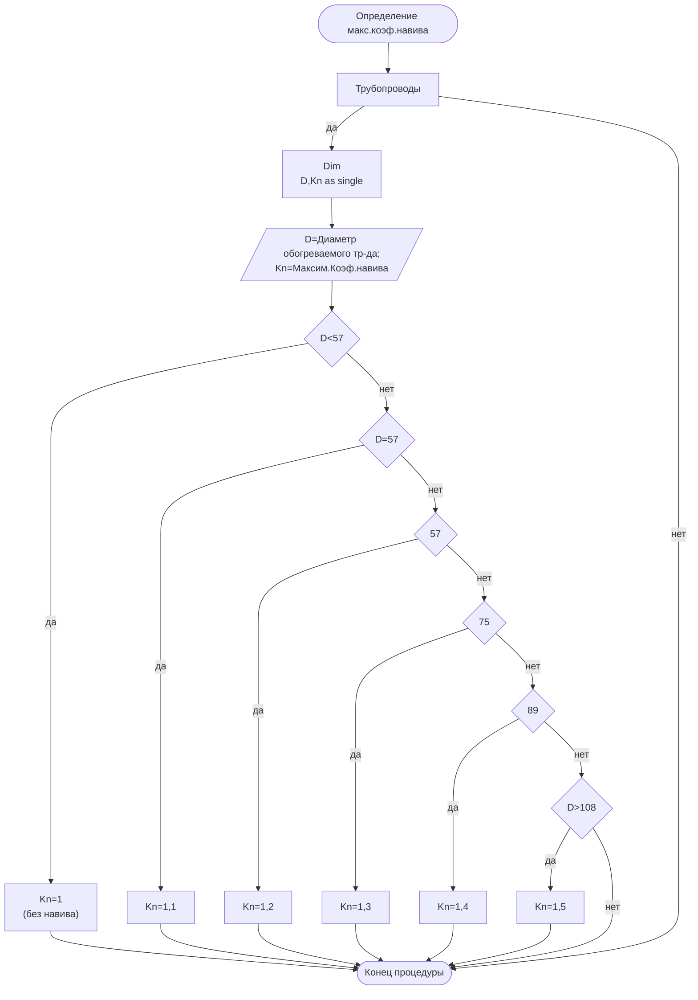

# Алгоритм: максимальный коэффициент навива

Источник VSDX: `Алгоритмы/алгоритм навив.vsdx`
Источник PDF: `Алгоритмы/алгоритм навив.pdf`

## Машинно извлеченная схема

- Узлов с текстом: `17`.
- Переходов Begin→End: `23`.
- JSON: [`generated/winding.json`](generated/winding.json).
- Mermaid: [`generated/winding.mmd`](generated/winding.mmd).

## Узлы

| ID | Тип | Текст |
|---|---|---|
| S1 | Start/End | Определение макс.коэф.навива |
| S40 | Shape | Трубопроводы |
| S42 | Process | Dim D,Kn as single |
| S45 | Data | D=Диаметр обогреваемого тр-да; Kn=Максим.Коэф.навива |
| S47 | Decision | D<57 |
| S49 | Shape | Kn=1 (без навива) |
| S52 | Decision | D=57 |
| S53 | Process | Kn=1,1 |
| S55 | Decision | 57<D<75 |
| S56 | Process | Kn=1,2 |
| S58 | Decision | 75<D<89 |
| S59 | Process | Kn=1,3 |
| S67 | Decision | 89<D<108 |
| S68 | Process | Kn=1,4 |
| S71 | Decision | D>108 |
| S72 | Process | Kn=1,5 |
| S75 | Start/End | Конец процедуры |

## Переходы

| # | Откуда | Условие/подпись | Куда | Connector |
|---|---|---|---|---|
| 1 | S1: Определение макс.коэф.навива |  | S40: Трубопроводы | S41 |
| 2 | S40: Трубопроводы | да | S42: Dim / D,Kn as single | S44 |
| 3 | S42: Dim / D,Kn as single |  | S45: D=Диаметр обогреваемого тр-да; / Kn=Максим.Коэф.навива | S46 |
| 4 | S45: D=Диаметр обогреваемого тр-да; / Kn=Максим.Коэф.навива |  | S47: D<57 | S48 |
| 5 | S47: D<57 | да | S49: Kn=1 / (без навива) | S51 |
| 6 | S52: D=57 | да | S53: Kn=1,1 | S54 |
| 7 | S55: 57<D<75 | да | S56: Kn=1,2 | S57 |
| 8 | S58: 75<D<89 | да | S59: Kn=1,3 | S60 |
| 9 | S47: D<57 | нет | S52: D=57 | S61 |
| 10 | S52: D=57 | нет | S55: 57<D<75 | S62 |
| 11 | S55: 57<D<75 | нет | S58: 75<D<89 | S63 |
| 12 | S67: 89<D<108 | да | S68: Kn=1,4 | S69 |
| 13 | S58: 75<D<89 | нет | S67: 89<D<108 | S70 |
| 14 | S71: D>108 | да | S72: Kn=1,5 | S73 |
| 15 | S67: 89<D<108 | нет | S71: D>108 | S74 |
| 16 | S72: Kn=1,5 |  | S75: Конец процедуры | S76 |
| 17 | S68: Kn=1,4 |  | S75: Конец процедуры | S77 |
| 18 | S59: Kn=1,3 |  | S75: Конец процедуры | S78 |
| 19 | S56: Kn=1,2 |  | S75: Конец процедуры | S79 |
| 20 | S53: Kn=1,1 |  | S75: Конец процедуры | S80 |
| 21 | S49: Kn=1 / (без навива) |  | S75: Конец процедуры | S81 |
| 22 | S71: D>108 | нет | S75: Конец процедуры | S82 |
| 23 | S40: Трубопроводы | нет | S75: Конец процедуры | S84 |

## Интерпретация для реализации

- Алгоритм определяет максимальный коэффициент навива `Kn` по диаметру трубопровода `D`.
- В схеме заданы интервалы: `D < 57`, `D = 57`, `57 < D < 75`, `75 < D < 89`, `89 < D < 108`, `D > 108`.
- Результаты веток: `1`, `1,1`, `1,2`, `1,3`, `1,4`, `1,5` соответственно.
- Для QA принято консервативное заполнение граничных точек: `57 < D <= 75`, `75 < D <= 89`, `89 < D <= 108`.

## QA-заметки

- В схеме нет явных веток для `D = 75`, `D = 89`, `D = 108`; QA-agent нормализует их в нижний соседний диапазон как более консервативный максимум навива.
- В QA-agent правило закреплено как deterministic oracle `tlt_max_winding_coefficient`.
