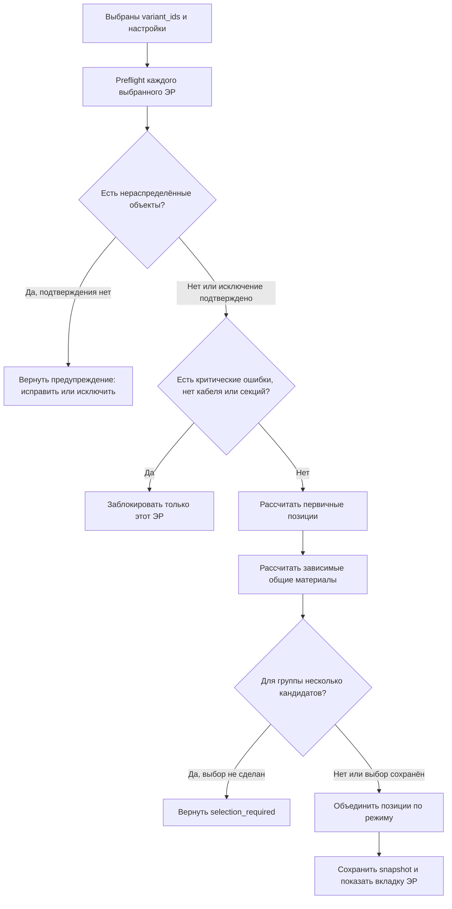

# Алгоритм выбора позиций и расчёта спецификации

**Контур:** frontend + backend  
**Статус:** нормализованный алгоритм по бизнес-источнику  
**Дата подготовки:** 2026-08-03  
**Бизнес-источник:** [«Расчёт спецификации для неавторизованных пользователей», редакция 4, 07.07.2026](<../../../ТНП/1_Кейс_«Расчёт_спецификации_для_неавторизованных_пользователей» (1).pdf>)  
**Разобранные разделы:** §6.18-6.20 и §7.1-7.15, страницы 52-81  
**Нормативная зависимость:** [ТЗ на электротехнический расчёт](./guest-electrical-calculation-tz.md)

> **Текущая демонстрационная конфигурация.** Встроенный каталог
> `builtin-specification/case1-demo-v1` (schema version `2`) является
> immutable DEMO/non-production версией. Он служит только для демонстрации
> алгоритма Case 1 и **не может использоваться для закупки**. PDF остаётся
> единственным бизнес-источником; все дополнения, которых в нём нет, ниже
> отмечены как `DEMO` и не заявляются производственно достоверными.

## 1. Назначение и границы

Документ переводит правила PDF в последовательный алгоритм:

1. пользователь выбирает один или несколько вариантов электротехнического расчёта, далее - ЭР;
2. система проверяет готовность каждого выбранного ЭР;
3. для каждого готового ЭР отдельно выбирает номенклатурные позиции и рассчитывает их количество;
4. система объединяет одинаковые позиции только внутри одной спецификации;
5. система сохраняет результат вместе с настройками и версиями использованных справочников.

Алгоритм описывает спецификацию для саморегулирующегося кабеля и трубопроводов. PDF не содержит достаточных формул для резервуаров и других типов объектов, поэтому их позиции нельзя рассчитывать по аналогии.

В документ не входят:

- подбор марки кабеля и формирование нагревательных секций - это вход из электротехнического расчёта;
- выгрузка Excel, PDF и формирование отчёта;
- цены, коммерческие предложения, складские остатки и выбор поставщика;
- формулы материалов, отсутствующие в исходном PDF.

## 2. Нормативные решения по противоречиям исходника

Этот документ уточняет алгоритм, но не переопределяет решения основного ТЗ. При конфликте действует раздел 3 [ТЗ на электротехнический расчёт](./guest-electrical-calculation-tz.md#3-нормативные-решения-по-неоднозначностям-pdf).

| ID | Разночтение PDF | Принятое правило |
|---|---|---|
| SPEC-DEC-01 | §6.18, §7.3 и §7.4 говорят о формировании всех ЭР, а §7.2 - только выбранных | Формировать только явно переданные `variant_ids`. Другие ЭР не проверять и не изменять |
| SPEC-DEC-02 | §7.9 использует фактическую длину секций, а электротехническое ТЗ требует запас 10% | Кабель заказывать по `required_order_length_m`; инженерные аксессуары считать по фактической монтажной длине `actual_installed_length_m` |
| SPEC-DEC-03 | §7.9 допускает ручное изменение секций, а §6.16 запрещает его | В MVP спецификация использует только автоматически сформированные актуальные секции |
| SPEC-DEC-04 | Настройки общие для проекта, но повторный расчёт выбранных ЭР должен быть явным | Изменение общих настроек помечает существующие спецификации как неактуальные; пересчитываются только ЭР из нового явного запроса |
| SPEC-DEC-05 | PDF не задаёт поведение при нуле подходящих позиций и при нескольких позициях без выбора | Ноль кандидатов - блокирующая диагностика. Один кандидат - автовыбор. Несколько - требуется явный выбор инженера |
| SPEC-DEC-06 | Часть строк справочников в PDF не содержит кода или условий `Ex`/`Rгр` | Для production недостающие значения нельзя придумывать: финальная спецификация блокируется до подключения полного справочника. Исключение только для явно помеченного demo-каталога описано ниже; оно не переносится в production |

### Демонстрационный каталог до подключения производственного справочника

Пока производственный справочник не подключён, приложение использует только
immutable версию `builtin-specification/case1-demo-v1` со `schema_version: 2`.
Это демонстрационный, не закупочный каталог: он не подтверждает существование,
цену, поставляемость или производственную идентичность позиции. После импорта
производственного каталога demo-версия должна быть выведена из `active` и не
может автоматически активироваться в production.

В таблице разделены дословно перенесённые сведения PDF и технические
дополнения DEMO. Префикс `DEMO-` означает вымышленный код, а не номенклатурный
код изготовителя.

| Поле/позиция | Значение из PDF | Придуманное DEMO-значение | Причина | Ограничение | Чем заменить в production |
|---|---|---|---|---|---|
| Идентичность каталога | PDF не задаёт версию машиночитаемого каталога | `catalog_key: builtin-specification`, `version: case1-demo-v1`, `schema_version: 2`, immutable | Нужна воспроизводимая и идемпотентная demo-поставка | Не является версией справочника владельца данных | Импортированным и утверждённым производственным каталогом с собственной версией |
| 18 identity-строк кабеля | Case 1 rev. 4 не перечисляет `10/17/25/31ТТН2-*`, `15/30/45/60ТТВ2-*`, `15…90ТТХ2-*` и коды `001-001/002/003-*` | Не новая бизнес-матрица и не вымышленные `DEMO-*` коды: техническое зеркалирование точной cable identity из уже сохранённого ER/BOM snapshot | Текущий fail-closed candidate matching не сформирует кабель без точной identity-кандидатуры | Эта документация не подтверждает production-достоверность марок или кодов; это известный интеграционный шов demo | Единым owner-approved cable catalog/snapshot без дублирования identity в seed |
| 12 соединительных коробок | Марки, коды, шесть условий, `section_divider` и `rounding_mode` дословно взяты со стр. 76; `min_quantity = 1` задано алгоритмом на стр. 78 и бизнес-правилом на стр. 81 | Нет семантической подстановки; для знака `-` применяется `{"mode":"not_applicable","decision_ref":"DEMO-CASE1-BOX-v1"}` | Новый контракт условий требует явного смысла вместо старого `"unused"` | Не добавляет отсутствующие правила выбора | Утверждённой машиночитаемой матрицей владельца данных, если она изменит PDF |
| `Ex`, `R_gr` для коробок | Входы объявлены на стр. 75, но стр. 76 не содержит условий для строк коробок | Во всех 12 строках: `{"mode":"not_applicable","decision_ref":"DEMO-CASE1-EX-RGR-NOT-APPLICABLE-v1"}` | Невозможно вывести матрицу из PDF; demo должен работать без выдумывания соответствий строкам | `Ex` и `R_gr` собираются и сохраняются в snapshot, но **не влияют на выбор коробки** | Полной матрицей применимости `Ex`/`R_gr`, утверждённой владельцем данных |
| Клей-герметик | PDF указывает `Клей-герметик силиконовый`, марка `NEO CONTACT MIX600`; полного номенклатурного кода нет | `DEMO-SEALANT-NEO-CONTACT-MIX600` | Нужна техническая идентичность строки в demo | Код вымышлен; не пригоден для заказа | Реальным кодом и упаковкой из производственного справочника |
| Стекловолоконные ленты `ЛКС 12`, `ЛКВ 12` | Марки и расчётные параметры приведены в PDF; номенклатурные коды не приведены | `DEMO-FIBERGLASS-LKS-12`, `DEMO-FIBERGLASS-LKV-12` | Demo-результату необходимы отдельные ключи строк | Коды вымышлены; марки не подтверждают поставщика | Реальными кодами, единицами поставки и параметрами упаковки |
| Алюминиевая лента | PDF задаёт расчётный расход и длину катушки, но не полную идентичность позиции | Марка и код `DEMO-ALUMINIUM-TAPE-50M` | Demo-результату необходим ключ строки | Код и точная марка не производственные | Реальной маркой, кодом и упаковкой из производственного справочника |

Новый seed не содержит значений `"unused"` и не содержит строк или кодов
`TEST-*`. Для применяемого булева условия используется только
`{"mode":"match","operator":"eq","value":true|false}`; для
неприменимого - только объект `not_applicable` с `decision_ref`. Все коды
`DEMO-*` вымышлены. Из PDF без изменения перенесена известная матрица 12
коробок со страницы 76; DEMO-допущения не расширяют эту матрицу.

## 3. Термины и входные данные

### 3.1 Термины

- **ЭР** - независимый вариант электротехнического расчёта проекта.
- **Спецификация ЭР** - перечень материалов только одного ЭР.
- **Распределённый объект** - объект, назначенный поддерживаемой системе обогрева.
- **Готовый объект** - распределённый объект с актуальным успешным расчётом, маркой кабеля и секциями.
- **Номенклатурная база** - версионированный набор позиций и параметров расчёта количества.
- **Кандидат** - строка выбранной номенклатурной базы, прошедшая условия применения.
- **Общая позиция** - материал, рассчитываемый после первичных позиций, например клей-герметик.

### 3.2 Параметры запроса формирования

| Параметр | Тип | Правило |
|---|---|---|
| `variant_ids` | непустой список UUID | Только эти ЭР участвуют в операции |
| `catalog_id`, `catalog_version` | идентификаторы | На текущем этапе стандартная база выбирается автоматически |
| `grouping_mode` | `separate_by_object_type` или `merge_materials` | Определяет только группировку результата, но не формулы |
| `Ex` | boolean | Тип зоны по взрывоопасности |
| `K1i` | boolean | Индикация питающих на коробках |
| `K2i` | boolean | Дополнительная индикация в конце секции |
| `Kiu` | boolean | Дополнительная индикация сверху коробки |
| `L_K2i_m` | число | Минимальная длина секции для применения `K2i` |
| `R_gr` | число | Коэффициент горячего резервирования; PDF не задаёт общую формулу его применения |
| `exclude_unassigned_confirmed` | boolean | Явное подтверждение исключения нераспределённых объектов |
| `catalog_selections` | карта сохранённых выборов | Нужна для групп, где найдено несколько кандидатов |

Значения настроек применяются одинаково ко всем ЭР одного запроса.

### 3.3 Данные каждого объекта ЭР

Для расчёта нужны:

| Данные | Источник | Проверка |
|---|---|---|
| `object_id`, `object_type` | объект проекта | В этом алгоритме поддержан только `pipe` |
| состояние распределения и расчёта | ЭР | Участвует только `ready` и актуальный результат |
| полный маркоразмер и номенклатурный код кабеля | результат ЭР + BOM-справочник | Требуется точное совпадение, без поиска по похожему тексту |
| температурная группа `LOW` или `MEDIUM_HIGH` | результат ЭР | Обязательна для комплектов и стекловолоконной ленты |
| группы секций: `section_length_m`, `section_count` | результат ЭР | Значения больше нуля |
| `actual_installed_length_m` | результат ЭР | Фактическая монтажная длина для аксессуаров |
| `required_order_length_m` | результат ЭР | Закупочная длина кабеля |
| `outer_diameter_mm` | объект трубопровода | Больше нуля; `57 мм` относится к ветке `>= 57` |

Автоматический расчёт формирует для объекта одинаковые секции, поэтому у коробочного алгоритма есть одно значение `L_sec` и одно суммарное `N_sec`. Если это ограничение будет снято, правило выбора коробок для неодинаковых групп надо утвердить отдельно.

### 3.4 Обязательные поля строки номенклатуры

Каждая используемая строка каталога должна иметь:

- стабильный идентификатор;
- базу и версию каталога;
- наименование, марку и номенклатурный код;
- единицу поставки;
- условия применимости;
- параметры формулы количества;
- источник и версию данных.

Наименование не является идентификатором и не участвует в объединении строк.

## 4. Общий алгоритм



### 4.1 Фаза A: preflight

Для каждого `variant_id` независимо:

1. Проверить существование ЭР и его принадлежность проекту.
2. Найти нераспределённые объекты только этого ЭР.
3. Если они есть и исключение не подтверждено, вернуть их количество и идентификаторы без запуска расчёта.
4. Если пользователь выбирает «Исправить», открыть первый выбранный ЭР с такими объектами и его вкладку «Нераспределённые объекты».
5. Если пользователь подтверждает исключение, продолжить только с распределёнными объектами и сохранить предупреждение в результате.
6. Среди распределённых объектов найти:
   - критические ошибки;
   - неактуальные результаты;
   - отсутствующую марку или точную номенклатурную позицию кабеля;
   - отсутствующие или некорректные секции.
7. Любая такая проблема блокирует спецификацию данного ЭР. Готовые выбранные ЭР могут формироваться независимо.

### 4.2 Фаза B: расчёт одного ЭР

Порядок обязателен из-за зависимостей материалов:

1. Зафиксировать snapshot входов, настроек и версий справочников.
2. Оставить только готовые распределённые объекты ЭР.
3. Рассчитать и накопить:
   - греющий кабель;
   - соединительные комплекты;
   - ремонтные комплекты;
   - стекловолоконную крепёжную ленту;
   - алюминиевую ленту;
   - соединительные коробки.
4. После комплектов рассчитать клей-герметик.
5. Применить режим разделения или объединения материалов.
6. Проверить единицы, количества, коды и отсутствие неразрешённых выборов.
7. Атомарно заменить предыдущий результат новой спецификацией.

Псевдокод:

```text
generate_specification(project_id, variant_ids, options):
    require variant_ids is not empty
    catalog = load_exact_active_catalog(options.catalog_id, options.catalog_version)

    for variant_id in variant_ids:
        preflight = check_variant(variant_id, options)
        if preflight.requires_unassigned_confirmation:
            return warning for variant_id
        if preflight.has_blocking_errors:
            record blocked result for variant_id
            continue

        rows = []
        accumulators = new per-variant accumulators

        for object in preflight.ready_assigned_objects:
            accumulate_cable(object, accumulators)
            accumulate_connection_kits(object, options, catalog, accumulators)
            accumulate_repair_basis(object, accumulators)
            accumulate_fiberglass_tape(object, catalog, accumulators)
            accumulate_aluminium_tape(object, catalog, accumulators)
            accumulate_boxes(object, options, catalog, accumulators)

        rows += materialize_cables(accumulators)
        rows += materialize_connection_kits(accumulators)
        rows += materialize_repair_kits(accumulators)
        rows += materialize_tapes(accumulators)
        rows += materialize_boxes(accumulators)
        rows += calculate_sealant(rows, catalog)

        require every ambiguous catalog group has an explicit valid selection
        rows = group_rows(rows, options.grouping_mode)
        validate_and_persist_atomically(variant_id, rows, options, catalog)
```

## 5. Единый протокол выбора номенклатурной позиции

Для каждой категории, кроме соединительных коробок:

1. Ограничить поиск выбранной базой и её точной версией.
2. Отфильтровать строки по условиям категории, например по температурной группе.
3. Если кандидатов нет, вернуть блокирующую диагностику с категорией и входными условиями.
4. Если кандидат один, выбрать его автоматически.
5. Если кандидатов несколько:
   - принять сохранённый `catalog_item_id`, только если он входит в текущий список кандидатов;
   - иначе вернуть список кандидатов и состояние `selection_required`;
   - после выбора пересчитать позицию и все зависящие от неё материалы.
6. Записать в результат точный идентификатор строки, код, единицу, версию каталога и применённые параметры формулы.

Нельзя:

- выбирать по совпадению части названия;
- подменять отсутствующую марку похожей;
- объединять позиции только по наименованию;
- молча брать первую строку при нескольких кандидатах.

Соединительные коробки являются исключением: система проверяет все строки матрицы и добавляет каждую прошедшую строку, а не выбирает одну из них.

## 6. Выбор и количество материалов

### 6.1 Греющий кабель

Для каждой группы одинаковых секций PDF задаёт:

```text
L_group_actual = section_length_m * section_count
L_mark_actual = sum(L_group_actual)
```

В нормативном MVP количество кабеля в заказе берётся из актуального результата ЭР:

```text
L_mark_order = sum(required_order_length_m)
```

`required_order_length_m` рассчитывается электротехническим контуром после выравнивания секций и включает нормативный запас 10%. Аксессуары ниже используют `actual_installed_length_m`, если их собственная формула явно не говорит иначе.

Правила:

- найти точную строку активного BOM-справочника по полному маркоразмеру;
- суммировать длину только при совпадении версии каталога и номенклатурного кода;
- разные марки и коды выводить отдельными строками;
- отсутствие точного кода блокирует ЭР с `SPEC_CABLE_NOMENCLATURE_MISSING`;
- нулевые секции, нулевая длина или критическая ошибка не допускаются preflight.

### 6.2 Соединительные комплекты

Сначала секции группируются по температурной группе кабеля. Для каждой группы:

```text
N_connection_kits = ceil(N_sections / sections_per_kit)
```

Кандидаты из PDF:

| Температурная группа | Марка | Код | Секций на комплект |
|---|---|---|---:|
| `LOW` | `КСН-1` | `001-004-001` | 1 |
| `LOW` | `КСН-2` | `001-004-002` | 2 |
| `MEDIUM_HIGH` | `КСВ-1` | `001-005-001` | 1 |
| `MEDIUM_HIGH` | `КСВ-2` | `001-005-002` | 2 |

В каждой температурной группе два кандидата, поэтому инженер выбирает один вариант. Одновременное добавление обоих вариантов для одной и той же группы запрещено.

Пример PDF: для `LOW`, `N_sections = 9` и выбранного `КСН-2` количество равно `ceil(9 / 2) = 5 шт.`

### 6.3 Ремонтные комплекты

Фактическая монтажная длина суммируется по температурной группе:

```text
L_group_actual = sum(actual_installed_length_m)
N_repair_kits = ceil(L_group_actual / cable_length_per_kit_m)
```

Строки PDF:

| Температурная группа | Марка | Код | Кабеля на комплект |
|---|---|---|---:|
| `LOW` | `КСР-1` | `001-006-001` | 150 м |
| `MEDIUM_HIGH` | `КСР-2` | `001-006-002` | 150 м |

Если полный каталог даст несколько кандидатов одной группы, применяется единый протокол выбора из раздела 5.

Пример PDF: `ceil(729 / 150) = 5 шт.`

### 6.4 Клей-герметик

Клей рассчитывается после соединительных и ремонтных комплектов:

```text
N_all_kits = sum(N_connection_kits) + sum(N_repair_kits)
N_sealant = ceil(N_all_kits / kits_per_sealant_unit)
```

В PDF приведена одна позиция `NEO CONTACT MIX600` с вместимостью `7 комплектов на 1 шт.`, но номенклатурный код не указан. До появления кода в полном справочнике позицию нельзя надёжно объединять и сохранять как финальную номенклатуру.

Пример PDF: `ceil((9 + 5) / 7) = 2 шт.`

### 6.5 Стекловолоконная крепёжная лента

Позиция выбирается по температурной группе:

| Температурная группа | Марка | Длина катушки |
|---|---|---:|
| `LOW` | `ЛКС 12` | 30 м |
| `MEDIUM_HIGH` | `ЛКВ 12` | 30 м |

Для каждого трубопровода рассчитывается требуемая длина:

```text
L_fiberglass_object =
    ((pi * outer_diameter_mm * 2.5 / 1000)
     * (actual_installed_length_m / 0.3))
    * 1.1
```

Нормализованный порядок для объектов с разными диаметрами:

1. посчитать `L_fiberglass_object` отдельно для каждого объекта;
2. суммировать длины по выбранной позиции ленты;
3. округлить до катушек один раз после суммирования:

```text
N_fiberglass_reels = ceil(sum(L_fiberglass_object) / reel_length_m)
```

PDF не приводит номенклатурные коды обеих лент. Их обязан дать полный каталог.

Пример PDF: `ceil(8939 / 30) = 298 катушек`.

### 6.6 Алюминиевая лента

Для каждого объекта:

```text
L_aluminium_object = actual_installed_length_m * consumption_m_per_cable_m
```

После суммирования по выбранной позиции:

```text
N_aluminium_reels = ceil(sum(L_aluminium_object) / reel_length_m)
```

В примере базы PDF расход равен `1 м/м`, длина катушки - `50 м`. Марка и номенклатурный код не заполнены, поэтому рабочий каталог должен дополнить идентичность позиции.

Пример PDF: `ceil(729 * 1 / 50) = 15 катушек`.

### 6.7 Соединительные коробки

#### 6.7.1 Подготовка значений

Для каждого трубопровода:

```text
d_ge_57 = outer_diameter_mm >= 57
N_sec = суммарное количество нагревательных секций объекта
L_sec = длина одинаковой нагревательной секции объекта
```

Дополнительно используются `K1i`, `K2i`, `Kiu`, `Ex`, `L_K2i_m` и `R_gr` из настроек.

#### 6.7.2 Проверка строки

Для каждой строки матрицы:

1. Проверять только условия с `mode: "match"`; условие с `mode: "not_applicable"` не участвует в сравнении.
2. Булевы условия `match/eq` должны точно совпасть с фактом.
3. Если требуется `L_sec >= L_K2i_m`, сравнение включающее.
4. Если требуется `N_sec >= 3`, сравнение включающее.
5. При наличии применяемых условий `Ex` и `R_gr` проверить их по правилам полного справочника. Для `case1-demo-v1` обе оси имеют только состояние `not_applicable`, поэтому не влияют на выбор, но переданные значения сохраняются в snapshot.
6. Если хотя бы одно используемое условие не выполнено, строку пропустить.
7. Каждую прошедшую строку рассчитать и добавить. Совпадение нескольких строк допустимо и показано в примере PDF.

#### 6.7.3 Расчёт строки

```text
raw = N_sec / section_divider

if rounding_mode == "up":
    calculated = ceil(raw)
else if rounding_mode == "down":
    calculated = floor(raw)
else:
    error

quantity = max(calculated, min_quantity)
```

Для коробок `min_quantity = 1`. `section_divider` должен быть больше нуля. После расчёта одинаковые коробки суммируются по номенклатурному коду.

#### 6.7.4 Матрица из PDF

Знак `-` означает «не используется».

| Марка | Код | `d >= 57` | `K1i` | `K2i` | `Kiu` | `L_sec >= L_K2i` | `N_sec >= 3` | Делитель | Округление |
|---|---|---|---|---|---|---|---|---:|---|
| `СКВ 1201` | `002-001-001` | да | нет | - | - | - | - | 3 | `up` |
| `СКВ 1202` | `002-001-002` | нет | нет | - | - | - | - | 3 | `up` |
| `СКВ 1201-С` | `002-001-003` | да | - | да | нет | да | - | 3 | `up` |
| `СКВ 1201-С1` | `002-001-004` | да | - | да | да | да | - | 1 | `up` |
| `СКВ 1202-С` | `002-001-005` | нет | - | да | нет | да | - | 1 | `up` |
| `СКВ 1202-С1` | `002-001-006` | нет | - | да | да | да | - | 1 | `up` |
| `СКВ 1601` | `002-001-007` | да | нет | - | - | - | - | 3 | `down` |
| `СКВ 1602` | `002-001-008` | нет | нет | - | - | - | да | 3 | `down` |
| `СКВ 1601-С` | `002-001-009` | да | да | - | нет | - | - | 3 | `up` |
| `СКВ 1601-С1` | `002-001-010` | да | да | - | да | - | - | 3 | `up` |
| `СКВ 1602-С` | `002-001-011` | нет | да | - | нет | - | - | 3 | `up` |
| `СКВ 1602-С1` | `002-001-012` | нет | да | - | да | - | - | 3 | `up` |

Матрица на странице 76 не содержит значений `condition_Ex` и `condition_R_gr`, хотя эти поля объявлены на странице 75. Поэтому production не должен придумывать их или считать текстовое описание формул. Единственное ограниченное demo-исключение задано в разделе «Демонстрационный каталог до подключения производственного справочника»: для `case1-demo-v1` это `not_applicable` с `decision_ref: DEMO-CASE1-EX-RGR-NOT-APPLICABLE-v1`, а не правило соответствия строки.

Пример PDF для `d = 60 мм`, `K1i = нет`, `N_sec = 5`:

- `СКВ 1201`: `ceil(5 / 3) = 2 шт.`;
- `СКВ 1601`: `floor(5 / 3) = 1 шт.`.

Обе строки добавляются. При `floor(2 / 3) = 0` итог всё равно равен `max(0, 1) = 1 шт.`

## 7. Группировка и отображение

### 7.1 Разделять по типам объектов

1. Материалы рассчитываются по каждому типу объектов отдельно.
2. Одинаковые коды разных типов не суммируются.
3. Общие материалы выводятся в разделе «Общие материалы».
4. Для текущего MVP детальные формулы есть только для раздела «Трубопроводы».

Ключ строки:

```text
(variant_id, catalog_version, object_type_section, nomenclature_code)
```

### 7.2 Объединять материалы

1. Сначала выполнить все формулы отдельно по типам объектов.
2. Затем объединить позиции с одинаковой базой, версией и номенклатурным кодом.
3. Суммировать количество и показать одну строку.

Ключ строки:

```text
(variant_id, catalog_version, nomenclature_code)
```

Никогда не объединяются:

- материалы разных ЭР;
- строки разных версий базы;
- разные номенклатурные коды;
- строки без подтверждённого кода;
- позиции с несовместимыми единицами поставки.

### 7.3 Выходная строка

Для каждой позиции отображаются и сохраняются:

- наименование;
- марка;
- номенклатурный код;
- поставщик, если указан;
- единица поставки;
- рассчитанное количество;
- категория или раздел;
- идентификатор и версия строки каталога;
- применённые параметры и формула количества.

Каждому ЭР соответствует отдельная вкладка. Название вкладки повторяет актуальное название ЭР. Переключение вкладки меняет только отображаемую спецификацию и не пересчитывает другие ЭР.

## 8. Актуальность и повторный расчёт

Спецификация одного ЭР становится неактуальной при изменении:

- распределения объектов;
- исходных данных или результата теплопотерь;
- марки, укладки, числа ниток, секций или электрических параметров;
- применимой версии технического или BOM-справочника;
- настроек формирования, влияющих на позиции или количество;
- сохранённого выбора одного из нескольких кандидатов.

Правила:

1. Изменение одного ЭР делает неактуальной только его спецификацию.
2. Изменение общих настроек или активной версии базы делает неактуальными все ранее сформированные спецификации проекта.
3. Переименование ЭР обновляет название вкладки, но само по себе не меняет расчёт и не делает его неактуальным.
4. Устаревший результат нельзя показывать как актуальный или использовать в новом отчёте.
5. Повторный расчёт запускается явно и атомарно заменяет прежние строки.
6. Настройки не создают отдельную пользовательскую версию спецификации; история версий в PDF не предусмотрена.

Для проверки актуальности snapshot должен содержать как минимум fingerprint:

```text
variant_revision
object_result_revisions
section_revisions
options
catalog_versions
saved_catalog_selections
formula_version
```

## 9. Диагностики и незаполненные места источника

| Ситуация | Поведение |
|---|---|
| Нераспределённые объекты | Предупредить; разрешить исправить или явно исключить. Исключённые объекты перечислить во вкладке ЭР |
| Распределённый объект с критической ошибкой, без кабеля или секций | Не формировать спецификацию этого ЭР; другие готовые выбранные ЭР не блокировать |
| Нет точной кабельной позиции | Блокировать с `SPEC_CABLE_NOMENCLATURE_MISSING` |
| Нет кандидата аксессуара | Блокировать затронутую спецификацию и показать условия поиска |
| Несколько кандидатов без выбора | Вернуть `selection_required`; не брать первую строку автоматически |
| Сохранённый выбор больше не входит в кандидаты | Считать выбор невалидным, пометить спецификацию stale и запросить новый выбор |
| Нет кода, единицы или параметра упаковки | Не выдавать финальную строку; указать недостающее поле справочника |
| Не зарегистрированы `Ex`/`R_gr` условия коробок | В production не угадывать матрицу; блокировать финализацию затронутой коробочной части. Только `case1-demo-v1` использует документированное `not_applicable` и не применяет эти оси к выбору |
| `R_gr` передан, но строка справочника не задаёт его применение | Не применять коэффициент к комплектам или лентам автоматически |
| Объект не является трубопроводом | Не использовать трубопроводные формулы; вернуть unsupported до появления отдельного алгоритма |
| Расчёт дал отрицательное значение, `NaN`, неизвестный режим округления или нулевой делитель | Ошибка справочника или формулы; результат не сохранять как актуальный |

Отдельно требуют владельца бизнес-правил:

1. Полная production-матрица `condition_Ex` и `condition_R_gr` для 12 соединительных коробок.
2. Номенклатурные коды клея, стекловолоконной и алюминиевой лент.
3. Формальное назначение `R_gr` вне условий выбора коробок.
4. Формулы для резервуаров и других типов объектов.

## 10. Контрольные примеры

| Категория | Вход | Ожидаемый результат |
|---|---|---|
| Кабель | `60 м * 2 секции` одной марки | `120 м` фактической длины до применения нормативной закупочной длины |
| Соединительный комплект | `LOW`, `N_sec = 9`, выбран `КСН-2`, вместимость 2 | `5 шт.` |
| Ремонтный комплект | `LOW`, `L_actual = 729 м`, норма 150 м | `5 шт.` |
| Клей | соединительных 9, ремонтных 5, норма 7 | `2 шт.` |
| Стекловолоконная лента | требуется 8939 м, катушка 30 м | `298 катушек` |
| Алюминиевая лента | кабель 729 м, расход 1 м/м, катушка 50 м | `15 катушек` |
| Коробка, граница диаметра | `d = 57 мм` | Ветка `d >= 57` |
| Коробка, минимум | `floor(2 / 3) = 0`, строка прошла условия | `1 шт.` |
| Изоляция ЭР | два выбранных ЭР с одинаковым кодом | Две отдельные спецификации, количества не суммируются |

## 11. Трассировка к PDF

| Раздел PDF | Что перенесено |
|---|---|
| §6.18, страницы 52-53 | Готовность, независимые спецификации ЭР, нераспределённые объекты и частичное продолжение по готовым ЭР |
| §6.19-6.20, страницы 53-55 | Stale после изменения и связь названия ЭР с вкладкой спецификации |
| §7.1-7.8, страницы 56-60 | Выбор ЭР, настройки, режимы группировки, отображение и повторный расчёт |
| §7.9, страницы 61-62 | Кабель по сформированным секциям и группировка марки |
| §7.10, страницы 63-65 | Соединительные комплекты |
| §7.11, страницы 66-67 | Ремонтные комплекты |
| §7.12, страницы 68-69 | Клей-герметик |
| §7.13, страницы 70-71 | Стекловолоконная лента |
| §7.14, страницы 72-73 | Алюминиевая лента |
| §7.15, страницы 74-81 | Параметрический выбор и количество соединительных коробок |
