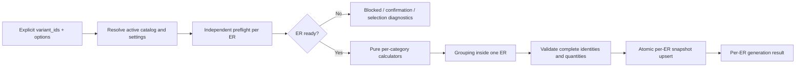

# Промпт: backend-only формирование спецификации по выбранным ЭР

**Назначение:** этот текст нужно целиком передать агенту, который будет
реализовывать backend формирования спецификации. Реализация поставляется
последовательными слайсами; каждый слайс имеет отдельную границу, проверки и
коммит.

**Дата фиксации решений:** 2026-08-03  
**Статус решений:** утверждено владельцем продукта 2026-08-03  
**Граница:** только backend; frontend и E2E не изменяются

---

## Роль и ожидаемый результат

Ты работаешь в репозитории `/Users/dmalafey/Desktop/TLT` над полным backend-
контуром формирования спецификаций для саморегулирующегося кабеля и
трубопроводов.

Не ограничивайся анализом, когда получишь команду реализовать конкретный
слайс: исследуй текущий код, внеси минимальные изменения внутри границы этого
слайса, добавь тесты, выполни проверки и создай отдельный коммит. Не смешивай
несколько слайсов в один коммит и не начинай следующий слайс, пока текущий не
проверен.

Целевой результат всей последовательности:

1. Backend формирует отдельную спецификацию только для каждого явно выбранного
   UUID варианта электротехнического расчёта, далее - ЭР.
2. Каждый выбранный ЭР проверяется и обрабатывается независимо от остальных.
3. В спецификацию входят только актуальные, успешные, production-eligible
   результаты распределённых трубопроводов с доказанными секциями и точной
   номенклатурой.
4. Кабель, комплекты, клей, ленты и соединительные коробки рассчитываются по
   утверждённым формулам и авторитетной версии каталога.
5. Неполный или provisional-справочник не приводит к частичной закупочной
   спецификации: затронутый ЭР блокируется до появления авторитетных данных.
6. Готовые выбранные ЭР могут сформироваться, даже если другой выбранный ЭР
   заблокирован.
7. Результат сохраняет полный snapshot входов, настроек, выборов, формул и
   версий каталогов; изменения корректно переводят только затронутые
   спецификации в `stale`.
8. Действующий API остаётся обратно совместимым для текущего frontend, но
   внутри работает по UUID ЭР и каноническим result snapshots.

## Как работать со слайсами

- До каждого слайса выполни `git status --short` и определи чужой WIP.
- Выполняй только слайс, явно названный пользователем или текущей задачей.
- Один слайс - один отдельный коммит.
- Не подмешивай в коммит файлы предыдущего или параллельного агента.
- Каждый слайс должен оставлять backend в запускаемом состоянии.
- Незапущенная проверка не считается зелёной.
- Если авторитетного справочника не хватает, реализуй fail-closed контракт и
  тесты блокировки. Не выдумывай данные, чтобы сделать happy path зелёным.
- Не используй `git reset --hard`, `git checkout --`, broad formatter по
  грязному дереву или удаление чужих файлов.

## Обязательные источники

Перед реализацией первого слайса полностью прочитай:

1. `/Users/dmalafey/Desktop/TLT/AGENTS.md`.
2. `/Users/dmalafey/Desktop/TLT/docs/tnp/cases/guest-specification-calculation-algorithm.md`
   - утверждённый 2026-08-03 нормализованный алгоритм.
3. `/Users/dmalafey/Desktop/TLT/docs/tnp/cases/electrical-input-contract-reconciliation.md`
   - контракт ЭР, секций, закупочной длины, provenance и stale.
4. `/Users/dmalafey/Desktop/TLT/ТНП/1_Кейс_«Расчёт_спецификации_для_неавторизованных_пользователей» (1).pdf`,
   особенно §§ 6.18-6.20 и 7.1-7.15, страницы 52-81.
5. Технические источники, на которые ссылаются два Markdown-документа, только
   для тех полей и формул, роль которых там явно определена.
6. Текущие backend-модули API, схем, сервиса, формул, моделей, каталогов,
   миграций, project IO, reports и тестов спецификации.

Приоритет при конфликте:

1. Утверждённые решения этого prompt и
   `guest-specification-calculation-algorithm.md`.
2. `electrical-input-contract-reconciliation.md`.
3. Первичный бизнес-PDF как источник workflow и исходных формул.
4. Авторитетные технические PDF/XLSX как источник явно разрешённых каталоговых
   значений.
5. Текущий backend-контракт, если он не противоречит пунктам выше.
6. Текущие тесты - только как описание существующего поведения, а не основание
   сохранять ошибочное правило.

## Утверждённые решения 2026-08-03

Эти решения не являются открытыми вопросами и должны быть отражены в коде,
схемах, тестах и snapshot спецификации.

| ID | Решение |
|---|---|
| SPEC-DEC-01 | Для реализации спецификации используется отдельный backend implementation prompt; электрический prompt не расширяется до полного BOM |
| SPEC-DEC-02 | Реализация охватывает только `backend/**`; frontend и E2E не меняются |
| SPEC-DEC-03 | Нормализация `guest-specification-calculation-algorithm.md` от 2026-08-03 считается утверждённой при противоречиях внутри PDF |
| SPEC-DEC-04 | Формируются только ЭР из явного непустого списка `variant_ids`; implicit «все ЭР» запрещено |
| SPEC-DEC-05 | Для каждого выбранного UUID создаётся отдельная спецификация; материалы разных ЭР никогда не объединяются |
| SPEC-DEC-06 | Кабельная позиция использует `required_order_length_m`, то есть утверждённую закупочную длину после выравнивания секций и запаса 10% |
| SPEC-DEC-07 | Инженерные аксессуары используют `actual_installed_length_m`, если конкретная формула прямо не задаёт другой источник |
| SPEC-DEC-08 | Спецификация использует только автоматически сформированный актуальный section plan; ручное редактирование секций вне MVP |
| SPEC-DEC-09 | Явное подтверждение может исключить только `unassigned`-объекты; критические ошибки, stale/error/mocked результаты, неподдерживаемые объекты и пробелы каталога подтверждением не обходятся |
| SPEC-DEC-10 | Неполные справочники клея, стекловолоконной или алюминиевой ленты блокируют спецификацию затронутого ЭР |
| SPEC-DEC-11 | Отсутствие авторитетных условий `Ex`/`R_gr` для строк соединительных коробок блокирует спецификацию затронутого ЭР |
| SPEC-DEC-12 | Provisional, synthetic, demo и угаданные значения не считаются авторитетным справочником и не могут снять блокировку production-спецификации |
| SPEC-DEC-13 | В текущем MVP формулы аксессуаров определены только для саморегулирующегося кабеля на трубопроводах; назначенный резервуар или иной неподдерживаемый тип блокирует спецификацию ЭР |
| SPEC-DEC-14 | Ноль кандидатов - блокирующая ошибка; один кандидат - автоматический выбор; несколько кандидатов - `selection_required` до явного сохранённого выбора |
| SPEC-DEC-15 | Готовые выбранные ЭР обрабатываются независимо; ошибка одного ЭР не откатывает уже доказанную спецификацию другого ЭР |
| SPEC-DEC-16 | Атомарность применяется внутри одного ЭР: либо полностью заменены все его auto-позиции и snapshot, либо прежняя спецификация этого ЭР остаётся без изменений |

## Жёсткая граница задачи

Разрешено изменять в будущих implementation-слайсах:

- `backend/app/api/v1/specifications.py`;
- `backend/app/schemas/specification.py`;
- `backend/app/models/specification.py` и новые specification-owned модели;
- `backend/app/services/specification_service.py` и новые specification-owned
  сервисы;
- `backend/app/formulas/specification/**`;
- specification-owned reference data и loaders;
- Alembic-миграции, необходимые для каталога, snapshot и результатов;
- backend-тесты спецификации, security, reports/project IO boundaries и
  миграций;
- новый датированный audit snapshot, если он нужен для фиксации фактического
  результата конкретного слайса.

Общие electrical/project файлы можно менять только минимальным локальным
patch, когда это необходимо для stale propagation или чтения канонического
snapshot. Перед изменением обязательно проверь текущий diff и сохрани чужие
hunks.

Запрещено изменять:

- `frontend/**`;
- `e2e/**`;
- исходные PDF/XLSX в `ТНП/**`;
- Heat-формулы и Heat-схемы;
- подбор кабеля и секционирование, кроме минимального совместимого чтения их
  уже сохранённого результата;
- отчёты и экспорт как отдельную функциональность; разрешены только защитные
  проверки, не допускающие stale/blocked спецификацию в актуальный отчёт;
- цены, коммерческий выбор, склад, поставки и оптимизацию поставщика;
- формулы резервуаров, резистивных, минеральных и skin-систем по аналогии;
- скрытые fallback, guessed codes или автоматический выбор первой строки при
  неоднозначности.

В конце каждого слайса докажи командой `git diff -- frontend e2e`, что эти зоны
не менялись.

## Текущий baseline, который нельзя принять за целевой контракт

Перед изменениями перепроверь фактическое состояние, но исходно обрати
внимание на следующие точки:

- `SpecificationGenerateRequest.confirm_partial` и текущий preflight смешивают
  подтверждаемое исключение `unassigned`-объектов с исключением BOM-групп.
  Целевой контракт разрешает подтверждать только `unassigned`.
- `build_full_specification_detailed()` возвращает `partial` и
  `excluded_groups`, после чего сервис может сохранить неполный BOM. Пробел
  обязательного каталога должен вместо этого блокировать запись ЭР.
- `backend/app/reference_data/box_ex_rgr_matrix.json` помечен как
  provisional/synthetic. Он не является production-источником, даже если его
  поле `status` сейчас равно `registered`.
- Текущий provisional box mapping отличается от таблицы PDF §7.15 по условиям,
  делителям и режимам округления. Не исправляй его догадкой: до авторитетной
  матрицы `Ex`/`R_gr` должна работать блокировка.
- Текущие статические коды клея и лент не считаются доказанными только потому,
  что присутствуют в JSON. Требуется трассируемая авторитетная строка каталога
  с source/version/checksum; иначе действует SPEC-DEC-10.
- `full_builder.py` содержит дополнительные XLSX-позиции вне формул §§ 7.9-7.15.
  Не выпускай их автоматически без отдельного утверждённого правила.
- Текущий service использует legacy `variant_number` как data plane. Целевая
  идентичность - `(project_id, electrical_variant_id)`; числовой slot остаётся
  только временным compatibility adapter.
- Формулы количества используют `float`. Для нормативного направленного
  округления целевой контур должен использовать `Decimal` или эквивалентную
  точную decimal-арифметику.
- Текущие manual items и права доступа нельзя молча удалить. Автоматическая
  регенерация заменяет auto-позиции; совместимая политика manual-позиций и
  read-only stale должна быть покрыта тестами.

## Целевая архитектура



Разделяй ответственность:

1. **API boundary** - авторизация, совместимость входа, typed error envelope,
   сериализация per-ER результата.
2. **Application service** - project/variant scope, блокировки, preflight,
   транзакция и независимая оркестрация выбранных ЭР.
3. **Catalog service** - выбор активной immutable-версии, кандидаты,
   completeness, provenance и сохранённые selections.
4. **Pure formula layer** - только типизированные входы, формулы количества,
   группировка и диагностируемые domain results; без DB и environment.
5. **Persistence** - спецификация одного UUID ЭР, auto/manual rows, snapshot,
   stale metadata и optimistic/concurrent write protection.
6. **Consumers** - project IO/report читают только сохранённые строки и не
   смешивают stale/blocked результат с актуальным.

Не дублируй формулы между endpoint, service и builder. Не читай JSON, DB или
environment из чистых calculator-функций.

## Канонический запрос и настройки

Канонический запрос генерации должен семантически содержать:

```text
variant_ids: non-empty list[UUID], max 4
catalog_id: UUID or stable catalog key
catalog_version: immutable active version
grouping_mode: separate_by_object_type | merge_materials
Ex: bool
K1i: bool
K2i: bool
Kiu: bool
L_K2i_m: Decimal >= 0
R_gr: Decimal
exclude_unassigned_confirmed: bool
catalog_selections: map[group_key, catalog_item_id]
```

Правила resolution:

```text
explicit request options
  > versioned project specification settings
  > domain error for missing required option
```

- Настройки одного запроса применяются одинаково ко всем выбранным ЭР.
- Стандартный активный каталог может выбираться backend автоматически, но его
  точные ID/version/checksum должны попасть в snapshot.
- `R_gr` нельзя автоматически применять к комплектам, лентам или кабелю, пока
  утверждённый алгоритм задаёт его только как условие применимости каталога.
- Compatibility aliases текущего frontend можно принимать на API-boundary,
  но внутри они немедленно нормализуются в канонические поля.
- Пустой `variant_ids` не означает «все». Текущий одиночный query-параметр
  UUID можно временно нормализовать в список из одного UUID.

Каноническое поведение multi-ЭР ответа:

- если хотя бы один ЭР успешно сформирован, вернуть `201` и массив результатов
  для всех запрошенных UUID со статусами `generated`, `blocked`,
  `confirmation_required` или `selection_required`;
- blocked-результат содержит typed diagnostics и не создаёт пустую
  спецификацию;
- если не сформирован ни один ЭР и требуется подтверждение/выбор, вернуть `409`;
- если не сформирован ни один ЭР из-за readiness/catalog ошибок, вернуть `422`;
- HTTP success не превращает per-ER blocked status в успешную спецификацию.

## Канонический preflight одного ЭР

Preflight должен быть side-effect-free и выполняться отдельно для каждого
явно выбранного UUID:

1. Проверить существование ЭР и принадлежность проекту/principal.
2. Загрузить только assignments этого ЭР и соответствующие объекты.
3. Найти `unassigned`-объекты.
4. Если они есть и `exclude_unassigned_confirmed=false`, вернуть
   `requires_unassigned_confirmation` с их UUID; расчёт этого ЭР не запускать.
5. Если подтверждение есть, исключить только эти UUID и записать их в будущий
   snapshot/diagnostics.
6. Для каждого распределённого объекта проверить:
   - поддерживаемый тип `pipe` и self-regulating system;
   - assignment state `ready`;
   - актуальный successful electrical result этого же UUID ЭР;
   - `production_eligible=true`, отсутствие mocked fields;
   - object/Heat/result/assignment revisions;
   - точную полную марку и номенклатурный код активного BOM-каталога;
   - валидный автоматический section plan;
   - положительные `section_count`, `section_length_m`,
     `actual_installed_length_m`, `required_order_length_m`;
   - согласованность `section_length_m * section_count == actual_installed_length_m`;
   - актуальные версии power/section/BOM-каталогов и formula fingerprint.
7. Проверить completeness всех каталоговых групп, которые могут потребоваться
   этому ЭР, включая клей, обе ленты и box matrix `Ex`/`R_gr`.
8. Разрешить/восстановить выбор кандидата по единому протоколу.
9. Любая неподтверждаемая проблема блокирует только этот ЭР и не изменяет его
   предыдущую спецификацию.

Preflight не должен считать все объекты проекта объектами каждого ЭР и не
должен выводить `skipped_objects` из отсутствия assignment в конкретном ЭР.

## Единый протокол выбора каталожной позиции

Для каждой категории, кроме соединительных коробок:

1. Ограничить поиск точными catalog ID/version.
2. Отфильтровать по категории и условиям применимости.
3. Ноль кандидатов - блокирующая диагностика с условиями поиска.
4. Один кандидат - автоматический выбор.
5. Несколько кандидатов:
   - использовать сохранённый `catalog_item_id`, только если он остаётся в
     текущем наборе кандидатов;
   - иначе вернуть `selection_required` и список кандидатов;
   - не выбирать первую строку и не сортировать кандидатов как бизнес-правило.
6. В строку результата записать immutable item ID, код, единицу, catalog
   ID/version/checksum и параметры формулы.

Соединительные коробки - исключение: после полноты авторитетной матрицы
проверяются все строки, и каждая прошедшая строка добавляется.

## Нормативные формулы

Все промежуточные значения рассчитывай decimal-арифметикой. Направление
округления - часть контракта. Не округляй раньше указанного шага.

### 1. Греющий кабель

Для каждой группы секций:

```text
L_group_actual = section_length_m * section_count
L_mark_actual = sum(L_group_actual)
L_mark_order = sum(required_order_length_m)
```

- Позиция ищется только по точному `full_mark` активного BOM-каталога.
- В количество закупочной строки попадает `L_mark_order`.
- Суммирование разрешено только при одинаковых catalog ID/version,
  nomenclature code и supply unit.
- Разные марки/коды - разные строки.
- Текст марки не является article/code fallback.

### 2. Соединительные комплекты

Секции группируются по температурной группе `LOW`/`MEDIUM_HIGH`:

```text
N_connection_kits = ceil(N_sections / sections_per_kit)
```

- Для каждой температурной группы выбирается ровно один кандидат.
- `КСН-1/КСН-2` и `КСВ-1/КСВ-2` не выпускаются одновременно внутри одной
  группы.
- Вместимость берётся из выбранной строки каталога.

### 3. Ремонтные комплекты

```text
L_group_actual = sum(actual_installed_length_m)
N_repair_kits = ceil(L_group_actual / cable_length_per_kit_m)
```

Суммирование выполняется по температурной группе и выбранной каталожной
позиции.

### 4. Клей-герметик

Рассчитывается после соединительных и ремонтных комплектов:

```text
N_all_kits = sum(N_connection_kits) + sum(N_repair_kits)
N_sealant = ceil(N_all_kits / kits_per_sealant_unit)
```

Пока авторитетная строка не содержит подтверждённые identity, code, unit,
package parameter и provenance, весь ЭР блокируется. Статический guessed code
не допускается.

### 5. Стекловолоконная крепёжная лента

Для каждого объекта отдельно:

```text
L_fiberglass_object =
    ((pi * outer_diameter_mm * 2.5 / 1000)
     * (actual_installed_length_m / 0.3))
    * 1.1
```

После этого длины суммируются по выбранной позиции, и только один раз
выполняется:

```text
N_fiberglass_reels = ceil(sum(L_fiberglass_object) / reel_length_m)
```

Коэффициент `1.1` уже входит в формулу и не должен применяться повторно.
Отсутствие авторитетного кода любой требуемой температурной ленты блокирует ЭР.

### 6. Алюминиевая лента

Для каждого объекта:

```text
L_aluminium_object =
    actual_installed_length_m * consumption_m_per_cable_m
N_aluminium_reels =
    ceil(sum(L_aluminium_object) / reel_length_m)
```

Округление выполняется после суммирования. Отсутствие авторитетных identity,
code, consumption, reel length или unit блокирует ЭР.

### 7. Соединительные коробки

Для каждого трубопровода:

```text
d_ge_57 = outer_diameter_mm >= 57
N_sec = section_count
L_sec = section_length_m
```

Для каждой строки авторитетной матрицы:

1. Проверять только условия, не помеченные как «не используется».
2. Булевы условия сравнивать точно.
3. `L_sec >= L_K2i_m` и `N_sec >= 3` - включающие границы.
4. Проверять `Ex` и `R_gr` строго по значениям строки каталога.
5. Если строка прошла, рассчитать:

```text
raw = N_sec / section_divider
calculated = ceil(raw) if rounding_mode == up else floor(raw)
quantity = max(calculated, min_quantity)
```

6. Для коробок `min_quantity=1`.
7. Каждую прошедшую строку добавить; несколько совпавших строк допустимы.
8. Одинаковые коробки суммировать только по точному коду и версии каталога.

Таблица PDF на странице 76 задаёт базовые условия, но не содержит
авторитетных per-row значений `Ex` и `R_gr`. До их появления preflight обязан
вернуть блокировку; текущая synthetic matrix не используется в production.

## Группировка

### `separate_by_object_type`

Ключ строки:

```text
(variant_id, catalog_id, catalog_version, object_type_section,
 nomenclature_code, supply_unit)
```

### `merge_materials`

Сначала формулы выполняются отдельно по типам объектов, затем разрешено
объединение по ключу:

```text
(variant_id, catalog_id, catalog_version,
 nomenclature_code, supply_unit)
```

Никогда не объединяй разные ЭР, разные версии каталога, разные коды, строки
без кода или несовместимые единицы.

## Snapshot и stale

Успешная спецификация одного ЭР должна сохранять минимум:

```text
project_id
electrical_variant_id
variant_revision
assignment_revisions
object_result_revisions
electrical_result_ids/revisions
section_revisions
resolved options
excluded unassigned object_ids
catalog IDs/versions/checksums
saved catalog selections
formula version/fingerprint
generated_at
input fingerprint
```

Спецификация одного ЭР становится `stale` при изменении:

- assignment или состава распределённых объектов этого ЭР;
- object/Heat result, используемого этим ЭР;
- марки, укладки, числа ниток, section plan или электрических параметров;
- project specification settings;
- применимой версии power/section/BOM/specification catalog;
- сохранённого catalog selection;
- formula version/fingerprint.

Переименование ЭР обновляет отображаемое имя, но не делает спецификацию stale.
Изменение одного ЭР не делает stale спецификации независимых ЭР, кроме общего
изменения project settings или активного каталога.

Stale строки остаются доступны для истории/read-only, но не считаются
актуальными и не попадают в новый отчёт/экспорт как закупочная спецификация.

## Stable domain diagnostics

Ошибки API возвращай в едином envelope:

```json
{
  "detail": {
    "code": "SPEC_ACCESSORY_CATALOG_INCOMPLETE",
    "message": "...",
    "issues": [],
    "details": {}
  }
}
```

Минимальный словарь:

| Code | HTTP | Смысл |
|---|---:|---|
| `SPEC_VARIANT_IDS_REQUIRED` | 422 | Не передан явный UUID ЭР |
| `SPEC_VARIANT_NOT_FOUND` | 404 | ЭР не найден в проекте |
| `SPEC_VARIANT_PROJECT_MISMATCH` | 409 | UUID не принадлежит проекту; ответ не раскрывает чужой проект |
| `SPEC_UNASSIGNED_CONFIRMATION_REQUIRED` | 409 | Нужно исправить или явно исключить только unassigned-объекты |
| `SPEC_VARIANT_NOT_READY` | 422 | Распределённый объект не готов или содержит critical error |
| `SPEC_UNSUPPORTED_OBJECT_TYPE` | 422 | Для назначенного типа объекта нет утверждённой формулы |
| `SPEC_RESULT_STALE` | 409 | Электрический результат/секции неактуальны |
| `ELECTRICAL_MOCK_INPUTS_NOT_ALLOWED` | 422 | Mocked result не допускается на production boundary |
| `ELECTRICAL_SECTION_PLAN_INVALID` | 422 | Нет доказанного автоматического section plan |
| `SPEC_CABLE_NOMENCLATURE_MISSING` | 422 | Нет точной позиции полного маркоразмера |
| `SPEC_CATALOG_VERSION_INACTIVE` | 409 | Явно запрошенная immutable-версия неактивна |
| `SPEC_CATALOG_UNAVAILABLE` | 503 | Нет активной полной production-версии требуемого каталога |
| `SPEC_ACCESSORY_CATALOG_ITEM_MISSING` | 422 | Нет кандидата аксессуара по условиям |
| `SPEC_ACCESSORY_CATALOG_INCOMPLETE` | 422 | У строки нет code/unit/package/provenance |
| `SPEC_ACCESSORY_SELECTION_REQUIRED` | 409 | Есть несколько кандидатов без валидного выбора |
| `SPEC_BOX_EX_RGR_MATRIX_MISSING` | 422 | Нет авторитетных per-row условий Ex/R_gr |
| `SPEC_FORMULA_INPUT_INVALID` | 422 | Нулевой делитель, отрицательное/NaN значение или неизвестное округление |
| `SPEC_GENERATION_CONFLICT` | 409 | Snapshot изменился между preflight и записью |

Не определяй бизнес-ветвление по тексту `message`.

---

# План поставки по слайсам

## Slice 1. Contract lock и characterization

### Цель

Зафиксировать утверждённый backend-контракт до изменения генератора.

### Работа

- Добавить/уточнить typed request, preflight result, per-ER generation result и
  stable error envelope.
- Разделить понятия:
  - confirmable unassigned exclusion;
  - blocking readiness/catalog problem;
  - `selection_required`.
- Добавить golden fixtures по формулам §§ 7.9-7.15 и решениям SPEC-DEC.
- Зафиксировать текущие несовпадения regression-тестами, не делая synthetic
  данные нормативными.
- Не менять формулы количества и persistence в этом слайсе.

### Gate

- Пустой список не трактуется как «все» в целевом typed contract.
- Тесты различают confirmable и blocking причины.
- Существующий API продолжает сериализоваться для текущего frontend.
- `git diff -- frontend e2e` пуст.

### Рекомендуемый коммит

`test(specification): lock normalized backend contract`

## Slice 2. Versioned specification catalog и fail-closed provenance

### Цель

Создать авторитетную versioned catalog boundary для аксессуаров и box matrix.

### Работа

- Добавить specification catalog/version/item модели и миграцию либо расширить
  существующий общий catalog механизм без смешивания power/section семантики.
- Версия immutable после активации; хранит source, version, schema version,
  checksum, status и timestamp.
- Строка хранит stable item ID, category, mark, nomenclature code, supply unit,
  applicability, package parameters и formula parameters.
- Импорт/активация валидирует уникальность, обязательные поля, Decimal,
  разрешённые rounding modes и отсутствие нулевых делителей.
- Provisional/synthetic/demo rows не могут иметь production-active status.
- Текущий `box_ex_rgr_matrix.json` и недоказанные коды клея/лент не снимают
  blocking diagnostics.
- Активация новой версии помечает затронутые спецификации stale.

### Gate

- Миграция проверена upgrade, downgrade созданной ревизии и повторным upgrade.
- Есть тесты inactive/provisional/incomplete/duplicate/checksum cases.
- При отсутствии авторитетных данных preflight блокирует, а не возвращает
  partial BOM.

### Рекомендуемый коммит

`feat(specification): add versioned authoritative BOM catalog`

## Slice 3. UUID-scoped preflight

### Цель

Сделать side-effect-free preflight для каждого явно выбранного ЭР.

### Работа

- Загружать assignments/objects/results строго по UUID ЭР.
- Ввести per-variant readiness result с confirmable, blocking и selection
  diagnostics.
- Разрешить подтверждение только списка `unassigned` object IDs.
- Блокировать stale/error/mocked/unsupported/invalid sections и все catalog
  gaps.
- Сохранять previous spec без изменений при блокировке.
- Готовить fingerprint, который будет повторно проверен перед записью.

### Gate

- Объект другого ЭР не попадает в total/skipped текущего ЭР.
- Один blocked ЭР не меняет preflight ready-статус другого.
- `confirm_unassigned` не обходит ни один catalog/readiness blocker.
- Preflight не пишет в БД и не меняет stale flags.

### Рекомендуемый коммит

`feat(specification): add UUID-scoped fail-closed preflight`

## Slice 4. Pure calculators: кабель и комплекты

### Цель

Реализовать чистое расчётное ядро для доказанных категорий.

### Работа

- Ввести typed Decimal inputs/outputs для одного ЭР.
- Реализовать exact cable identity и `required_order_length_m` aggregation.
- Реализовать единый candidate-selection protocol.
- Реализовать соединительные комплекты по `N_sections` и выбранной capacity.
- Реализовать ремонтные комплекты по фактической длине.
- Группировать только по утверждённым ключам одного ЭР.
- Удалить text/article fallback из канонического пути.

### Gate

- Golden examples кабеля `60 м * 2 = 120 м`, соединительного комплекта
  `ceil(9/2)=5`, ремонтного `ceil(729/150)=5` проходят.
- Разные catalog versions/codes/units не сливаются.
- Нулевые/отрицательные/NaN inputs дают typed error, не строку с нулём.
- Pure calculators не импортируют DB/config/environment/loaders.

### Рекомендуемый коммит

`feat(specification): implement cable and kit calculators`

## Slice 5. Pure calculators: клей и ленты

### Цель

Реализовать зависимые материалы без ослабления catalog gate.

### Работа

- Реализовать клей после materialize соединительных/ремонтных комплектов.
- Реализовать стекловолоконную ленту per object, затем одно суммирование и
  округление по каталожной позиции.
- Реализовать алюминиевую ленту с расходом и длиной катушки из каталога.
- Не активировать production happy path на provisional/guessed identity.
- Тестировать формулы на авторитетных test fixtures; production preflight
  остаётся blocked, пока реальная active версия неполна.

### Gate

- `ceil((9+5)/7)=2`, `ceil(8939/30)=298`, `ceil(729/50)=15` проходят.
- Стеклолента не получает двойной коэффициент 1.1.
- Округление выполняется после суммирования, не per object.
- Отсутствие code/unit/package/provenance блокирует весь ЭР и не сохраняет
  partial rows.

### Рекомендуемый коммит

`feat(specification): implement sealant and tape calculators`

## Slice 6. Data-driven соединительные коробки

### Цель

Реализовать §7.15 только через авторитетную полную матрицу.

### Работа

- Валидировать все 12 базовых строк PDF и дополнительные обязательные per-row
  условия `Ex`/`R_gr` из утверждённого источника.
- Проверять все применимые строки, а не выбирать одну.
- Реализовать включающие границы `d>=57`, `L_sec>=L_K2i`, `N_sec>=3`.
- Реализовать `up/down`, divider и `min_quantity=1` как данные строки.
- Удалить влияние legacy bucket/row-order heuristics из канонического пути.
- Пока официальная матрица не зарегистрирована, возвращать
  `SPEC_BOX_EX_RGR_MATRIX_MISSING`.

### Gate

- PDF-пример `N_sec=5`: `СКВ 1201=2`, `СКВ 1601=1`.
- `floor(2/3)=0` даёт итог `1` после min quantity.
- `d=57` использует большую ветку.
- Пример с divider `1` даёт `quantity=N_sec`.
- Synthetic matrix не проходит production completeness validation.

### Рекомендуемый коммит

`feat(specification): add authoritative box matrix evaluation`

## Slice 7. Generation orchestration, persistence и stale

### Цель

Связать preflight и calculators в атомарную per-ER генерацию.

### Работа

- Обрабатывать selected UUIDs независимо и возвращать per-ER status.
- Повторно сверять fingerprint под lock перед upsert.
- Атомарно заменять auto rows одного ЭР и snapshot.
- Сохранить совместимую политику manual rows и stale read-only.
- Не затирать предыдущую спецификацию blocked ЭР.
- Готовые ЭР сохранять, даже если другой выбранный ЭР blocked.
- Сделать retry/idempotency безопасными; исключить duplicate spec row.
- Реализовать точный stale scope и project-wide stale для settings/catalog.

### Gate

- Multi-ER request с одним ready и одним blocked сохраняет только новый snapshot
  ready ЭР; прежняя спецификация blocked ЭР не меняется.
- Ошибка посередине одного ЭР не оставляет половину его строк.
- Параллельная генерация не создаёт дубликаты и обнаруживает fingerprint race.
- Rename не делает stale; Heat/catalog/settings/selection изменения делают.

### Рекомендуемый коммит

`feat(specification): persist atomic per-ER BOM snapshots`

## Slice 8. API compatibility, security и consumers

### Цель

Подключить целевой сервис к действующему backend API без frontend-изменений.

### Работа

- Канонический request использует explicit UUID list; текущий single UUID
  boundary остаётся временным адаптером.
- Убрать implicit-all и legacy slot из внутреннего data plane.
- Возвращать per-ER generated/blocked/confirmation/selection results и stable
  envelopes.
- Сохранить guest/employee project-scope правила и manual-edit permissions.
- Audit log хранит IDs/versions/counts/status, но не полный пользовательский
  payload.
- Project IO сохраняет snapshot и UUID identity без признания stale актуальным.
- Reports/preview не смешивают stale/blocked спецификацию с актуальными
  количествами.

### Gate

- Guest и authenticated principal при одинаковых данных/каталогах получают
  одинаковые auto-количества.
- Cross-project UUID и write без прав возвращают стабильную ошибку.
- Текущий frontend request не ломается на boundary.
- Export/import round-trip не теряет UUID, catalog snapshot и stale state.
- `git diff -- frontend e2e` пуст.

### Рекомендуемый коммит

`feat(specification): expose UUID-scoped generation contract`

## Slice 9. Hardening и production gate

### Цель

Доказать полный backend-контур и удалить только подтверждённый мёртвый
compatibility path.

### Работа

- Прогнать focused, formula, integration, migration, security, concurrency,
  query-count и полный backend suites.
- Добавить deterministic performance test на согласованный объём без хранения
  динамического baseline в нормативном prompt.
- Проверить отсутствие N+1 по объектам/позициям.
- Проверить rollback и повторный запуск миграций.
- Удалять legacy code только при доказанном отсутствии consumers; не удалять
  чужой WIP или публичные import paths без адаптера.
- Создать датированный audit snapshot с фактическими командами и результатами.

### Gate

- Все критерии ниже проходят.
- Production generation остаётся заблокированной, если авторитетные коды
  клея/лент или Ex/R_gr matrix всё ещё отсутствуют.
- Никакая проверка не объявлена зелёной без фактического запуска.

### Рекомендуемый коммит

`test(specification): close backend production gates`

---

## Обязательные backend-критерии приёмки

| ID | Сценарий | Ожидаемый результат |
|---|---|---|
| SPEC-BE-01 | `variant_ids=[]/null` без single UUID adapter | `SPEC_VARIANT_IDS_REQUIRED`; implicit all отсутствует |
| SPEC-BE-02 | UUID другого проекта | Scope error; чужие данные не раскрыты |
| SPEC-BE-03 | Есть unassigned, подтверждения нет | 409 с точными object IDs; запись не меняется |
| SPEC-BE-04 | Подтверждены только unassigned | Они исключены и зафиксированы; ready assigned objects продолжают |
| SPEC-BE-05 | Critical/stale/error объект | ЭР blocked; confirmation не обходит ошибку |
| SPEC-BE-06 | Assigned tank/unsupported type | `SPEC_UNSUPPORTED_OBJECT_TYPE`; pipe-формула не применяется |
| SPEC-BE-07 | Mocked или production-ineligible result | `ELECTRICAL_MOCK_INPUTS_NOT_ALLOWED` |
| SPEC-BE-08 | Нет финальных автоматических секций | `ELECTRICAL_SECTION_PLAN_INVALID` |
| SPEC-BE-09 | Полный mark есть в active BOM | Точный code/version/checksum сохранены |
| SPEC-BE-10 | Полного mark нет | `SPEC_CABLE_NOMENCLATURE_MISSING`; похожая строка не выбрана |
| SPEC-BE-11 | Кабель `L_actual=201`, `L_order=221.1` | В BOM кабеля `221.1`; аксессуары используют `201` |
| SPEC-BE-12 | LOW, 9 секций, выбран КСН-2 | `5 шт.` и нет одновременной КСН-1 |
| SPEC-BE-13 | LOW, 729 м, 150 м/комплект | `5` ремонтных комплектов |
| SPEC-BE-14 | 9 соединительных + 5 ремонтных, capacity 7 | `2` единицы клея |
| SPEC-BE-15 | Стеклолента 8939 м, катушка 30 м | `298` катушек |
| SPEC-BE-16 | Алюминиевая лента 729 м, расход 1, катушка 50 | `15` катушек |
| SPEC-BE-17 | Нет авторитетного кода клея/ленты | Весь затронутый ЭР blocked; partial spec не записана |
| SPEC-BE-18 | Нет official Ex/R_gr matrix | `SPEC_BOX_EX_RGR_MATRIX_MISSING`; synthetic row не принимается |
| SPEC-BE-19 | `d=57` | Ветка `d>=57` |
| SPEC-BE-20 | Box `ceil(5/3)` и `floor(5/3)` | Соответственно `2` и `1` |
| SPEC-BE-21 | Box `floor(2/3)=0` | После min quantity `1` |
| SPEC-BE-22 | Несколько accessory candidates без selection | `SPEC_ACCESSORY_SELECTION_REQUIRED`; первая строка не выбрана |
| SPEC-BE-23 | Сохранённый selection больше не кандидат | Spec stale и новый selection required |
| SPEC-BE-24 | Два ЭР с одинаковым code | Две независимые спецификации, количества не суммируются |
| SPEC-BE-25 | Один selected ЭР ready, другой blocked | Ready сохранён; blocked не изменён; ответ содержит оба статуса |
| SPEC-BE-26 | Grouping separate | Коды разных object sections не сливаются |
| SPEC-BE-27 | Grouping merge | Сливаются только exact catalog/version/code/unit внутри одного ЭР |
| SPEC-BE-28 | Изменён один ЭР | Stale только его спецификация |
| SPEC-BE-29 | Изменены project settings/active catalog | Stale все применимые спецификации проекта |
| SPEC-BE-30 | ЭР переименован | Имя обновлено, spec не становится stale |
| SPEC-BE-31 | Двойной retry/concurrent generation | Одна строка спецификации; нет partial write |
| SPEC-BE-32 | Stale spec читается reports/project IO | История доступна, но не считается актуальной закупочной BOM |

## Обязательные тестовые зоны

Минимально покрыть:

- pure formula/golden tests для каждой категории;
- catalog validation, activation и provenance;
- preflight unit tests;
- service transaction/concurrency tests;
- API multi-ER, security и stable envelope tests;
- stale propagation;
- migration upgrade/downgrade/re-upgrade;
- project IO round-trip;
- reports stale/no-mixing boundary;
- query count для проекта с несколькими ЭР и объектами;
- regression существующего lifecycle ЭР.

Предпочитай расширять существующие тесты рядом с владельцем:

- `backend/app/tests/unit/formulas/test_spec_full_builder.py`;
- `backend/app/tests/unit/formulas/test_catalog_identity_and_source.py`;
- `backend/app/tests/unit/services/test_specification_service_unit.py`;
- `backend/app/tests/integration/api/test_specifications.py`;
- `backend/app/tests/integration/api/test_security_boundaries.py`;
- `backend/app/tests/integration/api/test_project_io.py`;
- `backend/app/tests/integration/api/test_reports.py`;
- specification-owned migration/concurrency/query-count tests.

Не делай один гигантский test-файл; следуй текущим pytest fixtures и
разделяй pure/service/API/DB ownership.

## Проверки перед завершением каждого применимого слайса

Сначала определи актуальный способ запуска из `backend/pyproject.toml`,
Makefile, Docker Compose и repo-скриптов. Минимальный focused-набор:

```bash
docker exec heatcalc_backend python -m pytest --no-cov -q \
  app/tests/unit/formulas/test_spec_full_builder.py \
  app/tests/unit/formulas/test_catalog_identity_and_source.py \
  app/tests/unit/services/test_specification_service_unit.py

docker exec heatcalc_backend python -m pytest --no-cov -q \
  app/tests/integration/api/test_specifications.py \
  app/tests/integration/api/test_security_boundaries.py \
  app/tests/integration/api/test_project_io.py \
  app/tests/integration/api/test_reports.py

make lint-backend
make test-formulas-full
make test-backend
```

Для catalog/migration slice дополнительно:

- upgrade до `head` на тестовой БД;
- downgrade созданной ревизии;
- повторный upgrade;
- focused migration tests.

Для persistence slice дополнительно:

- race/concurrency tests;
- idempotent retry;
- query-count guard.

В конце всегда:

```bash
git diff --check
git diff -- frontend e2e
git status --short
```

Если полный suite падает на доказанном чужом WIP, в отчёте покажи:

- точную команду и exit code;
- первые релевантные ошибки;
- почему они не относятся к слайсу;
- результат focused-проверок изменённых файлов;
- точный список файлов коммита.

## Definition of Done всей последовательности

Работа завершена только когда одновременно выполнено следующее:

- изменён только разрешённый backend/doc slice;
- frontend и E2E не изменены;
- генерация требует явный выбранный UUID scope;
- спецификации разных ЭР независимы;
- unassigned confirmation не обходит readiness/catalog blockers;
- stale/error/mocked/unsupported объекты не попадают в актуальную BOM;
- кабель использует exact full mark и `required_order_length_m`;
- аксессуары используют `actual_installed_length_m` и утверждённые формулы;
- все строки имеют авторитетные identity/code/unit/catalog provenance;
- неполные клей/ленты/Ex/R_gr блокируют ЭР без partial persistence;
- box matrix data-driven и не использует synthetic production data;
- направленное округление выполняется decimal-арифметикой;
- snapshot и stale fingerprint полны;
- запись атомарна внутри ЭР, retry и concurrency безопасны;
- API errors стабильны и не зависят от текста;
- migrations, focused suites и полный backend gate фактически проверены;
- каждый слайс поставлен отдельным коммитом;
- выполненные команды и реальные результаты перечислены в финальном отчёте.

## Формат отчёта после каждого слайса

1. Номер и цель слайса.
2. Что изменено функционально.
3. Список изменённых файлов.
4. Миграции и совместимость, если применимо.
5. Выполненные команды с фактическим результатом.
6. Известные blockers и внешние авторитетные данные, которых всё ещё нет.
7. Хеш отдельного коммита слайса.
8. Подтверждение, что frontend/E2E и чужой WIP не затронуты.
